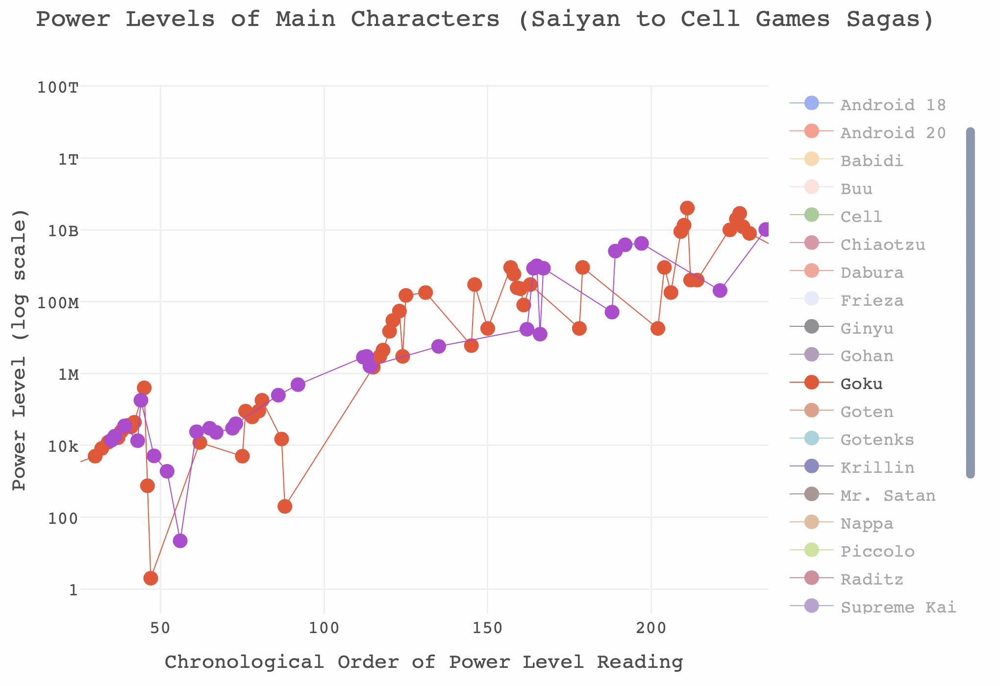

```{r setup, include = FALSE}
library(tidyverse) 
library(plotly)
library(htmltools)

db_data <- read_csv("../../static/Dragon_Ball_Data_Set.csv")
db_data

# Filter only Dragon Ball Z series
db_data <- db_data %>% filter(Dragon_Ball_Series == "Dragon Ball Z")

# Drop the filler sagas and movies
unique(db_data$Saga_or_Movie)

db_data <- db_data %>% filter(Saga_or_Movie %in% c("Saiyan Saga", "Namek Saga", "Ginyu Force Saga",
                                        "Captain Ginyu Saga", "Frieza Saga", "Trunks Saga",
                                        "Android Saga", "Imperfect Cell Saga", 
                                        "Perfect Cell Saga", "Goku And Gohan in The Hyperbolic Time Chamber",
                                        "Cell Games Saga",
                                        "Great Saiyaman Saga/World Tournament Saga",
                                        "Babidi Saga/Majin Buu Saga",
                                        "Fusion Saga",
                                        "Kid Buu Saga"
                                        ))

# Filter only main characters
unique(db_data$Character)
main_characters <- c("Goku", "Gohan", "Piccolo", "Chiaotzu", "Krillin", "Vegeta", 
            "Trunks", "Android 17", "Android 18", "Yamcha", "Tien",
            "Raditz", "Nappa", "Vegeta", "Frieza", "Zarbon", 
            "Ginyu", "Android 20", "Android 16",
            "Cell", "Goten", "Videl", "Mr. Satan", "Buu", "Babidi", "Supreme Kai",
            "Dabura", "Gotenks", "Vegito")

main_characters

# Filter characters down to main characters

db_data <- db_data %>% filter(str_detect(Character, paste(main_characters, collapse = "|")))


# Check and remove any oddities

unique(db_data$Character)

# Remove Cell Jrs

db_data <- db_data %>% filter(Character != "Cell Jrs")


# Data is already ordered chronologically, so let's add a chronological
# order of appearance variable to events

db_data$chron_order <- seq(1, nrow(db_data), 1)


# Tidy up Power_Level variable to make it numeric by removing commas
db_data <- db_data %>% mutate(
  Power_Level = as.numeric(str_remove_all(Power_Level, "\\,"))
) 

unique(db_data$Power_Level)

# Use string matching to assign which character each entry belongs to

db_data <- db_data %>% mutate(
  main_char = str_match(Character, paste(main_characters, collapse = "|"))[,1]
) %>% mutate(
  main_char = ifelse(str_detect(Character, "Gotenks"), "Gotenks", main_char)
) %>% mutate(
  main_char = ifelse(str_detect(Character, "Buu"), "Buu", main_char)
)

# Fortunately string match matches the first string in a group - solving the absorbed issues


# Design colour schemes
colours_dbz <- c(
  "Goku" = "#DC5232",
  "Gohan" = "#5D2E6B",
  "Piccolo" = "#9DD732",
  "Krillin" = "#0F227B",
  "Vegeta" = "#A33DC9",
  "Trunks" = "#5A4AC0",
  "Android 17" = "#F77B22",
  "Android 18" = "#3B63E4",
  "Raditz" = "#782316",
  "Nappa" = "#AE8C33",
  "Frieza" = "#CCD3EF", 
  "Zarbon" = "#B0E5E5", 
  "Ginyu" = "#13150A",
  "Android 20" = "#EC0100",
  "Android 16" = "#94C710",
  "Cell" = "#3E8909",
  "Yamcha" = "#994A46",
  "Tien" = "#1D960A",
  "Babidi" = "#FAC92D",
  "Buu" = "#EDC0BD",
  "Dabura" = "#F02411",
  "Goten" = "#AB3C06",
  "Supreme Kai" = "#6D4D95",
  "Vegito" = "#1B51AE",
  "Videl" = "#6B2B77",
  "Mr. Satan" = "#3C1A1A",
  "Chiaotzu" = "#991F3B",
  "Gotenks" = "#1CACA5"
)

# Interactive plot version

# Saga to segment mapper

dbz_finalplot <- plot_ly(db_data, 
        x = ~chron_order, 
        y = ~Power_Level, 
        group = ~main_char,
        type = "scatter", 
        color = ~main_char, 
        colors = colours_dbz,
        mode = "markers+lines", 
        text = ~paste(Character, "<br>", Saga_or_Movie, sep = ""),
        marker = list(size = 10, opacity = 1),
        line = list(width = 0.7),
        hovertemplate = paste('Power Level: %{y}',
                              '<br>%{text}'),
        width = 550,
        height = 450) %>%
  layout(
    title = list(text = "Power Levels of Main Characters<br>(Saiyan to Buu Sagas)",
                 size = 18),
    font = list(family = "SimHei, monospace"),
    yaxis = list(title = "Power Level (log scale)",
                 type = "log",
                 size = 14),
    xaxis = list(title = "Chronological Order of Power Level Reading",
                 size = 14,
                 rangemode = "nonnegative"),
    margin = list(t = 80)
    )

```

```{r, echo = FALSE}
div(dbz_finalplot, align = "center")
```

<br>

When I was a kid we had something called Sky analogue TV. It hasn't existed since 2001. Essentially, you had access to a handful of Sky TV channels but only between certain hours of the day. At some point this included a channel on which I could watch a show called Dragon Ball Z. 

For those of you unfamiliar with Dragon Ball Z, who will likely get little entertainment out of this post, it was a cartoon imported from Japan where each saga followed a more-or-less predictable pattern of our group of muscled heroes surmounting increasingly insurmountable odds thanks to a combination of high-gravity training and unlocking inborn talents, normally through the medium of yelling. It was almost like someone decided to make a cartoon based on the quote plastered on every gym wall: "hard work beats talent when talent doesn't work hard".

Suffice to say it was one of my great childhood regrets that the inconsistency of analogue Sky TV and, despite the best efforts of my friend Dan and multiple car boot sale bootleggers, I never managed to watch Dragon Ball Z in its entireity. [However, I did notice that there was a dataset of power levels on Kaggle, uploaded by user Shiddharth Saran](https://www.kaggle.com/shiddharthsaran/dragon-ball-dataset). _If I couldn't watch the show through as a kid, I could at least visualise it as an adult_. 

The tutorial below will show you how to replicate the interactive graph below using the `tidyverse` and `plotly` packages in `R`. As you will see, there is a surprising amount of tidying that needs to be done, but this is relatively painless thanks to packages like `stringr`.

----

## Code: Creating scoutR with dplyr & plotly

Start by downloading the Dragon Ball dataset from Kaggle [here](https://www.kaggle.com/shiddharthsaran/dragon-ball-dataset). I always start by importing databases as a `tibble` and looking at what kind of state the data is in. We're also going to load our libraries in this stage: `tidyverse` for `ggplot`, `dplyr`, `stringr`, and a bunch of other useful things, and `plotly` for our interactive scoutR tool. 

----

```{r}
library(tidyverse) 
library(plotly)

db_data <- read_csv("../../static/Dragon_Ball_Data_Set.csv")
db_data
```

----

Because we read this data in using `readr::read_csv()`, rather than the base `R` `read.csv()`, we get a useful overview of how each of the columns in our data file have been parsed and a `head()` of the first 10 rows of data (NB: Check Chi-chi's power level in Dragon Ball and compare it to Mr. Satan and Videl's in Dragon Ball Z for a surprise.)

Just this initial read in tells me several things we will have to fix before we can visualise any data. In no particular order:

* Power level has been parsed as a character type variable, rather than a numeric variable
* We have no variable indicating the chronological order of these power readings (however, fortunately the order of the rows happens to be the chronological order)
* We have no 'generic' variable indicating the character that the power reading belongs to (e.g. Goku is different to Goku (hungry))
* We also have data about the Dragon Ball series (of which I know next to nothing about), not just Dragon Ball Z

Let's start working through these issues and get the data into plottable form. Before I do though, bear in mind that this is just my solution - the great thing about `R` I've found is that every time I go back to an old project I see about a dozen things I would have done completely differently with the new skills I've learned on subsequent projects. 

### Tidying the Dragon Ball Z Data 

I'm going to start by filtering everything that isn't from the Dragon Ball Z series - that means removing all of the readings from Dragon Ball. Do do this I use `filter` from the `dplyr` package. If you're not familiar with things like the `%>%` syntax below, I'd recommend reading [R for Data Science](https://r4ds.had.co.nz) by Hadley Wickham and Garret Grolemund. I also use the very useful `%in%` operator, which checks whether the values in `Saga_or_Movie` match any within the vector after the operator. This is much nicer than writing a bunch of nested `ifelse()` statements and I use it all the time. 

I use the `unique()` function to check all the unique Sagas and Movies in the data, since I can't remember them all off by heart (and even if I did, should check how they've been recorded in this data).

----
```{r, results = FALSE}
# Filter only Dragon Ball Z series
db_data <- db_data %>% filter(Dragon_Ball_Series == "Dragon Ball Z")

# Drop the filler sagas and movies
unique(db_data$Saga_or_Movie)

# Filter only the Sagas from the vector in c()
db_data <- db_data %>% filter(Saga_or_Movie %in% c(
 "Saiyan Saga", 
 "Namek Saga", 
 "Ginyu Force Saga",
 "Captain Ginyu Saga", 
 "Frieza Saga", 
 "Trunks Saga",
 "Android Saga", 
 "Imperfect Cell Saga", 
 "Perfect Cell Saga", 
 "Goku And Gohan in The Hyperbolic Time Chamber",
 "Cell Games Saga",
 "Great Saiyaman Saga/World Tournament Saga",
 "Babidi Saga/Majin Buu Saga",
 "Fusion Saga",
 "Kid Buu Saga"
))

```
----

Next up is filtering down our list of characters. Dragon Ball Z has a _lot_ of characters, and plotting a fraction of them, let alone all of them, is going to result in a mess. Because I'm going to use this list of main characters for creating a variable with information about which character each power level reading belongs to, I'm going to save this vector as `main_characters`.

To filter out only the main characters I need to use the `str_detect` function from `stringr`. This is because, unlike with the `Saga_or_Movie` variable, there is a lot of surrounding text in the `Character` variable (e.g. Goku (Hungry)). If I just used `%in% c("Goku", ...)` then a string like `Goku (Hungry)` would come up as `FALSE`, because it's not an exact match. It would end up being filtered out when we actually want to keep it.

By using `str_detect` we are saying _"If the string in the Character variable contains this string anywhere within it then its value is TRUE"_. However, we cannot use `%in%` in the way that we did earlier; instead, we just need one long string with a bunch of 'or' operators (`|`) - for example, _"if the string contains Goku or Piccolo or Gohan or Vegeta..."_ We do this by using the `paste()` function with the argument `collapse = "|"` - we paste our main character vector as one long string with each entry seperated by a `|` symbol, which is our "or" operator. 

Then I use the `unique()` function to try and eyeball any oddities; the dataset is small enough that I can do this by eye and with my knowledge of the series. We filter out the Cell Jrs because they're not really Cell. 

----
```{r, results=FALSE}
# Vector of main characters
main_characters <- c("Goku", "Gohan", "Piccolo", "Chiaotzu", "Krillin", "Vegeta", 
            "Trunks", "Android 17", "Android 18", "Yamcha", "Tien",
            "Raditz", "Nappa", "Vegeta", "Frieza", "Zarbon", 
            "Ginyu", "Android 20", "Android 16",
            "Cell", "Goten", "Videl", "Mr. Satan", "Buu", "Babidi", "Supreme Kai",
            "Dabura", "Gotenks", "Vegito")

# Filter characters down to main characters
db_data <- db_data %>% filter(str_detect(Character, paste(main_characters, collapse = "|")))

# Check and remove any oddities
unique(db_data$Character)

# Remove Cell Jrs
db_data <- db_data %>% filter(Character != "Cell Jrs")

```
----

Now that we've filtered out any oddities and retained only our main heroes and villains we can add a new variable that identifies the chronological order of events - we will need this for plotting our X axis. We do this using some base `R` code, saving a new variable which is a sequence of numbers from 1 to the total number of rows in our dataset using the `seq()` function. It's lucky for us that the data is already entered in chronological order.

----

```{r}
# Data is already ordered chronologically, so let's add a chronological
# order of appearance variable to events
db_data$chron_order <- seq(1, nrow(db_data), 1)
```

----

Next we need to tidy up that `Power_Level` column - it's currently being treated as a string when it should be numeric. If it's interpreted as a string we won't be able to plot it properly. Luckily this is pretty simple as the only issue is the commas that are used. We can use the `str_remove_all()` function to remove all of the commas and then convert the column to numeric using the `as.numeric()` function. 


----
```{r}
# Tidy up Power_Level variable to make it numeric by removing commas
db_data <- db_data %>% mutate(
  Power_Level = as.numeric(str_remove_all(Power_Level, "\\,"))
) 
```
----

Our next task is to create a new variable that contains a simplified character string so that we can group our power readings to the same characters, in other words, making sure `Goku`, `Goku (Hungry)`, and `Goku (SSJ)` are all grouped under Goku. Fortunately, this is easy using the `str_match()`, which can copy over the first match in the Characters variable against our long string of main character names (using the same `paste()` trick as before) to the new variable.

Unfortunately, it is not quite as simple as it could be due to Dragon Ball Z's naming conventions and propensity for villains to absorb heroes. In particular here I have to add an additional couple of corrections: 

* Because Goten (Goku's son) has a name that matches any entries for "Gotenks" - the fusion character formed by Goten and Trunks - first, all entries for Gotenks get assigned to Goten. So we need to add an additional transformation to find any 'Gotenks' entries and correct their value to 'Gotenks'. This is kind of a lazy solution but does the job.

* This causes another issue of changing one of Buu's values to belonging to Gotenks, because at that stage in the show he has absorbed Gotenks. So the final part reallocates that entry back to Buu.

----
```{r}
# Use string matching to assign which character each entry belongs to
db_data <- db_data %>% mutate(
  main_char = str_match(Character, paste(main_characters, collapse = "|"))[,1]
) %>% mutate(
  # Reallocate Gotenks entries to Gotenks, not Goten
  main_char = ifelse(str_detect(Character, "Gotenks"), "Gotenks", main_char)
) %>% mutate(
  # Reallocate absorbed Gotenks entry back to Buu
  main_char = ifelse(str_detect(Character, "Buu"), "Buu", main_char)
)
```
----

### Creating an interactive visualisation of DBZ power levels

At long last we can plot our data! We have our newly created x-axis variable, chronological order (`chron_order`), our tidied up y-axis variable, power level (`Power_Level`), and our grouping variable that we created using various functions from `stringr`, main character (`main_char`).

Before we make something interactive, let's do a static plot to see whether everything looks right. We're going to use a point-and-line plot using `ggplot` so we can see where each reading is and how each character progresses.

----
```{r}
ggplot(db_data) +
  geom_line(aes(x = chron_order, y = Power_Level, group = main_char, col = main_char)) +
  geom_point(aes(x = chron_order, y = Power_Level, group = main_char, col = main_char))
```
----

Oh no! This isn't very informative. Because so many of the power levels in the later sagas are so extreme (over a trillion in some cases) we can't really parse what's going on. Luckily we can transform the y-axis into something more manageable by looking at the natural log of the power levels. 

----
```{r}
ggplot(db_data) +
  geom_line(aes(x = chron_order, y = log(Power_Level), group = main_char, col = main_char)) +
  geom_point(aes(x = chron_order, y = log(Power_Level), group = main_char, col = main_char))
```
----

That's certainly better, however we still have far too many characters to get a grasp of what's going on. We can at least say that the power levels of most heroes and villains increase exponentially as the sagas go on. We can do much better with an interactive plot.

Before we create the interactive plot I also want to create a colour scheme for each character, just from taking colour swabs from an iconomic piece of clothing (or colour of skin in the case of Piccolo and Buu). I store these in a vector of linked names and HEX code strings. 

----
```{r}
# Colour schemes
colours_dbz <- c(
  "Goku" = "#DC5232",
  "Gohan" = "#5D2E6B",
  "Piccolo" = "#9DD732",
  "Krillin" = "#0F227B",
  "Vegeta" = "#A33DC9",
  "Trunks" = "#5A4AC0",
  "Android 17" = "#F77B22",
  "Android 18" = "#3B63E4",
  "Raditz" = "#782316",
  "Nappa" = "#AE8C33",
  "Frieza" = "#CCD3EF", 
  "Zarbon" = "#B0E5E5", 
  "Ginyu" = "#13150A",
  "Android 20" = "#EC0100",
  "Android 16" = "#94C710",
  "Cell" = "#3E8909",
  "Yamcha" = "#994A46",
  "Tien" = "#1D960A",
  "Babidi" = "#FAC92D",
  "Buu" = "#EDC0BD",
  "Dabura" = "#F02411",
  "Goten" = "#AB3C06",
  "Supreme Kai" = "#6D4D95",
  "Vegito" = "#1B51AE",
  "Videl" = "#6B2B77",
  "Mr. Satan" = "#3C1A1A",
  "Chiaotzu" = "#991F3B",
  "Gotenks" = "#1CACA5"
)
```
----

Great - now we can create our interactive plot using `plotly`. There's quite a lot going on here, and I've found `plotly` a lot harder to use than `ggplot` with a little less support out there, but the amount of resources for the package is growing daily. To try and explain each part I've added comments to the code below.

It is possible to make 'quick and dirty' `plotly` plots with just a `ggplot` object by using the `ggplotly()` function, but this restricts a lot of the features you can get from using the `plot_ly()` function from the package itself. Nonetheless, I'll usually use `ggplotly()` on a test plot first to build up an idea of what kind of aesthetics I want before figuring out how to replicate that in `plot_ly()`.

----
```{r}

dbz_finalplot <- plot_ly(
  db_data, 
  # plot chronological order on the x axis - don't forget the ~
  x = ~chron_order, 
  # Plot power level on the y axis
  y = ~Power_Level, 
  # Group by main_char variable
  group = ~main_char,
  # Type of plot is a scatter plot
  type = "scatter", 
  # The colours are linked to the grouping variable main_char
  color = ~main_char, 
  # The values for the colours should come from the colour palette we made earlier
  colors = colours_dbz,
  # The mode is markers and lines (points linked by lines)
  mode = "markers+lines", 
  # Here we create a text variable which details the text we want to pop up when we
  # hover over a point, in this case the reading information from the Character variable
  # followed by a line break, followed by the saga or movie
  text = ~paste(Character, "<br>", Saga_or_Movie, sep = ""),
  # We set some aesthetic properties for the markers
  marker = list(size = 10, opacity = 1),
  # and for the lines - we make the lines thin to aid interpretation as much as possible
  line = list(width = 0.7),
  # Here we specify what we want to come up when we hover over a point: the Y value and
  # the text we specified earlier
  hovertemplate = paste('Power Level: %{y}',
                        '<br>%{text}'),
  height = 450, width = 550) %>%
  # Then we specify our custom layout options - plotly uses a slightly unusual system of
  # lists for these. It's okay once you get used to it.
  layout(
    title = list(text = "Power Levels of Main Characters<br>(Saiyan to Buu Sagas)",
                 size = 18),
    font = list(family = "SimHei, monospace"),
    # We specify that we want a log scale on our y axis - plotly does nice log scales
    yaxis = list(title = "Power Level (log scale)",
                 type = "log",
                 size = 14),
    # We want our x axis to be nonnegative since a chronological order of -1 makes no sense
    xaxis = list(title = "Chronological Order of Power Level Reading",
                 size = 14,
                 rangemode = "nonnegative"),
    # I like to increase the top margin on plotly so the plotly toolbar doesn't obscure the title
    margin = list(t = 80)
    )

div(dbz_finalplot, align = "center")

```
----

And that's it! Not bad for a very short project. Before signing off, if you've not played around with it you might think that this is still too busy to do anything with. I would recommend playing around with the legends and axes. Here are some examples of what you can do with a `plotly` graph that you may not know, and there's a gif below where I have isolated Goku and Vegeta's power levels between the Saiyan and Cell Games sagas. 

* You can isolate a 'trace' by double-clicking on the name in the legend. This will re-size the limits on the axes automatically. Double click on any name in the legend to return all traces.
* You can add additional traces to your isolated one by left clicking once on additional values in the legend. 
* You can zoom the axes in by left clicking and dragging across the area of interest in the plot.
* You can zoom in on just the x axis by left clicking and dragging the pointer _horizontally_, with no vertical movement.
* You can zoom in on just the y axis by left clicking and dragging the pointer _vertically_, with no horizontal movement.
* Double click anywhere in the plot to reset the axes.

----



----


