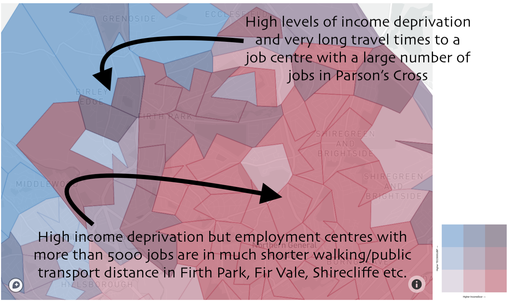

```{r setup, include = FALSE}
library(shiny)
library(tidyverse)
library(plotly)
library(shiny)
library(shinydashboard)
library(htmlwidgets)
library(sf)
library(lazyeval)
library(rlang)
library(mltools)
library(RColorBrewer)
library(gsubfn)

# Load APIs ---------------------------------------------------------------

mapbox_access_token = read_file("../../static/mapbox_token.txt")
Sys.setenv('MAPBOX_TOKEN' = mapbox_access_token)


# Old data (included transformation) --------------------------------------
# 
# # Existing data from CWIP App
# lsoa_data <- read_csv("data/lsoa_dataset_2019.csv")
# labels_lsoa_data <- read_csv("data/lsoa_dataset_labels.csv")
# 
# 
# # Shapefile data
# geo_data <- read_sf("data/lsoa_boundaries_sf")
# msoa_names <- read_csv("data/msoa_names.csv") %>% select(-X6)
# 
# 
# # Join all data and buffer
# lsoa_data_spatial <- left_join(geo_data, lsoa_data, by = c("LSOA11CD" = "LSOA_code")) %>%
#                       left_join(msoa_names, by = c("MSOA11CD" = "msoa11cd"))
# 
# lsoa_data_spatial <- st_transform(lsoa_data_spatial, CRS("+init=epsg:27700"))
# lsoa_data_spatial <- st_buffer(lsoa_data_spatial, dist = 0)
# lsoa_data_spatial <- st_transform(lsoa_data_spatial, CRS("+init=epsg:4326 +proj=longlat +datum=WGS84 +no_defs"))
# lsoa_data_spatial <- st_cast(lsoa_data_spatial, to = "MULTIPOLYGON")
# 


# Load Pre-prepared data -------------------------------------------------------
lsoa_data_spatial <- read_rds("../../static/mog_data.RDS")
labels_lsoa_data <- read_csv("../../static/lsoa_dataset_labels.csv")

labels_lsoa_data <- labels_lsoa_data %>% mutate(
  label = paste(label, " - (", var_name, ")", sep = "")
)

labels_lsoa_data_2 <- labels_lsoa_data
labels_lsoa_data_univ <- labels_lsoa_data

# Functions ------------------------------------------------

### Create functions for automating bivariate maps

# Function for calculating tertiles.
tertile_values <- function(data, variable, la) {
  require("dplyr")
  require("lazyeval")
  variable = enquo(variable)
  
  filtered_data <- data %>% filter(LA_name %in% la)
  var_quantile <- filtered_data %>% pull(!!variable) %>%
    quantile(probs = seq(0, 1, length.out = 4), na.rm = TRUE)
  
  if (sum(duplicated(as.numeric(var_quantile))) == 0) {
    return(var_quantile)
  } else {
    
    rare_quantile <- filtered_data %>% filter(!!variable > 0) %>% 
                        pull(!!variable) %>% 
                        quantile(probs = seq(0, 1, length.out = 3))
    
    rare_quantile <- c(0, rare_quantile)
    
    names(rare_quantile) <- c("0%", "33.3333%", "66.66667%", "100%")
    
    return(rare_quantile)
  }
  
}


# Calculate cuts and join to colour scale
bivar_cuts <- function(data, x, y, la) {
  require(dplyr)
  require(lazyeval)
  require(rlang)
  
  # enquote the variables
  x <- enquo(x)
  y <- enquo(y)
  
  x_st <- get_expr(x)
  y_st <- get_expr(y)
  
  bivariate_colour_scale <- tibble(
    "3 - 3" = "#3F2949", # high IMD, high LAC
    "2 - 3" = "#435786",
    "1 - 3" = "#4885C1", # low IMD, high LAC
    "3 - 2" = "#77324C",
    "2 - 2" = "#806A8A", # medium IMD, medium LAC
    "1 - 2" = "#89A1C8",
    "3 - 1" = "#AE3A4E", # high IMD, low LAC
    "2 - 1" = "#BC7C8F",
    "1 - 1" = "#CABED0" # low IMD, low LAC
  ) %>%
    gather("group", "fill")
  
  # Colour scale
  
  bivariate_colour_scale$bivar_key <- c(
    paste("<br>", "3 (High) ", x_st, " -<br>", "3 (High) ", y_st, "<br>", sep = ""), # 3 (High) X, 3 (High) Y
    paste("<br>", "2 (Mid) ", x_st, " -<br>", "3 (High) ", y_st, "<br>", sep = ""),
    paste("<br>", "1 (Low) ", x_st, " -<br>", "3 (High) ", y_st, "<br>", sep = ""), # 1 (Low) X, 3 (High) Y
    paste("<br>", "3 (High) ", x_st, " -<br>", "2 (Mid) ", y_st, "<br>", sep = ""),
    paste("<br>", "2 (Mid) ", x_st, " -<br>", "2 (Mid) ", y_st, "<br>", sep = ""), # medium X, medium Y
    paste("<br>", "1 (Low) ", x_st, " -<br>", "2 (Mid) ", y_st, "<br>", sep = ""),
    paste("<br>", "3 (High) ", x_st, " -<br>", "1 (Low) ", y_st, "<br>", sep = ""), # 3 (High) X, 1 (Low) Y
    paste("<br>", "2 (Mid) ", x_st, " -<br>", "1 (Low) ", y_st, "<br>", sep = ""),
    paste("<br>", "1 (Low) ", x_st, " -<br>", "1 (Low) ", y_st, "<br>", sep = "") # 1 (Low) X, 1 (Low) Y
  )
  
  # Filter data
  fil_data <- data %>% filter(LA_name %in% la)


# Return data with tertile combinations linked to colour scale  
mutate(fil_data,
      X_tertile = cut(
          # remember bang bangs for evaluation
          !!x,
          breaks = tertile_values(data, !!x, la),
          include.lowest = TRUE
          ),
       Y_tertile = cut(
         # remember bang bangs for evaluation
         !!y,
         breaks = tertile_values(data, !!y, la),
         include.lowest = TRUE
       ),
      bivar_group = paste(
        as.numeric(X_tertile), "-",
        as.numeric(Y_tertile)
      )
) %>%
  left_join(bivariate_colour_scale, by = c("bivar_group" = "group")
  )  

  
}


# Function for drawing bivariate maps:
draw_bivariate_map <- function(data, x, y, la) {
  require(dplyr)
  require(lazyeval)
  require(rlang)
  require(plotly)
  
  x <- enquo(x)
  y <- enquo(y)

  
  x_st <- get_expr(x)
  y_st <- get_expr(y)
  
  # Colours lookup
  
  bivariate_scale <- c(
    "3 - 3" = "#3F2949", # high IMD, high LAC
    "2 - 3" = "#435786",
    "1 - 3" = "#4885C1", # low IMD, high LAC
    "3 - 2" = "#77324C",
    "2 - 2" = "#806A8A", # medium IMD, medium LAC
    "1 - 2" = "#89A1C8",
    "3 - 1" = "#AE3A4E", # high IMD, low LAC
    "2 - 1" = "#BC7C8F",
    "1 - 1" = "#CABED0" # low IMD, low LAC
  )
  
  names(bivariate_scale) <- c(
    paste("<br>", "3 (High) ", x_st, " -<br>", "3 (High) ", y_st, "<br>", sep = ""), # 3 (High) X, 3 (High) Y
    paste("<br>", "2 (Mid) ", x_st, " -<br>", "3 (High) ", y_st, "<br>", sep = ""),
    paste("<br>", "1 (Low) ", x_st, " -<br>", "3 (High) ", y_st, "<br>", sep = ""), # 1 (Low) X, 3 (High) Y
    paste("<br>", "3 (High) ", x_st, " -<br>", "2 (Mid) ", y_st, "<br>", sep = ""),
    paste("<br>", "2 (Mid) ", x_st, " -<br>", "2 (Mid) ", y_st, "<br>", sep = ""), # medium X, medium Y
    paste("<br>", "1 (Low) ", x_st, " -<br>", "2 (Mid) ", y_st, "<br>", sep = ""),
    paste("<br>", "3 (High) ", x_st, " -<br>", "1 (Low) ", y_st, "<br>", sep = ""), # 3 (High) X, 1 (Low) Y
    paste("<br>", "2 (Mid) ", x_st, " -<br>", "1 (Low) ", y_st, "<br>", sep = ""),
    paste("<br>", "1 (Low) ", x_st, " -<br>", "1 (Low) ", y_st, "<br>", sep = "") # 1 (Low) X, 1 (Low) Y
  )
  

  # Drop unnecessary variables
  data_lite <- select(data, LSOA11CD, msoa11hclnm, !!x, !!y, LA_name)
  
  # Data transformations
  map_data <- bivar_cuts(data_lite, !!x, !!y, la)
  
  # plot_mapbox(map_data,
  #             alpha = 0.6,
  #             alpha_stroke = 0.1,
  #             color = ~bivar_key,
  #             colors = bivariate_scale,
  #             text = ~paste(x_st, ": ", round(eval(parse(text = x_st)), 1), "<br>",
  #                           y_st, ": ", round(eval(parse(text = y_st)), 1), "<br>",
  #                           "<b>", msoa11hclnm, "</b>", sep = ""),
  #             hovertemplate = paste("%{text}<extra></extra>")
  #               ) %>%
  #                 layout(
  #                   mapbox = list(zoom = 8,
  #                                 style = "mapbox://styles/drcalumwebb/ck55r34nt00yh1dol4wfi3xi4",
  #                                 accesstoken = mapbox_access_token)
  #         )
  
  plot_mapbox(map_data,
              alpha = 0.6,
              alpha_stroke = 0.1,
              color = ~bivar_key,
              colors = bivariate_scale,
              text = ~paste(x_st, ": ", round(eval(parse(text = x_st)), 1), "<br>",
                            y_st, ": ", round(eval(parse(text = y_st)), 1), "<br>",
                            "<b>", msoa11hclnm, "</b>", sep = ""),
              hovertemplate = paste("%{text}<extra></extra>"),
              width = 500,
              height = 400
  ) %>%
    layout(
      mapbox = list(zoom = 8,
                    style = "mapbox://styles/drcalumwebb/ck55r34nt00yh1dol4wfi3xi4",
                    accesstoken = mapbox_access_token),
      margin = list(
  l = 0,
  r = 0,
  b = 0,
  t = 0,
  pad = 0
)
    )
  

  
}

 
# Create function for key for Shiny App
draw_bivar_legend <- function(x, y) {
  require(rlang)
  require(dplyr)
  require(tidyverse)
  
  x <- enquo(x)
  y <- enquo(y)
  x_st <- get_expr(x)
  y_st <- get_expr(y)
  
  # Bivariate colour scale
  bivariate_scale <- tibble(
    "3 - 3" = "#3F2949", # high IMD, high LAC
    "2 - 3" = "#435786",
    "1 - 3" = "#4885C1", # low IMD, high LAC
    "3 - 2" = "#77324C",
    "2 - 2" = "#806A8A", # medium IMD, medium LAC
    "1 - 2" = "#89A1C8",
    "3 - 1" = "#AE3A4E", # high IMD, low LAC
    "2 - 1" = "#BC7C8F",
    "1 - 1" = "#CABED0" # low IMD, low LAC
  ) %>% 
    gather(group, fill)
  
  
  bivariate_scale2 <- bivariate_scale %>%
    separate(group, into = c(as_string(x_st), as_string(y_st)), sep = " - ") %>%
    mutate(x_st = as.integer(!!x),
           y_st = as.integer(!!y))
  
  legend <- ggplot() +
    geom_tile(
      data = bivariate_scale2,
      mapping = aes(
        x = !!x,
        y = !!y,
        fill = fill,
        alpha = 0.75)
    ) +
    scale_fill_identity() +
    labs(x = paste("Higher", as_string(x_st), "\u2192"),
         y = paste("Higher", as_string(y_st), "\u2192")) +
    theme_minimal(
    ) +
    theme(    
      axis.line = element_blank(),
      panel.grid.major = element_blank(), 
      panel.grid.minor = element_blank(), 
      axis.text.x = element_blank(),
      axis.ticks.x = element_blank(),
      axis.text.y = element_blank(),
      axis.ticks.y = element_blank(),
      axis.title = element_text(size = rel(1)),
      legend.position = "none"
      ) +
    coord_fixed()
  
  legend
  
}

# Create quantiles key

# for red
draw_red_scale <- function(data, x, la) {
  require(rlang)
  require(dplyr)
  require(tidyverse)
  
  x <- enquo(x)
  x_st <- get_expr(x)
  
  # Scale values as table
    red_scale <- tibble(
      "3 - 1" = "#AE3A4E", # high IMD, low LAC
      "2 - 1" = "#BC7C8F",
      "1 - 1" = "#CABED0" # low IMD, low LAC
    ) %>% 
      gather(group, fill)
    
    # Name columns name of variable x
    red_scale <- red_scale %>%
      separate(group, into = c(as_string(x_st), "y", sep = " - ")) %>%
      mutate(x_st = as.integer(!!x),
             y = as.integer(y))
    
    first_tertile <- paste(round(tertile_values(data, !!x, la)[1], 1), 
                            "-", 
                            round(tertile_values(data, !!x, la)[2], 1))
    second_tertile <- paste(round(tertile_values(data, !!x, la)[2], 1), 
                           "-", 
                           round(tertile_values(data, !!x, la)[3], 1))
    third_tertile <- paste(round(tertile_values(data, !!x, la)[3], 1), 
                            "-", 
                            round(tertile_values(data, !!x, la)[4], 1))
    
    red_scale <- red_scale %>% arrange(x_st)
    
    red_scale$tertile_vals <- c(first_tertile, 
                                second_tertile, 
                                third_tertile)
    
    ggplot() +
      geom_tile(
        data = red_scale,
        mapping = aes(
          x = !!x,
          y = y,
          fill = fill,
          alpha = 0.75)
      ) +
      geom_text(
        data = red_scale,
        aes(
        x = !!x,
        y = y,
        label = tertile_vals
      )) +
      scale_fill_identity() +
      labs(x = paste("Higher", as_string(x_st), "\u2192"),
           y = "") +
      theme_minimal(
      ) +
      theme(    
        axis.line = element_blank(),
        panel.grid.major = element_blank(), 
        panel.grid.minor = element_blank(), 
        axis.text.x = element_blank(),
        axis.ticks.x = element_blank(),
        axis.text.y = element_blank(),
        axis.ticks.y = element_blank(),
        axis.title = element_text(size = rel(1)),
        legend.position = "none"
      ) +
      coord_fixed(1/6)
}


# for blue
draw_blue_scale <- function(data, x, la) {
  require(rlang)
  require(dplyr)
  require(tidyverse)
  
  x <- enquo(x)
  x_st <- get_expr(x)
  
  # Scale values as table
  red_scale <- tibble(
    "3 - 1" = "#4885C1", # high IMD, low LAC
    "2 - 1" = "#89A1C8",
    "1 - 1" = "#CABED0" # low IMD, low LAC
  ) %>% 
    gather(group, fill)
  
  # Name columns name of variable x
  red_scale <- red_scale %>%
    separate(group, into = c(as_string(x_st), "y", sep = " - ")) %>%
    mutate(x_st = as.integer(!!x),
           y = as.integer(y))
  
  first_tertile <- paste(round(tertile_values(data, !!x, la)[1], 1), 
                         "-", 
                         round(tertile_values(data, !!x, la)[2], 1))
  second_tertile <- paste(round(tertile_values(data, !!x, la)[2], 1), 
                          "-", 
                          round(tertile_values(data, !!x, la)[3], 1))
  third_tertile <- paste(round(tertile_values(data, !!x, la)[3], 1), 
                         "-", 
                         round(tertile_values(data, !!x, la)[4], 1))
  
  red_scale <- red_scale %>% arrange(x_st)
  
  red_scale$tertile_vals <- c(first_tertile, 
                              second_tertile, 
                              third_tertile)
  
  ggplot() +
    geom_tile(
      data = red_scale,
      mapping = aes(
        x = !!x,
        y = y,
        fill = fill,
        alpha = 0.75)
    ) +
    geom_text(
      data = red_scale,
      aes(
        x = !!x,
        y = y,
        label = tertile_vals
      )) +
    scale_fill_identity() +
    labs(x = paste("Higher", as_string(x_st), "\u2192"),
         y = "") +
    theme_minimal(
    ) +
    theme(    
      axis.line = element_blank(),
      panel.grid.major = element_blank(), 
      panel.grid.minor = element_blank(), 
      axis.text.x = element_blank(),
      axis.ticks.x = element_blank(),
      axis.text.y = element_blank(),
      axis.ticks.y = element_blank(),
      axis.title = element_text(size = rel(1)),
      legend.position = "none"
    ) +
    coord_fixed(1/6)
}


# Univariate maps ---------------------------------------------------------


# Need to create scale and then use quantiles


# Function to convert into deciles and assign custom colour scale called fill
bin_variable <- function(data, variable, la, nbins = 10) {
  require("dplyr")
  require("lazyeval")
  require("mltools")
  
  variable = enquo(variable)
  variable_st = get_expr(variable)
  nbins = nbins
  
  # filter data
  filtered_data <- data %>% filter(LA_name %in% la)
  
  var_binned <- filtered_data %>% mutate(
    binned_var = bin_data(round(!!variable, 3), bins = nbins, binType = "quantile")
  ) %>%
    mutate(
      binned_var = str_replace_all(binned_var, "\\,", " -")
    ) %>%
    mutate(
      binned_var = str_remove(binned_var, "\\[")
    ) %>%
    mutate(
      binned_var = str_remove(binned_var, "\\]")
    ) %>%
    mutate(
      binned_var = str_remove(binned_var, "\\(|\\)")
    ) %>%
    mutate(
      binned_var = paste0(variable_st, ": ", binned_var)
    )
  
  # Write 10 bins version of bins
  var_binned  <- var_binned %>% mutate(
    bin_upper = as.numeric(str_extract(binned_var, "(?<=- )[0-9]*.*"))
  )
  
  # Join numerically ordered bins (for sorting)
  bin_lth_lookup <- tibble("bin_upper" = unique(sort(var_binned$bin_upper)), "bin_low_high" = seq(1, length(unique(var_binned$bin_upper)), 1))
  
  var_binned <- var_binned %>% left_join(bin_lth_lookup, by = "bin_upper")
  
  # Create dynamic colour lookup with rcolorbrewer and ramp
  bin_col_lookup <- tibble(
    "bin_low_high" = seq(1, length(unique(var_binned$bin_upper)), 1),
    "bin_colour" = colorRampPalette(brewer.pal(3, "OrRd"))(length(unique(var_binned$bin_upper)))
  )
  
  var_binned <- var_binned %>% left_join(bin_col_lookup, 
                                         by = "bin_low_high") %>%
    mutate(
      binned_var = paste0("<br>Bin ", bin_low_high, ": <br>", binned_var, "<br>")
    )
  
  return(var_binned)

}


# Custom univariate colour scale (remember needs number of bins)
univariate_scale <- function(nbins) {
  nbins = nbins
  
  univariate_scale <- tibble(
    bin_low_high = seq(1, nbins, 1),
    bin_col_scale = colorRampPalette(brewer.pal(3, "OrRd"))(nbins)
  )
  
  return(univariate_scale)
  
}


# Function for drawing univariate plot ------
draw_univariate_map  <- function(data, x, nbins, la) {
  require("dplyr")
  require("lazyeval")
  require("mltools")
  require("plotly")
  
  x <- enquo(x)
  x_st <- get_expr(x)
    
  # Create bins
  data <- bin_variable(data, !!x, la, nbins)
    
    
    # Create colour scale for bins
    univariate_col_lookup_dt <- left_join(univariate_scale(nbins), 
                                        data %>%
                                          group_by(binned_var) %>%
                                          summarise(
                                            bin_low_high = first(bin_low_high)
                                          ),
                                        by = "bin_low_high"
                                      ) %>%
                                drop_na()
    
    
    # Create lookup vector for colour scale that can be read by Plotly
    univariate_col_lookup <- setNames(c(univariate_col_lookup_dt$bin_col_scale), 
                                      univariate_col_lookup_dt$binned_var)
    
    # Create plot - could do quantile version but wouldn't work with some data
    plot_mapbox(data,
                alpha = 0.6,
                alpha_stroke = 0.1,
                color = ~binned_var,
                colors = univariate_col_lookup,
                text = ~paste(x_st, ": ", round(eval(parse(text = x_st)), 1), "<br>",
                              "<b>", msoa11hclnm, "</b>", sep = ""),
                hovertemplate = paste("%{text}<extra></extra>"),
                showlegend = FALSE
    ) %>%
      layout(
        mapbox = list(zoom = 8,
                      style = "mapbox://styles/drcalumwebb/ck55r34nt00yh1dol4wfi3xi4",
                      accesstoken = mapbox_access_token)
      )

}
    

    
# Function for ggplot univariate map legend
draw_univariate_legend  <- function(data, x, nbins, la) {
  require("dplyr")
  require("lazyeval")
  require("mltools")
  require("plotly")
  
  x <- enquo(x)
  x_st <- get_expr(x)
  
  # Create bins
  data <- bin_variable(data, !!x, la, nbins)
  
  
  # Create colour scale for bins
  univariate_col_lookup_dt <- left_join(univariate_scale(nbins), 
                                        data %>%
                                          group_by(binned_var) %>%
                                          mutate(
                                            bin_var_raw = bin_data(round(!!x, 3), bins = nbins+1, boundaryType = "lcro)", binType = "quantile")
                                          ) %>%
                                          summarise(
                                            bin_low_high = first(bin_low_high),
                                            bin_var_raw = first(bin_var_raw)
                                          ),
                                        by = "bin_low_high"
  ) %>%
    drop_na() %>%
    mutate(
      bin_var_raw = str_replace(bin_var_raw, "\\,", " -")
    )  %>%
    mutate(
      bin_var_raw = str_remove_all(bin_var_raw, "\\[|\\)")
    ) %>% mutate(
      bin_var_raw = gsubfn("([0-9.]+)", ~format(round(as.numeric(bin_var_raw), 2), nsmall=2), bin_var_raw)
    )
  
  univariate_col_lookup_dt$y <- rep(1, times = nrow(univariate_col_lookup_dt))
  
  univariate_col_lookup_dt <- univariate_col_lookup_dt %>% arrange(bin_low_high) %>%
    mutate(bin_low_high_valid = seq(1, nrow(univariate_col_lookup_dt), 1)
           )

  ggplot() +
    geom_tile(
      data = univariate_col_lookup_dt,
      mapping = aes(
        x = bin_low_high_valid,
        y = y,
        fill = bin_col_scale,
        alpha = 0.75)
    ) +
    geom_text(
      data = univariate_col_lookup_dt,
      aes(
        x = bin_low_high_valid,
        y = y,
        label = bin_var_raw
      )) +
    scale_fill_identity() +
    labs(x = paste("Higher", as_string(x_st), "\u2192"),
         y = "") +
    theme_minimal(
    ) +
    theme(
      axis.line = element_blank(),
      panel.grid.major = element_blank(),
      panel.grid.minor = element_blank(),
      axis.text.x = element_blank(),
      axis.ticks.x = element_blank(),
      axis.text.y = element_blank(),
      axis.ticks.y = element_blank(),
      axis.title = element_text(size = rel(1)),
      legend.position = "none"
    ) +
    coord_fixed(1/8)

  
}


```

```{r, echo = FALSE}
shef_map <- draw_bivariate_map(lsoa_data_spatial, IncomeScor, TEC5000JBP, "Sheffield") %>%
  layout(showlegend = FALSE)
div(shef_map, align = "center")
```

[__To go straight to the Mapping Overlaps Gadget click here.__](https://webb.shinyapps.io/MappingOverlapsGadget/){target="_blank"} For the brief tutorial, read on.

Some time ago I saw a [map that was created by Timo Grossenbacher and Angelo Zehr](https://timogrossenbacher.ch/wp-content/uploads/2019/04/bm-thematic-bivariate-map-with-legend-1-2.png){target="_blank"} making the rounds on Twitter. This map showed the overlap between income tertiles and inequality tertiles in Swiss municipalities. Income was plotted using a blue scale and inequality was plotted using a red scale. Both variables were broken down into tertiles (low levels of income inequality, middle levels, and high levels) based on them having equal numbers of municipalities in them. This meant that there was 9 possible combinations of colours: high income, high inequality; low income, high inequality, et cetera.

This kind of descriptive mapping showed some really interesting things - areas of Switzerland that had high inequality and high average incomes contrasted with others those with high incomes but low inequality. It was a way of getting at something that I had tried to encourage people to do with the CWIP App, comparing univariate maps side by side to find interesting clusters. But now it wasm't very easy to do because, at the end of the day, you were still trying to hold multiple images in your head at once. 

I also happened to be working on a piece of research at the time looking at the spatial distribution of Child Welfare Interventions. I couldn't quite get my head around the spatial parameters in the spatial regression models I had built, I needed to __see__ what was going on to really understand. [Luckily for me, Timo Grossenbacher and Angelo Zehr had published their code and wrote a tutorial blogpost on how to replicate their beautiful map](https://timogrossenbacher.ch/2019/04/bivariate-maps-with-ggplot2-and-sf/){target="_blank"}. 

So, I took their code as a template and it worked beautifully. However, I noticed something that always happens when I do a project: I was writing out and 'find and replacing' the same lines of code multiple times to look at different local authorities, or at different combinations of variables. I remember reading something someone said one time "if you have to write the same piece of code more than 6 times, make it into a function". So I turned it into a function.

Then I realised that this would be something that many people might be interested in, particularly the social workers and community activists I've met in the course of my work, so I decided to make it into a responsive Shiny app. I had a small combined dataset with 104 different variables, which could lead to 5304 unique combinations (I think), and that's without thinking about comparing different local authorities. I wasn't going to get through them on my own, let alone write about them. I also needed a template to update the CWIP App maps anyway, so why not create a tool many people could use. And so, the [Mapping Overlaps Gadget](https://webb.shinyapps.io/MappingOverlapsGadget/){target="_blank"}, or MOG, was born. In this blog post I'm going to focus on how to use the MOG for overlapping variable maps, I might write something about the code at a later date.

### What data does the MOG include?

At the moment, the MOG contains LSOA level data from the following sources:

* Data from the Indices of Multiple Deprivation 2019
* Data from the 2011 Census relating to Ethnicity
* Life Expectancy at Birth (2009-2013)
* Median House Price (2017 & 2018)
* Journey Time Statistics for Key Services (2017)
* Access to Healthy Assets and Hazards (AHAH) 2017

You can access the MOG by going to [https://webb.shinyapps.io/MappingOverlapsGadget/](https://webb.shinyapps.io/MappingOverlapsGadget/){target="_blank"}. It takes a little time for MOG to boot up, so please be patient. It also takes a little time for it to generate a plot from your request, especially if you are looking at a large or multiple local authorities. You can access univariate (single variable) maps and overlap maps by using the navigation pane on the left hand side.  

The MOG is completely free to use and uses open data. The web hosting is paid for by the University of Sheffield's Higher Education Impact Funding - if you would like to see the MOG stay online, any feedback you can [email to me](https://www.sheffield.ac.uk/socstudies/staff/staff-profiles/calum-webb){target="_blank"} would be greatly appreciated, so I can make the case for hosting costs for next year. I don't get as much feedback on impact as I need, so any you can spare is greatly appreciated. Anyway, I have been cap in hand long enough...

### An example of using MOG for neighbourhood insight: Income deprivation and travel time to employment centres with the most jobs...

```{r, echo = FALSE}
div(shef_map, align = "center")
```

Above this text is a map of Sheffield. Each of the shapes that are overlaying the map is a Lower Super Output Area (LSOA). Each LSOA has between 1,000 and 3,000 people living in it. On the blue scale with have the travel time by public transport or walking to the nearest employment centre with over 5000 jobs, on the red scale we have the level of income deprivation in the neighbourhood (the proportion of people in income-related welfare benefits and/or whose income falls below 60 per cent of the median national income). First, let's look at the ranges in each group...

```{r, echo = FALSE}

suppressWarnings(blue_scale <- draw_blue_scale(lsoa_data_spatial, TEC5000JBP, "Sheffield"))

suppressWarnings(print(blue_scale))

```

Here we can see that a neighbourhood being coloured in grey on the TEC5000JBP (travel time in minutes by public transport to the nearest job centre with 5000+ jobs) means that the average travel time for that neighbourhood is between 2.2 minutes and 20 minutes. In the next most extreme value, the pale blue, it is between 20 and 29 and a half minutes. In the most extreme third of neighbourhoods, the richer blue, the travel time is between 29.4 and 64.8 minutes.

```{r, echo = FALSE}

suppressWarnings(red_scale <- draw_red_scale(lsoa_data_spatial, IncomeScor, "Sheffield"))

suppressWarnings(print(red_scale))

```

On the red scale we see the proportion of the neighbourhood population that are living on a low income. In the first group, the grey, we have between 0 and 10 per cent of the population with low income. In the next group, the pale red, we have between 10 and 20 per cent of the population on a low income. In the most extreme third we have between 20 and 50 per cent of the population on a low income. 

Now let's look at the combinations of those values in our bivariate legend:

```{r, echo = FALSE}
draw_bivar_legend(IncomeScor, TEC5000JBP)
```


The legend above shows the nine possible colour combinations from our variable groups. We can take the numbers from above to figure out what the values of our two values would be within. For example, if we look at the top-right colour - which I'm going to call purple - we can infer that a purple neighbourhood has a travel time of between 29.4 and 64.8 minutes to their nearest employment centre with at least 5000 jobs and between 20 and 50 per cent of the population living on a low income, because it is a combination of the most intense red and the most intense blue on our scales. Or, in simpler terms, they have long travel times to jobs-rich employment centres and high levels of income deprivation. 

Now if you go back and look at the map above you should be able to make some sense of the colours. If not, let's look at an example. 

 

This might, for example, open up questions as to whether it would be beneficial for Sheffield City Council to commission an additional bus route to some of the employment centres that have higher numbers of jobs. This was just one example chosen largely at random though. I'm interested to hear what people come up with and any interesting things they might find. [You can click this link to go to the MOG and have a go.](https://webb.shinyapps.io/MappingOverlapsGadget/){target="_blank"}


