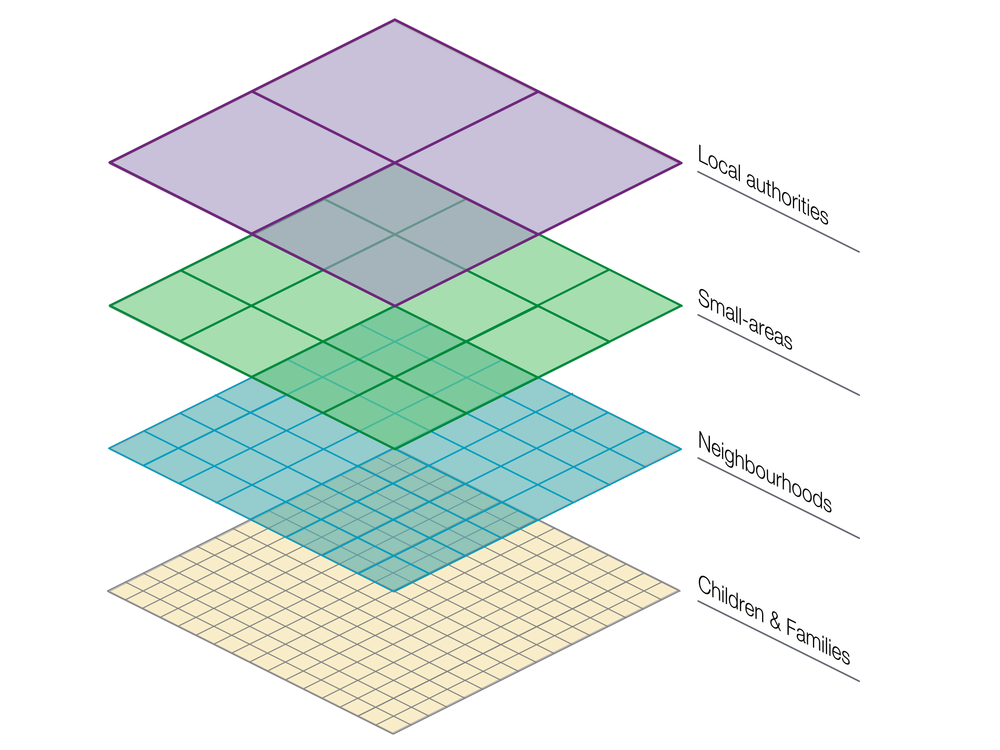
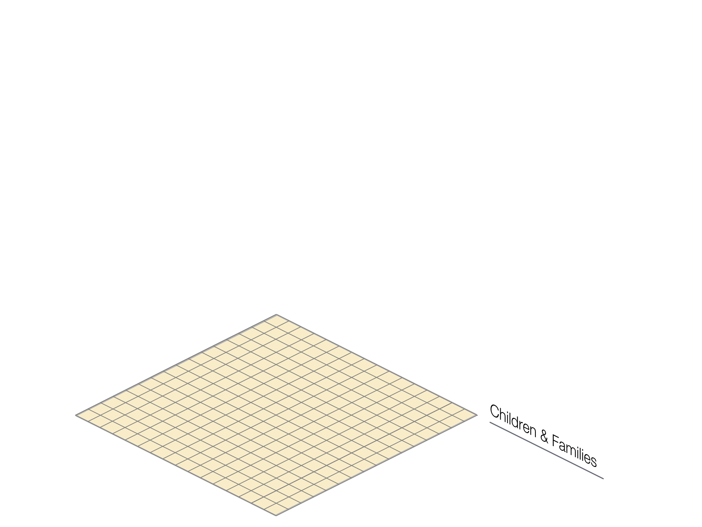
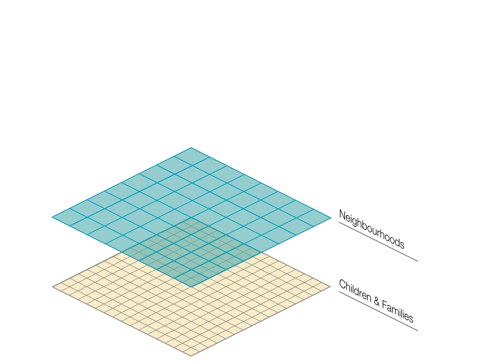
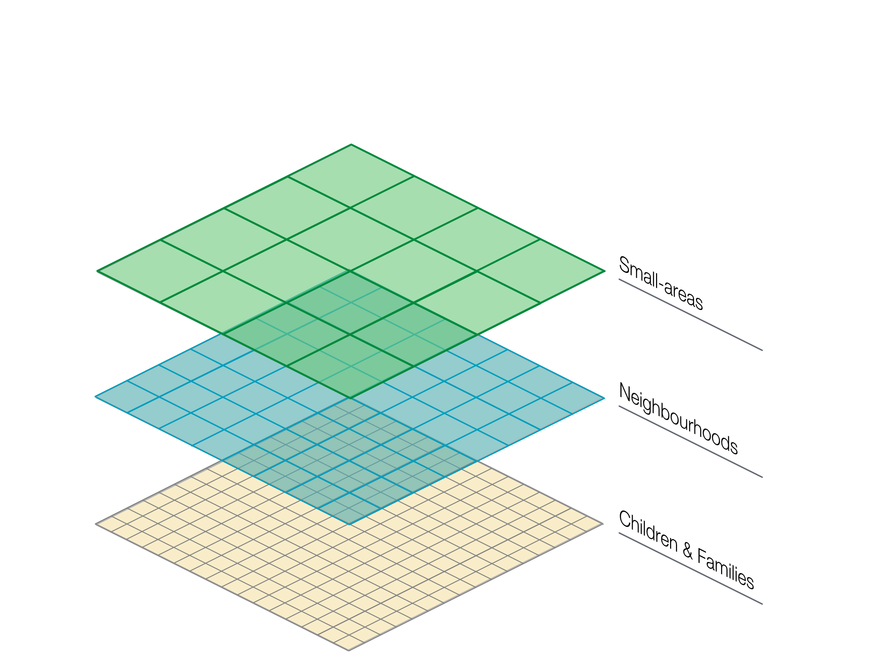
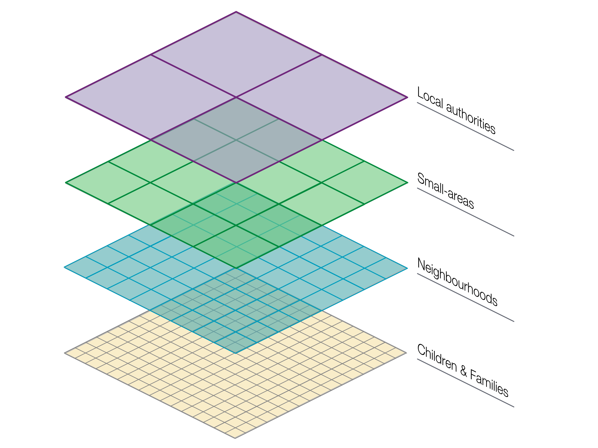
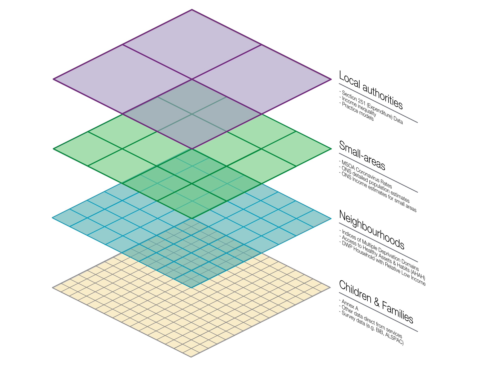
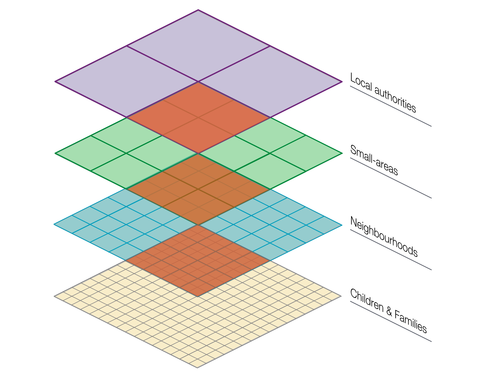
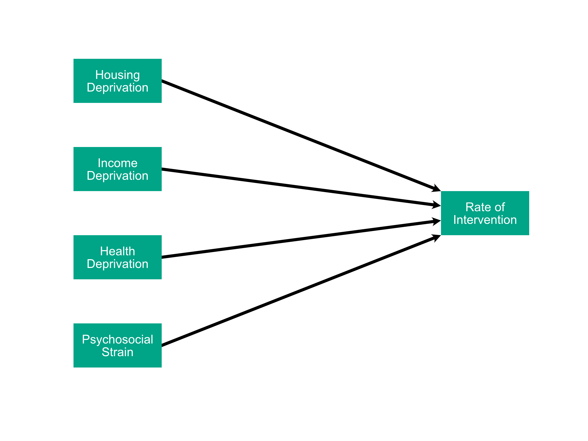
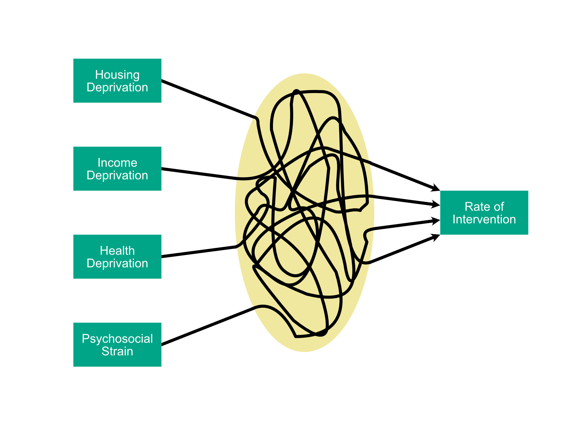
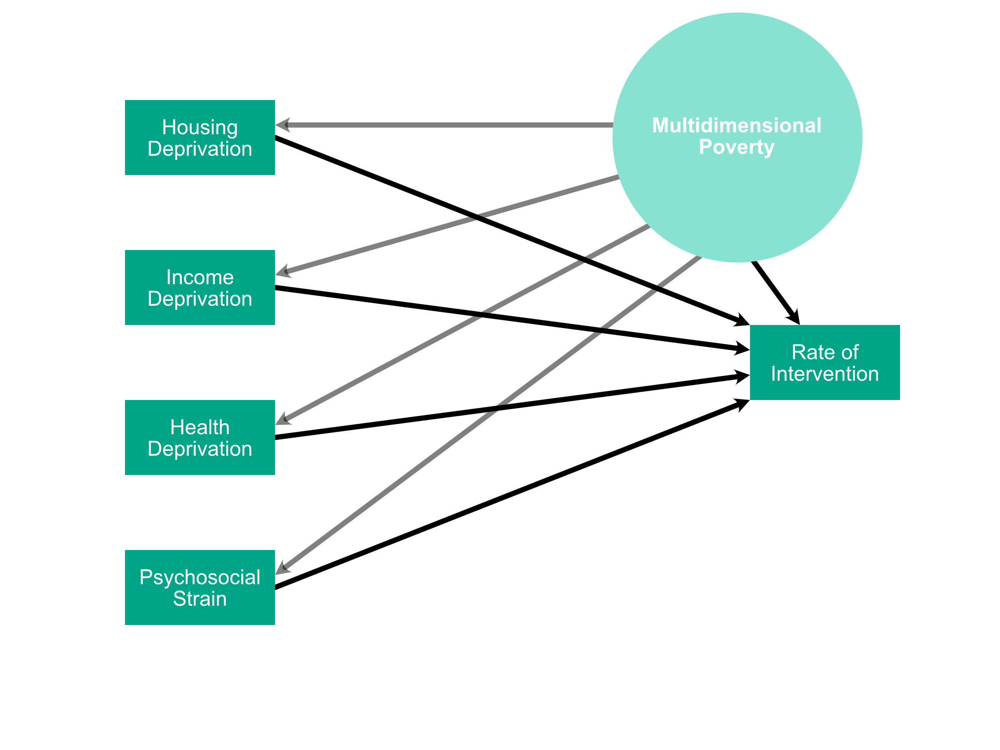

class: hide_logo, bottom
background-image: url(images/cwip_illustration4x3.png)
background-size: contain


```{r setup, include=FALSE}
library(xaringan)
library(xaringanthemer)
library(xaringanExtra)
library(tidyverse)
library(plotly)
options(htmltools.dir.version = FALSE)

knitr::opts_chunk$set(
  fig.width=9, fig.height=3.5, fig.retina=3,
  out.width = "100%",
  cache = FALSE,
  echo = TRUE,
  message = FALSE, 
  warning = FALSE,
  fig.show = TRUE,
  hiline = TRUE
)
```

```{css echo=FALSE}
.hide-count .remark-slide-number {
  display: none;
}

.center-left {
  position:          relative;
  top:               50%;
  transform:         translateY(50%);
}

.center-right {
  position:          relative;
  top:               50%;
  transform:         translateY(10%);
}

```


```{r xaringan-themer, include=FALSE, warning=FALSE}
library(xaringanthemer)
style_duo_accent(primary_color = "#00775A", secondary_color = "#F8C500",
                    header_font_google = google_font("Yanone Kaffeesatz", "300"),
                    text_font_google   = google_font("Noto Sans", "200"),
                    code_font_google   = google_font("IBM Plex Mono"),
                 colors = c(
                   white = "#FFFFFF",
                   black = "#000000",
                   yellow = "#F8C500"
                 ),
                 text_font_size = "1.25rem"
                 )
```

```{r, load_refs, include=FALSE, cache=FALSE}
library(RefManageR)
BibOptions(check.entries = FALSE,
           bib.style = "authoryear",
           cite.style = "alphabetic",
           style = "markdown",
           hyperlink = FALSE,
           dashed = FALSE)
bibliography <- ReadBib("/Users/calumwebb/Google Drive/Social Work Resources/data_resources/biblio.bib", check = FALSE)
```

<style>
div.footnotes {
  position: absolute;
  bottom: 0;
  margin-bottom: 10px;
  width: 80%;
  font-size: 0.6em;
}
</style>

<script src="https://ajax.googleapis.com/ajax/libs/jquery/3.1.1/jquery.min.js"></script>
<script>
$(document).ready(function() {
  $('slide:not(.backdrop):not(.title-slide)').append('<div class=\"footnotes\">');

  $('footnote').each(function(index) {
    var text  = $(this).html();
    var fnNum = (index+1).toString();
    $(this).html(fnNum.sup());

    var footnote   = fnNum + '. ' + text + '<br/>';
    var oldContent = $(this).parents('slide').children('div.footnotes').html();
    var newContent = oldContent + footnote;
    $(this).parents('slide').children('div.footnotes').html(newContent);
  });
});
</script>


## .inverse[.white[Building a data wafer and what you can use it for: integrating the CSC data with area-based measures of need.]]

### .inverse[.white[Dr. Calum Webb]]

.white[26th April 2021]

---

## Contents

* #### What data is available, and at what levels?

* #### Why area-level data isn't just the poor cousin of individual level data.

* #### Working with hierarchical data 1: hierarchical dependence.

* #### Working with hierarchical data 2: multicollinearity as theory not flaw.

???

I will do my best to keep this presentation brief while throwing quite a lot out there for people to discuss, and to get their imaginations going.

The first thing I want to address is what data is available and what a simplification of its hierarchy looks like.

After that, I want to address the status of area-level data in children's social care research.

Then, before skillfully leaving time for a Q&A, I want to very briefly and very simplistically introduce two common issues with merging different levels of data against the potential if these issues are overcome.


---

```{r, echo = FALSE}



```

???

This is my basic 'data wafer' model that I'll be working with, and I'll go through each layer one at a time. 


---

```{r, echo = FALSE}



```

???

The first and most obvious layer is children and family/household level data.


---

## Child & Family Level

Existing child and family level data, with the exception of data that can be augmented with longitudinal surveys, is highly inadequate for exploring many research questions. 

* __Annex A and CSC administrative data__
* __Data from the National Pupil Database (e.g. FSM)__
* __Individual level longitudinal data (e.g. ALSPAC, BiB)__
* __Local Authority linked data__

???

You will probably be quite familiar with this kind of data. 

You will also probably be aware of its limitations, not least in the range of variables that are included and the considerable ethical and practical barriers to merging individual level data.


---


```{r, echo = FALSE}



```

???

Secondly, there is what could be called 'neighbourhood' level data.

Good examples of neighbourhood level data might be postcodes or LSOAs.


---

## Neighbourhoods (e.g. LSOAs, postcodes)

The integration of neighbourhoods opens up far more possibilities for capturing links between family contexts/conditions and intervention rates.

* __All domains that make up the Indices of Multiple Deprivation__
  * Income deprivation
  * Housing deprivation
  * Education and Skills deprivation
* __Access to Healthy Assets and Hazards (AHAH) data__
  * Proximity to gambling outlets, fast food outlets, etc.
  * Access to local green and blue spaces
* __Journey Time Statistics__
  * Distance to job centres with large numbers of jobs by car/walking/public transport.
  * Distance to health care by car/walking/public transport.
* __DWP data on households in relative low income.__
* __Derived metrics (e.g. distance from children's centres, or binary recording of access to some services)__
* __CWIP App__

???

There is a surprising breadth of variables at LSOA level, many of them are calculated routinely or come from the census.

For example, you can look at all of the subdomains of the indices of multiple deprivation.

You can also draw on a large amount of health data that used to be published by Public Health England.

The CWIP App collates many of these LSOA level datasets.

Lastly, something less frequently done is the derivation of spatial features: e.g. whether an LSOA has an active children's centre in it or not. This may be possible with various web-scraping tools.


---

```{r, echo = FALSE}



```

---

## Small-areas (e.g. MSOAs, Wards)

Some variables are only available at MSOA level, either due to available sample size or sensitivity.

* __MSOA Coronavirus incidence rates__
* __ONS intersectional population estimates (e.g. age \* gender \* ethnicity \* disability)__
* __ONS Income Estimates for Small Areas__<sup>1</sup> .footnote[[<sup>1 </sup>Income Estimates Data](https://www.ons.gov.uk/employmentandlabourmarket/peopleinwork/earningsandworkinghours/datasets/smallareaincomeestimatesformiddlelayersuperoutputareasenglandandwales)]

???

There is not a huge amount of data available at what I've titled 'small-area' (MSOA) level, but it is worth including because often there is some data where MSOA-level is the only reasonable level for it to be released at (due to, e.g. concerns about privacy). 


---

```{r, echo = FALSE}



```

---


## Local Authority data

A large amount of data is made available at the LA level since it's so often of interest to public services and has very little risk of identifiability. However, a lot of non-education, non-children's services data uses Local Authority Disticts.

* __Expenditure on Services (S251)__
* __Income inequality estimates__ <sup>2</sup>
* __Practice models, frameworks, or innovation funds__
* __Council overall party political control__
* __CHLDRN: Childhood Local Data on Risks and Needs__
* __CWIP App__


.footnote[<sup>2</sup> http://alasdairrae.github.io/atlasofinequality/]


???

Lastly, there is local authority level data which hopefully doesn't require much explaining. 


---

```{r, echo = FALSE}



```

---

## Area-level data is not individual level data's poor cousin

* Area-level data is often used as a substitute for desired individual level data.

--

__However,__

--

* This ignores the fact that __place has a very real and tangible impact on our lives__, sometimes as much as individual/household circumstances. It can also moderate individual-level relationships between variables.

--

* There are __ethical and operational arguments__ for making better use of area-based data.

--

But we do need to use caution when mixing data at different levels.

---

## Working with hierarchical data 1: hierarchical dependence.

In most statistical analyses we assume independence of errors.


```{r, echo = FALSE}

tibble(
  rate = c(50, 53, 55, 57, 59, 40, 42, 46, 48, 49, 31, 32, 38, 39, 42, 43),
  depr = c( 1,  2,  3,  4,  5,  3,  4,  5,  6,  7,  5,  6,  7,  8,  9, 10),
  la =   c( 1,  1,  1,  1,  1,  2,  2,  2,  2,  2,  3,  3,  3,  3,  3,  3)
) %>%
  ggplot() +
  geom_point(aes(x = depr, y = rate), size = 4) +
  geom_smooth(aes(x = depr, y = rate), method = "lm", se = FALSE, col = "#008663") +
  theme_minimal() +
  ylab("Rate of Intervention") +
  xlab("Neighbourhood Deprivation Decile (10 = Most Deprived)") +
  theme(legend.position = "none")


```

---

## Working with hierarchical data 1: hierarchical dependence.

In most statistical analyses we assume independence of errors.


```{r, echo = FALSE}

tibble(
  rate = c(50, 53, 55, 57, 59, 40, 42, 46, 48, 49, 31, 32, 38, 39, 42, 43),
  depr = c( 1,  2,  3,  4,  5,  3,  4,  5,  6,  7,  5,  6,  7,  8,  9, 10),
  la =   as.factor(c( 1,  1,  1,  1,  1,  2,  2,  2,  2,  2,  3,  3,  3,  3,  3,  3)
)) %>%
  ggplot() +
  geom_point(aes(x = depr, y = rate, col = la), size = 4) +
  geom_smooth(aes(x = depr, y = rate, group = la, col = la), method = "lm", se = FALSE) +
  theme_minimal() +
  ylab("Rate of Intervention") +
  xlab("Neighbourhood Deprivation Decile (10 = Most Deprived)")+
  theme(legend.position = "none")


```

???

This is a case of Simpson's Paradox; group membership of the points was confounding the actual relationship at the lower level.


---

```{r, echo = FALSE}



```

???

Observations within the same larger group or unit will typically be more similar to one another than observations outside that group. 

Therefore, techniques like multilevel modelling should be used to address for hierarchical independence.

---

## Working with hierarchical data 2: multicolinearity as theory not flaw.

* A second common problem is the separation of effects at aggregate levels: __as you aggregate, variables become more closely associated__.

__However,__

* This assumes correlation at the aggregate level is purely a __flaw__, not a __feature.__

* In actuality, many theories in sociology (e.g. of poverty), __stress multidimensionality__.


---

### What you want to happen

```{r, echo = FALSE}



```

??? 

We want a nice clear estimate of each independent variable's effects


---

### What actually happens

```{r, echo = FALSE}



```

???

In reality, shared effects will be biased because of multicollinearity. 

This is often just highlighted as a point of caution and ignored.

---

### What you could do instead

```{r, echo = FALSE}



```

???

What we could do is recognise and model this multicollinearity as a latent factor (in this case, multidimensional poverty).

It makes sense that there is a lot of correlation among the independent variables as people with low incomes also tend to be trapped in poor housing conditions, have worse health (perhaps because of both) and more psychosocial strain, and these two things can contribute to them being kept in poor housing and income conditions. 

This is a real part of life, not measurement error. It can be modelled using methods like Structural Equation Modelling.

With appropriate theory, that there is an effect of multidimensional (compound) poverty/deprivation and potentially additive effects of residual housing, health, or income deprivation above the association with poverty.


---

## Conclusions

* Aggregate data can be an excellent, varied, and ethical resource for research if its structure and potential problems are well-understood. __It is not just a poor substitute for individual level data.__

--

* Modern statistical modelling methods like multilevel modelling can __address the hierarchical independence problems__ that come with mixing data at different levels.

--

* __Lack of independence between aggregate variables can be recast as a feature, not a flaw__, with appropriate theory and methods: is there a theoretical foundation for unmeasured constructs? If not - do you need to read more theory?


---
class: hide-count

## Some sources of neighbourhood and aggregate data:

* [NOMIS](https://www.nomisweb.co.uk): Labour Market Statistics
* [PHE Fingertips](https://fingertips.phe.org.uk/profile/health-profiles/data#page/9/gid/1938132696/pat/6/par/E12000001/ati/201/are/E06000047/iid/90366/age/1/sex/1/cid/4/tbm/1): Public health aggregate data
* [CWIP App Open Code & Data Repository](https://github.com/cjrwebb/cwip-app): Includes merged LA level CSC data over time for many key variables.
* [University of Liverpool Place-Based Longitudinal Data Resource](https://pldr.org)
* [ONS Data](https://www.ons.gov.uk/help/localstatistics): Warning: Can be a nightmare to locate what you want. Better googling it with ONS in the search terms.
* [UK Data Service - Data by Geography](https://www.ukdataservice.ac.uk/get-data/geography.aspx)
* [Consumer Data Resource Centre](https://data.cdrc.ac.uk)
* [London Datastore](https://data.london.gov.uk/dataset/)
* [Statistics.gov.scot](https://statistics.gov.scot/home)
* [Statistics Wales](https://statswales.gov.wales/Catalogue)
* [CHLDRN](https://www.childrenscommissioner.gov.uk/chldrn/), Children's Commissioner

> 'Tidy datasets are all alike; every messy dataset is messy in its own way.' Hadley Wickham

---
class: middle

## Any questions?

Contact: [c.j.webb@sheffield.ac.uk](mailto:c.j.webb@sheffield.ac.uk)