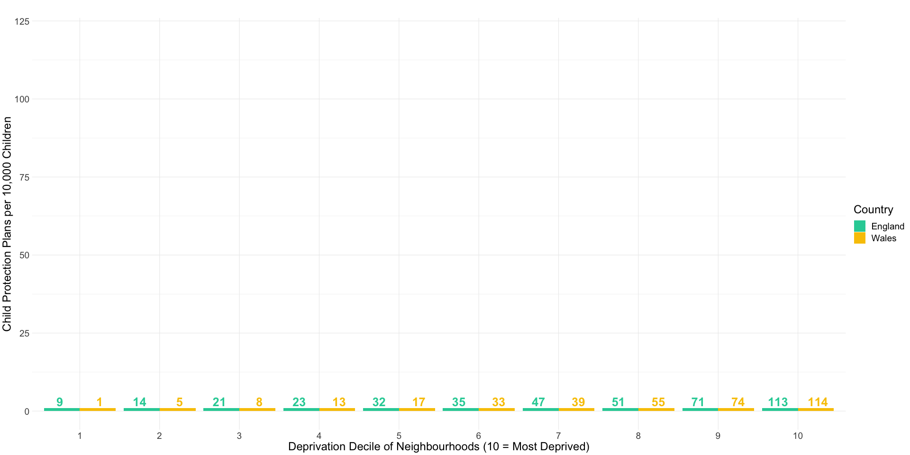
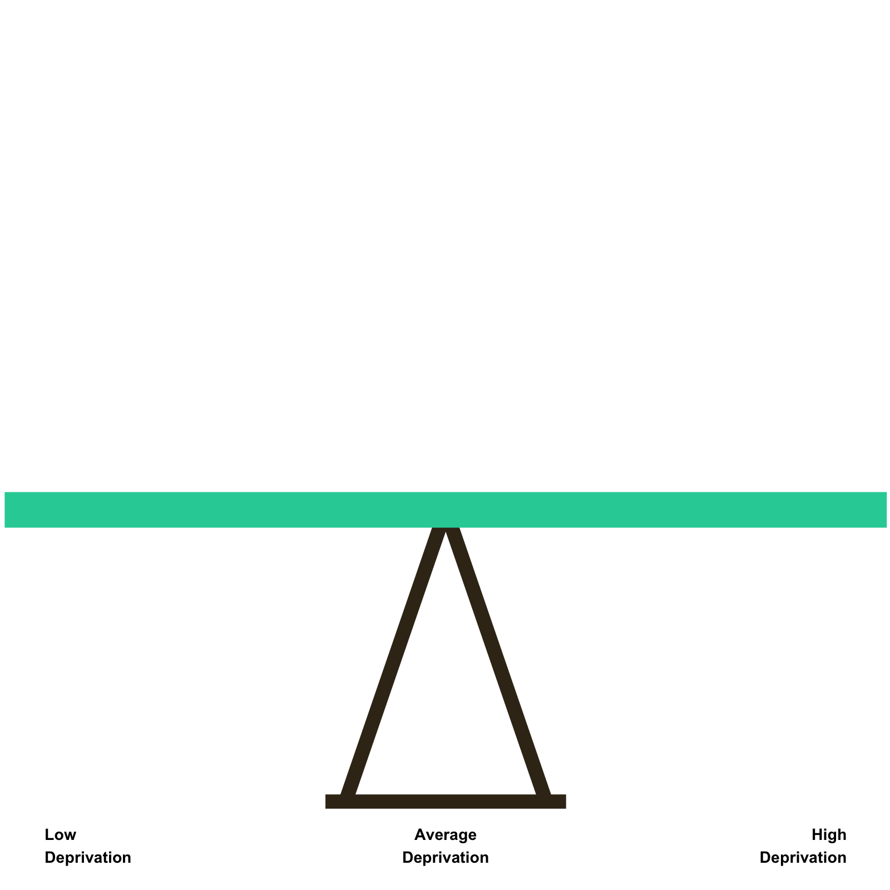
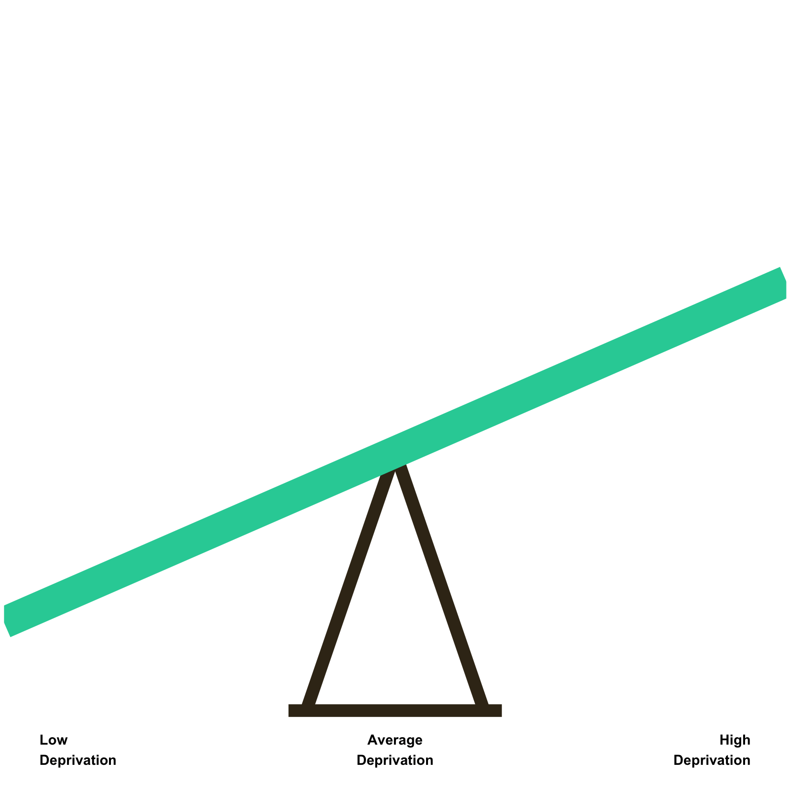
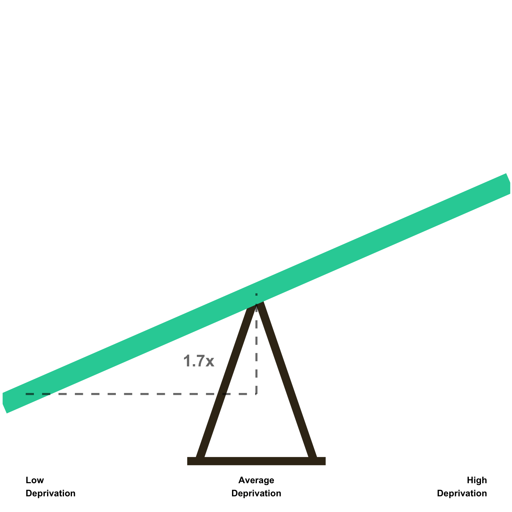
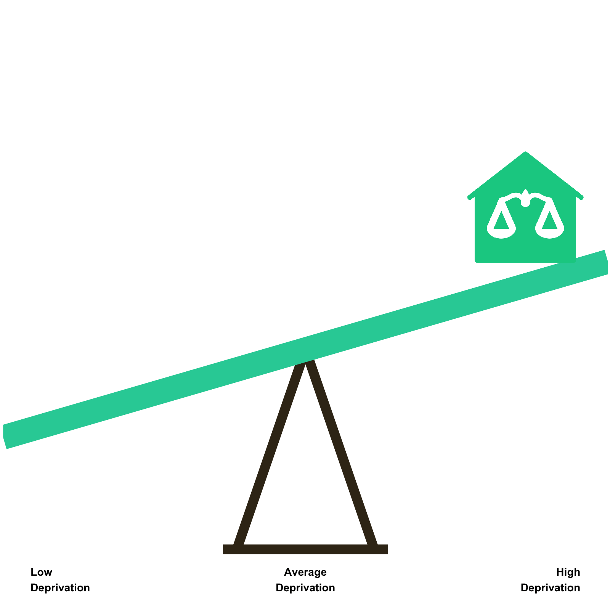

class: hide_logo, bottom
background-image: url(images/cbw-bg-wide.png)
background-size: contain


```{r setup, include=FALSE}
library(xaringan)
library(xaringanthemer)
library(xaringanExtra)
library(tidyverse)
library(plotly)
library(ggdark)
library(formattable)
library(data.table)
options(htmltools.dir.version = FALSE)
knitr::opts_chunk$set(warning = FALSE, message = FALSE) 
```

```{r xaringan-logo, echo=FALSE}
xaringanExtra::use_logo(
  image_url = "images/uni-sheffield.png",
  exclude_class = c("inverse", "hide_logo")
)
```

```{r xaringan-webcam, echo=FALSE}
xaringanExtra::use_webcam()
```

```{r xaringan-themer, include=FALSE, warning=FALSE}
library(xaringanthemer)
style_duo_accent(primary_color = "#26CFA5", secondary_color = "#000000",
                    header_font_google = google_font("Yanone Kaffeesatz", "300"),
                    text_font_google   = google_font("Noto Sans", "200"),
                    code_font_google   = google_font("IBM Plex Mono"),
                 colors = c(
                   white = "#FFFFFF",
                   black = "#000000",
                   yellow = "#F8C500",
                   green = "#1FA07E",
                   red = "#C81D39"
                 ),
                 text_font_size = "1.25rem",
                table_border_color = NA,
                table_row_border_color = NA,
                table_row_even_background_color = NA
                 )
```

```{r, load_refs, include=FALSE, cache=FALSE}
library(RefManageR)
BibOptions(check.entries = FALSE,
           bib.style = "authoryear",
           cite.style = "alphabetic",
           style = "markdown",
           hyperlink = FALSE,
           dashed = FALSE)
bibliography <- ReadBib("/Users/calumwebb/Google Drive/Social Work Resources/data_resources/biblio.bib", check = FALSE)
```

```{r xaringan-tile-view, echo=FALSE}
xaringanExtra::use_tile_view()
```

## .inverse[.white[CWIP: Inequalities in the Social Gradient]]

### .inverse[.white[Dr. Calum Webb]]

.inverse[.white[28th January 2021 | The University of Sheffield]]

---

# Contents

--

* A comparable way to measure and .green[test differences in the social gradient].

--

* The social gradient by .green[overall local authority deprivation] and .green[local income inequality]: the two IILs.

--

* The social gradient by .green[ethnic group population].

--

* Consequences for .green[policy] and .green[practice].


---

### Children in the poorest 10 per cent of neighbourhoods are more than 10 times as<br>likely to be living in care than children in the least poor 10 per cent of neighbourhoods. They are 12 times as likely to be on a child protection plan.


```{r bywaters2020child, fig.align="left", echo=FALSE, warning=FALSE, out.width="100%", out.height=420, fig.cap="Data from Bywaters, et al. <a href = https://pure.hud.ac.uk/en/publications/the-child-welfare-inequalities-project-final-report>2020</a>"}

cwi_rates <- tibble(depr = c(1, 2, 3, 4, 5, 6, 7, 8, 9, 10, 1, 2, 3, 4, 5, 6, 7, 8, 9, 10),
                    cpp = c(9, 14, 21, 23, 32, 35, 47, 51, 71, 113, 1, 5, 8, 13, 17, 33, 39, 55, 74, 114),
                    cla = c(12, 14, 23, 29, 29, 40, 55, 67, 88, 133, 7, 12, 16, 22, 31, 39, 54, 63, 108, 165),
                    country = c(rep("England", 10), rep("Wales", 10)))

cpp_plot <- cwi_rates %>%
  ggplot() +
  geom_bar(aes(x = as.factor(depr), y = cpp, group = country, fill = country, text = paste("CPP rate:", cpp, "per 10,000 -", country)), stat = "identity", position = "dodge") +
    geom_text(aes(x = as.factor(depr), y = cpp + 2, group = country,  label = cpp, colour = country), stat = "identity", position = position_dodge(width = 1), size = 4, fontface = "bold") +
  ggtitle(str_wrap("", 80)) +
  scale_fill_manual(values = c("#26CFA5", "#F8C500")) +
  scale_colour_manual(values = c("#26CFA5", "#F8C500")) +
  ylab("Child Protection Plans per 10,000 Children") +
  xlab("Deprivation Decile of Neighbourhoods (10 = Most Deprived)") +
  ggeasy::easy_add_legend_title("Country") +
  theme_minimal() +
  theme(plot.title = element_text(face = "bold"))

ratesplot <- ggplotly(cpp_plot, tooltip = "") %>% config(displayModeBar = F)

ratesplot

# widgetframe::frameWidget(ratesplot) #403 errors on deployment?

# 

```


---

class: middle

## We know, however, the size of this social gradient differs in different contexts and for different populations. Through 2019-2020, we developed a way to measure the social gradient as a single number and compare whether it was significantly different in different contexts or with different populations. 

---

# The Social Gradient

.pull-left[

```{r, echo = FALSE, out.width = 500, out.height = 500}



```

]

.pull-right[

The .green[social gradient] is a simple .green[measure of the size of socioeconomic inequalities in child welfare interventions]. You can think of it like a seesaw - .green[the stronger the social gradient is, the greater the vertical distance there is between the left and right sides of the seesaw]. 

]


---

# The Social Gradient

.pull-left[

```{r, echo = FALSE, out.width = 500, out.height = 500}


```

]

.pull-right[

The .green[social gradient] is a simple .green[measure of the size of socioeconomic inequalities in child welfare interventions]. You can think of it like a seesaw - .green[the stronger the social gradient is, the greater the vertical distance there is between the left and right sides of the seesaw]. 

In this case, the .green[left] of the seesaw represents .green[low deprivation neighbourhoods] and the .green[right] represents .green[high deprivation neighbourhoods] - with middle deprivation neighbourhoods in the middle. 

The steeper the incline of the seesaw, the more socioeconomic inequalities there are.

]


---

# The Social Gradient

.pull-left[

```{r, echo = FALSE, out.width = 500, out.height = 500}



```

]

.pull-right[

The .green[size of this incline or decline can be expressed in a single number] by measuring .green[how many times higher the height at the average deprivation level of the seesaw is than the height at the low-deprivation level of the seesaw].

On average, in neighbourhoods in a representative sample from England, the .green[size of the social gradient in children looked-after rates is 1.7]. 

]

---

# The Social Gradient

.pull-left[

```{r, echo = FALSE, out.width = 500, out.height = 500}


```

]

.pull-right[

The .green[size of this incline or decline can be expressed in a single number] by measuring .green[how many times higher the height at the average deprivation level of the seesaw is than the height at the low-deprivation level of the seesaw].

On average, in neighbourhoods in a representative sample from England, the .green[size of the social gradient in children looked-after rates is 1.7]. 

This means that we estimate that there are, on average, 1.7 times higher children looked after rates in your average middle-deprivation neighbourhood than there are in your average low deprivation neighbourhood.

]

---

# The Social Gradient

.pull-left[

```{r, echo = FALSE, out.width = 500, out.height = 500}



```

]

.pull-right[

This is a valuable way of simplifying the social gradient, because .green[it holds for every comparison of the same 'distance' in deprivation]. 

For example, we would also expect the rates of children looked-after in your average high deprivation neighbourhood to be 1.7 times higher than the average middle deprivation neighbourhood. 

]

---

# The Social Gradient

.pull-left[

```{r, echo = FALSE, out.width = 500, out.height = 500}


```

]

.pull-right[

This is a valuable way of simplifying the social gradient, because .green[it holds for every comparison of the same 'distance' in deprivation]. 

For example, we would also expect the rates of children looked-after in your average high deprivation neighbourhood to be 1.7 times higher than the average middle deprivation neighbourhood. 

We could extend even this further and would expect the rates in the most deprived 2.5% of neighbourhoods in the country to be 1.7 times higher than the rates of the high deprivation neighbourhood.

]

---

# The Social Gradient

.pull-left[

```{r, echo = FALSE, out.width = 500, out.height = 500}

knitr::include_graphics("images/seesaw_4.gif")

```

]

.pull-right[

Our research has been .green[exploring how the social gradient changes depending on different contexts]. 

This includes by .green[ethnic group population], by .green[overall LA deprivation], and by LA .green[income inequality] (Webb, et al. 2020a; 2020b). These different social contexts significantly change the size of the social gradient.

]

---

# The Social Gradient

.pull-left[

```{r, echo = FALSE, out.width = 500, out.height = 500}



```

]

.pull-right[

Our research has been .green[exploring how the social gradient changes depending on different contexts]. 

This includes by .green[ethnic group population], by .green[overall LA deprivation], and by LA .green[income inequality] (Webb, et al. 2020a; 2020b). These different social contexts significantly change the size of the social gradient.

.green[Low income-inequality local authorities have a significantly smaller social gradient of 1.4]; in low income-inequality local authorities there are fewer socioeconomic inequalities in children looked-after rates. 


]


---

## The Social Gradient by LA Deprivation & LA Income Inequality

<br><br>

```{r, echo=FALSE, width = "100%", fig.cap="Source: <a href='https://doi.org/10.1016/j.childyouth.2020.104849'>Webb, et al. 2020</a>"}

customGreen0 = "#DeF7E9"
customGreen = "#71CA97"
customRed = "#ff7f7f"

sg_1 <- tibble::tribble(
  ~`Intervention`, ~`Low Deprivation`, ~`High Deprivation`, ~`Low Income Inequality`, ~`High Income Inequality`,  
  "CIN", 1.672,           1.438,                  1.378,                   1.746,
  "CP", 1.846,          1.642,                  1.475,                   2.056,
  "CLA", 1.936,           1.489,                  1.435,                   2.009
  ) %>%
  data.table::as.data.table(.) 


  formattable(sg_1, align =c("l", "r", "r", "r", "r"),
            list(
              area(col = 2:5) ~ color_tile("transparent", customGreen))
            )


```

### Source: <a href='https://doi.org/10.1016/j.childyouth.2020.104849'>Webb, et al. 2020</a>

--

We call the first effect the .green['Inverse Intervention Law'] (Tudor-Hart, 1971) and the second the .green['Income Inequality Intervention Law'] (Webb, et al. 2020a). Together, the 'IILs'.


???

Table showing high vs low LA deprivation and high vs low LA income inequality

---

## The Social Gradient by LA Deprivation & LA Income Inequality


<br>

```{r, echo=FALSE, width = "100%", fig.cap="Source: <a href='https://doi.org/10.1016/j.childyouth.2020.104849'>Webb, et al. 2020</a>"}

customGreen0 = "#DeF7E9"
customGreen = "#71CA97"
customRed = "#ff7f7f"

sg_2 <- tibble::tribble(
  ~`Intervention`, ~`High Deprivation & High Income Inequality`, ~`Low Deprivation & High Income Inequality`, ~`High Deprivation & Low Income Inequality`, ~`Low Deprivation & Low Income Inequality`,
"CIN", 1.619, 1.882, 1.278, 1.486,
"CP", 1.939, 2.179, 1.391, 1.563,
"CLA", 1.762, 2.291, 1.258, 1.636)

  formattable(sg_2, align =c("l", "r", "r", "r", "r"),
            list(
              area(col = 2:5) ~ color_tile("transparent", customGreen))
            )


```

### Source: <a href='https://doi.org/10.1016/j.childyouth.2020.104849'>Webb, et al. 2020</a>

--

The size of the socioeconomic inequalities in low deprivation, high income inequality local authorities is around .green[5 times] the size of the socioeconomic inequalities in the high deprivation, low income inequality local authorities.


???

Table showing 2x2 interactions (high-high, low-low)

---

class: inverse

# The Social Gradient by Ethnic Population

--

.pull-left[

```{r ethsg_1, dev="svg", echo = FALSE, out.width = 450, out.height = 450, dpi = 350, fig.cap="Source: <a href='https://doi.org/10.1016/j.childyouth.2020.105299' style='color:white;text-decoration:underline'>Webb, et al. 2020</a>"}

intercept_white <- 3.737
slope_white <- 1.359
intercept_blafr <- 3.737 + 0.244
slope_blafr <- 1.359 + -1.23
x <- seq(-1, 1, 0.1)

line_white <- intercept_white + slope_white * x
line_blafr <- intercept_blafr + slope_blafr * x


ggplot() +
  geom_line(aes(x = x, y = exp(line_white)), size = 6, alpha = 0.8) +
  # geom_line(aes(x = x, y = exp(line_blafr)), size = 6, alpha = 0.8, col = "#7d7d83") +
  annotate("text", x = c(0, 1), y = exp(line_white[c(10, 21)]) * 0.8, label = round(exp(line_white[c(10, 21)]), 0), size = 6) +
  annotate("text", x = c(-1), y = exp(line_white[c(1)]) +15, label = round(exp(line_white[c(1)]), 0), size = 6) +
  # annotate("text", x = c(-1, 0, 1), y = exp(line_blafr[c(1, 10, 21)]) +15, label = round(exp(line_blafr[c(1, 10, 21)]), 0), size = 6, col = "#7d7d83") +
  annotate("text", x = 0, y = 150, hjust = 0, label = "White British", size = 8) +
  # annotate("text", x = 0.35, y = 25, hjust = 0, label = "Black African", size = 8, col = "#7d7d83") +
  annotate("text", x = c(-1, 0, 1), y = -15, hjust = c(0, 0.5, 1), label = c("Low\nDeprivation", "Middle\nDeprivation", "High\nDeprivation"), size = 6) +
  ylim(c(-20,180)) +
  ylab("Predicted MSOA CLA Rate") +
  xlab("") +
  dark_theme_minimal() +
  theme(axis.text = element_text(size = 20), axis.title = element_text(size = 24),
        panel.border = element_blank(), panel.background = element_rect(color = NA),
        plot.background = element_rect(fill = "black", colour = "black"),
        axis.text.x = element_blank())


```

]

.pull-right[

The social gradient for the .green[White British] MSOA child populations in the representative CWIP sample was .green[around 3.9] - much larger than the social gradient for the entire population on average.

]


---

class: inverse

# The Social Gradient by Ethnic Population

.pull-left[

```{r ethsg_2, dev="svg", echo = FALSE, out.width = 450, out.height = 450, dpi = 350, fig.cap="Source: <a href='https://doi.org/10.1016/j.childyouth.2020.105299' style='color:white;text-decoration:underline'>Webb, et al. 2020</a>"}

intercept_white <- 3.737
slope_white <- 1.359
intercept_blafr <- 3.737 + 0.244
slope_blafr <- 1.359 + -1.23
x <- seq(-1, 1, 0.1)

line_white <- intercept_white + slope_white * x
line_blafr <- intercept_blafr + slope_blafr * x


ggplot() +
  geom_line(aes(x = x, y = exp(line_white)), size = 6, alpha = 0.8) +
  geom_line(aes(x = x, y = exp(line_blafr)), size = 6, alpha = 0.8, col = "#7d7d83") +
  annotate("text", x = c(0, 1), y = exp(line_white[c(10, 21)]) * 0.8, label = round(exp(line_white[c(10, 21)]), 0), size = 6) +
  annotate("text", x = c(-1), y = exp(line_white[c(1)]) +15, label = round(exp(line_white[c(1)]), 0), size = 6) +
  annotate("text", x = c(-1, 0, 1), y = exp(line_blafr[c(1, 10, 21)]) +15, label = round(exp(line_blafr[c(1, 10, 21)]), 0), size = 6, col = "#7d7d83") +
  annotate("text", x = 0, y = 150, hjust = 0, label = "White British", size = 8) +
  annotate("text", x = 0.35, y = 25, hjust = 0, label = "Black African", size = 8, col = "#7d7d83") +
  annotate("text", x = c(-1, 0, 1), y = -15, hjust = c(0, 0.5, 1), label = c("Low\nDeprivation", "Middle\nDeprivation", "High\nDeprivation"), size = 6) +
  ylim(c(-20,180)) +
  ylab("Predicted MSOA CLA Rate") +
  xlab("") +
  dark_theme_minimal() +
  theme(axis.text = element_text(size = 20), axis.title = element_text(size = 24),
        panel.border = element_blank(), panel.background = element_rect(color = NA),
        plot.background = element_rect(fill = "black", colour = "black"),
        axis.text.x = element_blank())


```

]

.pull-right[

The social gradient for the .green[White British] MSOA child populations in the representative CWIP sample was .green[around 3.9] - much larger than the social gradient for the entire population on average.

By contrast, the social gradient for the .green[Black African] MSOA child populations was .green[around 1.14], which was not statistically significant. This means that the .green[intervention rates did not differ significantly as deprivation increased].

]

---

class: inverse

# The Social Gradient by Ethnic Population

.pull-left[

```{r ethsg_3, dev="svg", echo = FALSE, out.width = 450, out.height = 450, dpi = 350, fig.cap="Source: <a href='https://doi.org/10.1016/j.childyouth.2020.105299' style='color:white;text-decoration:underline'>Webb, et al. 2020</a>"}

intercept_white <- 3.737
slope_white <- 1.359
intercept_blafr <- 3.737 + 0.244
slope_blafr <- 1.359 + -1.23
x <- seq(-1, 1, 0.1)

line_white <- intercept_white + slope_white * x
line_blafr <- intercept_blafr + slope_blafr * x


ggplot() +
  geom_segment(aes(x = -0.95, xend = -0.95, y = exp(line_blafr[1]) - 5, yend = exp(line_white[1]) + 5), col = "white", size = 1, fill = "white", lty =2) +
  geom_segment(aes(x = 0.95, xend = 0.95, y = exp(line_blafr[21]) + 5, yend = exp(line_white[21]) - 20), col = "white", size = 1, fill = "white", lty =2) +
  geom_line(aes(x = x, y = exp(line_white)), size = 6, alpha = 0.8) +
  geom_line(aes(x = x, y = exp(line_blafr)), size = 6, alpha = 0.8, col = "#7d7d83") +
  # annotate("text", x = c(0, 1), y = exp(line_white[c(10, 21)]) * 0.8, label = round(exp(line_white[c(10, 21)]), 0), size = 6) +
  # annotate("text", x = c(-1), y = exp(line_white[c(1)]) +15, label = round(exp(line_white[c(1)]), 0), size = 6) +
  # annotate("text", x = c(-1, 0, 1), y = exp(line_blafr[c(1, 10, 21)]) +15, label = round(exp(line_blafr[c(1, 10, 21)]), 0), size = 6, col = "#7d7d83") +
  annotate("text", x = 0, y = 150, hjust = 0, label = "White British", size = 8) +
  annotate("text", x = 0.35, y = 25, hjust = 0, label = "Black African", size = 8, col = "#7d7d83") +
  annotate("text", x = c(-1, 0, 1), y = -15, hjust = c(0, 0.5, 1), label = c("Low\nDeprivation", "Middle\nDeprivation", "High\nDeprivation"), size = 6) +
  annotate("text", x = -0.85, y = 30, label = '"4"*phantom(":1")', parse = T, col = "#7d7d83", size = 6) + 
  annotate("text", x = -0.85, y = 30, label = 'phantom("4")*":1"', parse = T, col = "white", size = 6) + 
    annotate("text", x = 0.8, y = 85, label = '"2.7"*phantom(":1")', parse = T, col = "white", size = 6) + 
  annotate("text", x = 0.8, y = 85, label = 'phantom("2.7")*":1"', parse = T, col = "#7d7d83", size = 6) + 
  ylim(c(-20,180)) +
  ylab("Predicted MSOA CLA Rate") +
  xlab("") +
  dark_theme_minimal() +
  theme(axis.text = element_text(size = 20), axis.title = element_text(size = 24),
        panel.border = element_blank(), panel.background = element_rect(color = NA),
        plot.background = element_rect(fill = "black", colour = "black"),
        axis.text.x = element_blank())


```

]

.pull-right[

The social gradient for the .green[White British] MSOA child populations in the representative CWIP sample was .green[around 3.9] - much larger than the social gradient for the entire population on average.

By contrast, the social gradient for the .green[Black African] MSOA child populations was .green[around 1.14], which was not statistically significant. This means that the .green[intervention rates did not differ significantly as deprivation increased].

In .green[low deprivation] MSOAs, .green[Black African] children's care rates outnumber .green[White British] children's by .green[4 to 1]. In .green[high deprivation] MSOAs, .green[White British] children's care rates outnumber .green[Black African] children's care rates by nearly .green[3 to 1].

]

---

class: inverse

# The Social Gradient by Ethnic Population

.pull-left[

```{r ethsg_3.3, dev="svg", echo = FALSE, out.width = 450, out.height = 450, dpi = 350, fig.cap="Source: <a href='https://doi.org/10.1016/j.childyouth.2020.105299' style='color:white;text-decoration:underline'>Webb, et al. 2020</a>"}

intercept_white <- 3.737
slope_white <- 1.359
intercept_mh <- 3.737 + 0.965
slope_mh <- 1.359 + -0.352
x <- seq(-1, 1, 0.1)

line_white <- intercept_white + slope_white * x
line_mh <- intercept_mh + slope_mh * x


ggplot() +
  geom_segment(aes(x = -0.95, xend = -0.95, y = exp(line_mh[1]) - 5, yend = exp(line_white[1]) + 5), col = "white", size = 1, fill = "white", lty =2) +
  geom_segment(aes(x = 0.95, xend = 0.95, y = exp(line_mh[21]) - 40, yend = exp(line_white[21]) + 20), col = "white", size = 1, fill = "white", lty =2) +
  geom_line(aes(x = x, y = exp(line_white)), size = 6, alpha = 0.8) +
  geom_line(aes(x = x, y = exp(line_mh)), size = 6, alpha = 0.8, col = "#C81D39") +
  annotate("text", x = c(0, 1), y = exp(line_white[c(10, 21)]) * 0.7, label = round(exp(line_white[c(10, 21)]), 0), size = 6) +
  annotate("text", x = c(-1.05), y = exp(line_white[c(1)]), label = round(exp(line_white[c(1)]), 0), size = 6) +
  annotate("text", x = c(-1, 0, 1), y = exp(line_mh[c(1, 10, 21)]) + 35, label = round(exp(line_mh[c(1, 10, 21)]), 0), size = 6, col = "#C81D39") +
  annotate("text", x = 0.35, y = 40, hjust = 0, label = "White British", size = 8) +
  annotate("text", x = -0.5, y = 250, hjust = 0, label = "Mixed Heritage (Other)", size = 8, col = "#C81D39") +
  annotate("text", x = c(-1, 0, 1), y = -15, hjust = c(0, 0.5, 1), label = c("Low\nDeprivation", "Middle\nDeprivation", "High\nDeprivation"), size = 6) +
  # annotate("text", x = -0.85, y = 30, label = '"4"*phantom(":1")', parse = T, col = "#C81D39", size = 6) +
  # annotate("text", x = -0.85, y = 30, label = 'phantom("4")*":1"', parse = T, col = "white", size = 6) +
  #   annotate("text", x = 0.8, y = 85, label = '"2.7"*phantom(":1")', parse = T, col = "white", size = 6) +
  # annotate("text", x = 0.8, y = 85, label = 'phantom("2.7")*":1"', parse = T, col = "#C81D39", size = 6) +
  ylim(c(-20,350)) +
  ylab("Predicted MSOA CLA Rate") +
  xlab("") +
  dark_theme_minimal() +
  theme(axis.text = element_text(size = 20), axis.title = element_text(size = 24),
        panel.border = element_blank(), panel.background = element_rect(color = NA),
        plot.background = element_rect(fill = "black", colour = "black"),
        axis.text.x = element_blank())


```

]

.pull-right[

The last slide I want to show in this level of granularity is about the .red['Mixed Heritage (Other)' child population].

Across the spectrum of deprivation, the 'Mixed Heritage (Other)' population has .red[significantly higher rates of being in care], and a .red[significant social gradient]. They face the sharp end of the racial inequalities and socioeconomic inequalities we see in child welfare interventions.

Mixed Heritage people are the .red[fastest growing ethnic population in the UK]. Yet our analyses rarely consider the inequalities they face - .red[they are often excluded] from analyses because the category is so broad.

]

---

## Social Gradients in CLA rates for 11 English Ethnic Groups

```{r, echo=FALSE, width = "100%", fig.cap="Source: <a href='https://doi.org/10.1016/j.childyouth.2020.105299'>Webb, et al. 2020</a>"}

customGreen0 = "#DeF7E9"
customGreen = "#71CA97"
customRed = "#ff7f7f"

sg_data <- tibble::tribble(
                    ~eth_group, ~social_gradient, ~sig, ~diff_to_wb,
                  "White British",             3.89,   "Yes",                  "-",
              "Asian Bangladeshi",             1.01,    "No",                "Yes",
                   "Asian Indian",             1.13,    "No",                "Yes",
                "Asian Pakistani",             2.22,   "Yes",                 "No",
                  "Black African",             1.14,    "No",                "Yes",
                "Black Caribbean",             1.88,   "Yes",                "Yes",
                    "Black Other",             0.96,    "No",                "Yes",
                    "Mixed Other",             2.74,   "Yes",                 "No",
            "Mixed White & Asian",                3,   "Yes",                 "No",
    "Mixed White & Black African",             1.63,    "No",                "Yes",
  "Mixed White & Black Caribbean",             2.08,   "Yes",                "Yes"
  ) %>%
  rename(`Ethnic Group` = eth_group, `Social Gradient` = social_gradient,
         `Significant?` = sig, `Sig. Diff to W.B.` = diff_to_wb) %>%
  data.table::as.data.table(.)

formattable(sg_data, align =c("l", "r", "r", "r"),
            list(
              `Social Gradient` = color_tile("transparent", customGreen))
            )


```


???
Table of all social gradients

---

# Consequences for Policy and Practice

--

* There is a .green[crisis in socioeconomic and racial justice regarding the children's social care system]; the scale of the socioeconomic and intersectional inequalities, especially when they compound with larger structural contexts, is enormous, not well recognised, and not well understood.

--

* The IILs show that the response to .green[addressing child welfare inequalities must include national government]. Local income inequality and overall local authority deprivation are often the consequences of national policies. This is especially important considering the devolution of government.

--

* The analyses show that .green[anti-racist and anti-poverty social work policies and practice risk being unproductive or counterproductive for achieving justice if not pursued through an intersectional approach].

--

* The .green[data infrastructure for children's services, and factors like local income inequality, is poor; especially relative to other countries]. This greatly limits the depth of intersections we can analyse and should be a priority.


???

Consequences for policy and practice: we need to approach a new understanding of mechanisms using an intersectional approach


---

## References

```{r citations, include=FALSE}

RefManageR::NoCite(bibliography, c(
  "bywaters2018paradoxical",
  "bywaters2020child",
  "webb2020untangling",
  "webb2020cuts",
  "hart1971inverse"))

```

```{r refs, echo=FALSE, results="asis"}
PrintBibliography(bibliography, start = 1, end = 5)
```

---

class: hide_logo, bottom
background-image: url(images/cbw-bg-wide.png)
background-size: contain

### .inverse[.white[Dr. Calum Webb | c.j.webb@sheffield.ac.uk]]

.inverse[.white[28th January 2021 | The University of Sheffield]]