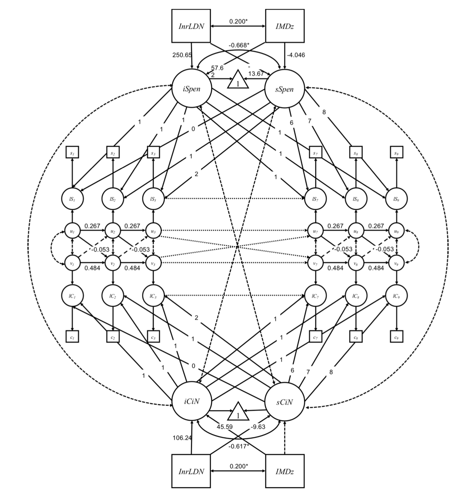
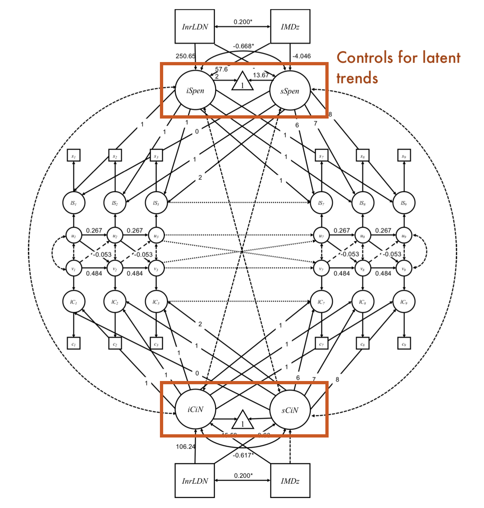
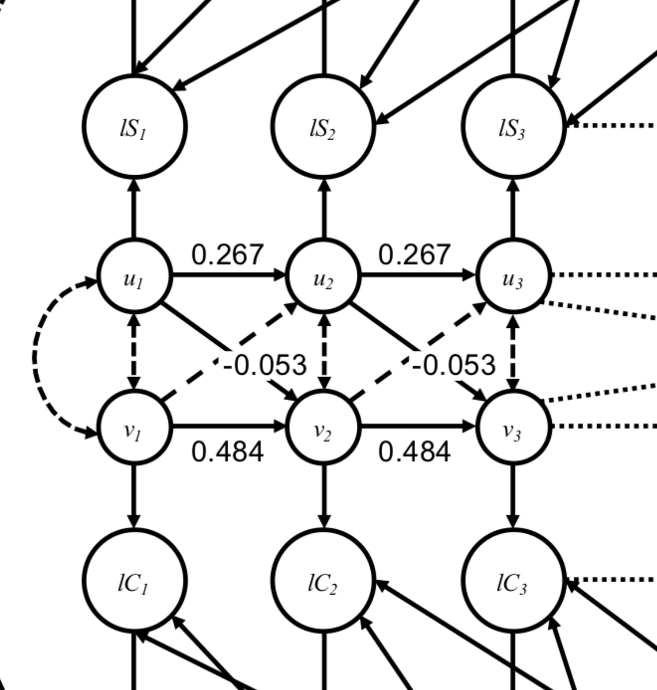

class: hide_logo, bottom
background-image: url(images/oh_bg.png)
background-size: contain


```{r setup, include=FALSE}
library(xaringan)
library(xaringanthemer)
library(xaringanExtra)
library(tidyverse)
library(plotly)
options(htmltools.dir.version = FALSE)
knitr::opts_chunk$set(warning = FALSE, message = FALSE) 
```

```{r xaringan-logo, echo=FALSE}
xaringanExtra::use_logo(
  image_url = "images/uni-sheffield.png",
  exclude_class = c("inverse", "hide_logo")
)
```

```{r xaringan-webcam, echo=FALSE}
xaringanExtra::use_webcam()
```

```{r xaringan-themer, include=FALSE, warning=FALSE}
library(xaringanthemer)
style_duo_accent(primary_color = "#EB5047", secondary_color = "#B14D4D",
                    header_font_google = google_font("Yanone Kaffeesatz", "300"),
                    text_font_google   = google_font("Noto Sans", "200"),
                    code_font_google   = google_font("IBM Plex Mono"),
                 colors = c(
                   white = "#FFFFFF",
                   black = "#000000",
                   yellow = "#F8C500",
                   green = "#1FA07E"
                 ),
                 text_font_size = "1.25rem",
                table_border_color = NA,
                table_row_border_color = NA,
                table_row_even_background_color = NA
                 )
```

```{r, load_refs, include=FALSE, cache=FALSE}
library(RefManageR)
BibOptions(check.entries = FALSE,
           bib.style = "authoryear",
           cite.style = "alphabetic",
           style = "markdown",
           hyperlink = FALSE,
           dashed = FALSE)
bibliography <- ReadBib("/Users/calumwebb/Google Drive/Social Work Resources/data_resources/biblio.bib", check = FALSE)
```

## .inverse[.white[In Defence of Ordinary Help: Local Authority Spending and Children in Need]]

### .inverse[.white[Dr. Calum Webb]]

.inverse[.white[8th December 2020]]

.inverse[.white[The University of Sheffield]]

---

background-image: url(images/slide-bg-1.svg)
background-size: contain

# Contents

- **Data & Findings**: Higher spending on preventative services is associated with significant reductions in Children in Need rates.

--

- **Why does this differ from the NAO and Ofsted's analyses and how does it square with what we see in the data?** An explanation of how ALT-SR models control for latent trends and statistical validity.

--

- **In Defence of Ordinary Help**. Rethinking how evidence is used in commissioning and the argument for ecosystems of support. (We're doing it all backwards!)

--

- **Where next** for this research and methodology?


---

background-image: url(images/slide-bg-1.svg)
background-size: contain

# Data

--

* **Section 251 Returns**: Preventative services spending encompassed all spending that was not associated with safeguarding (statutory social work and children's safeguarding boards) or children looked-after; per child in the population. (Hold your criticisms of S251 for a moment! They will be addressed.)

--

* **Children in Need** at March 31st rate per 10,000 children from the Children in Need Census.

--

* **Controls** for Indices of Multiple Deprivation score and whether the LA is in the Inner London region.

--

* All variables at **local authority** level.

---

background-image: url(images/slide-bg-1.svg)
background-size: contain

# Findings

> ## **For every £20 increase in preventative spending in a previous year, there was an average reduction of 1.06 per 10,000 in Children in Need rates the following year within local authorities - holding all else constant.**


---

background-image: url(images/slide-bg-2.svg)
background-size: contain

# Putting £20 and 1.06 in context

```{r spending_plot, echo=FALSE, warnings=FALSE, out.width="100%", out.height="380", fig.cap="Data from <a href=https://www.gov.uk/government/collections/section-251-materials>S251 Outturns, DfE 2011-2020</a>."}

spend_plot <- readr::read_rds("csc_data_spend_imd.rds") %>%
  pivot_wider(names_from = "description", values_from = "value") %>%
  janitor::clean_names() %>%
  dplyr::rename(exp_cla = 4, exp_sg = 5, exp_eh = 6, pop = 7, imd = 8) %>%
  mutate(exp_cla = (exp_cla*100000) / pop,
         imd_tertile = as.factor(dplyr::ntile(x = imd, n = 3))) %>% # 3 = most deprived
  group_by(imd_tertile, year) %>%
  summarise_at(vars(exp_cla:exp_eh), ~round(median(., na.rm = TRUE), 1)) %>%
  ungroup() %>%
  pivot_longer(cols = exp_cla:exp_eh, names_to = "spending", values_to = "value_per_child") %>%
  mutate(spending = case_when(spending == "exp_cla" ~ "Looked-after", 
                              spending == "exp_sg" ~ "Safeguarding",
                              spending == "exp_eh" ~ "Early Help etc.") %>% 
           fct_relevel(., c("Looked-after", "Early Help etc.", "Safeguarding")),
         imd_tertile = fct_recode(imd_tertile, "Least Deprived 50 LAs" = "1", "Average 50 LAs" = "2", "Most Deprived 50 LAs" = "3")) %>%
  ggplot() +
  geom_area(aes(x = year, y = value_per_child, fill = spending)) +
  geom_text(data = . %>% filter(spending == "Early Help etc." & year %in% c(2011, 2013, 2015, 2017, 2019)), 
            aes(x = year+0.1, y = value_per_child+15, label = round(value_per_child,0)), size = 2.5) +
  geom_line(data = . %>% filter(spending == "Early Help etc." & year %in% c(2011, 2013, 2015, 2017, 2019)), 
            aes(x = year, y = value_per_child), size = 0.2, alpha = 0.8) +
  facet_wrap(vars(imd_tertile)) +
  ggeasy::easy_add_legend_title("\n\nSpending\nCategory") +
  ggplot2::theme_minimal() +
  scale_xaringan_fill_discrete() +
  xlab("") +
  ylab("Median Spending per Child") +
  scale_x_continuous(breaks = seq(2011, 2019, 2)) +
  theme(axis.text.x = element_text(angle = 45))

spend_plot <- ggplotly(spend_plot, tooltip = "") %>% config(displayModeBar = F)

spend_plot

```

---

background-image: url(images/slide-bg-2.svg)
background-size: contain

# If austerity never happened?

```{r auster_plot, echo=FALSE, warnings=FALSE, out.width="100%", out.height="375", fig.cap="What would we predict the lagged effect of each cut to<br>preventative services from a 2010/11 base (left) to be on<br>average LA CIN rates (right)? If spending had stayed the <br>same, we'd expect to have seen <b>21% fewer CIN in 2019</b>."}

auster_plot <- tibble::tribble(
        ~year, ~prev_spend, ~change_from2010spend, ~pred_cin_change,
    "2010-2011",483.6,0,0,
    "2011-2012",383.6,-100.4,5.3,
    "2012-2013",354.5,-129.5,6.9,
    "2013-2014",330,-154,8.2,
    "2014-2015",309.3,-174.7,9.3,
    "2015-2016",277.6,-206.4,10.9,
    "2016-2017",251.1,-232.9,12.3,
    "2017-2018",249.2,-234.8,12.4,
    "2018-2019",239,-245,13
  ) %>%
  mutate(change_from2010spend = change_from2010spend/10) %>%
  pivot_longer(cols = c(change_from2010spend, pred_cin_change), names_to = "measure") %>%
  mutate(hjust = ifelse(value > 0, 1, 0)) %>%
  ggplot() +
  geom_bar(aes(y = year, x = value, group = measure, fill = measure), stat = "identity") +
  geom_text(aes(y = year, x = ifelse(value < 0, value + 2, value - 2), label = ifelse(value < 0, value * 10, value), hjust = hjust), col = "white") +
  annotate(geom = "text", y = c("2018-2019", "2018-2019"), x = c(-11, 5.5), label = c("Difference vs. 2010/11 Spend per Child", "Expected CIN Lag"), col = "white") +
  theme_minimal() +
  xlab("") +
  ylab("") +
  scale_fill_manual(values = c("#DA5C4F", "#FFB200")) +
  ggeasy::easy_remove_legend() +
  theme(axis.ticks = element_blank(), axis.text.x = element_blank(), panel.grid = element_blank(),
        axis.text.y = element_text(size = 12))

auster_plot <- ggplotly(auster_plot, tooltip = "") %>% config(displayModeBar = F)

auster_plot


```

---

background-image: url(images/slide-bg-3.svg)
background-size: contain

# Incompatible with NAO and Ofsted's<br>Findings

> “Our inspectors have seen this across the country and we now know that: **Inadequacy is not a function of size, deprivation or funding**, but of the quality of leadership and management.”

.right[Michael Wilshaw, Ofsted, 2016: 5, quoted in Lavalette, 2019: 28]

At a population level, analyses by the National Audit Office (NAO, 2016, 2019) and Ofsted (2016) reported there was **no relationship between expenditure on children’s services and Ofsted ratings or intervention** (usually Child Protection Plans).


---

background-image: url(images/slide-bg-2.svg)
background-size: contain

# Does not seem to match what we see<br>in the national averages

```{r average_plot, echo=FALSE, warnings=FALSE, out.width="100%", out.height="325", fig.cap="The average rate of Children in Need in local authorities has<br>been relatively stable, despite large decreases in<br>preventative spending"}
average_plot <- tibble::tibble( 
cin_rate = c(369, 353, 359, 370, 363, 363, 356, 365, 361),
year = c(2011, 2012, 2013, 2014, 2015, 2016, 2017, 2018, 2019),
prev_spend = c(483.6, 383.6, 354.5, 330.0, 309.3, 277.6, 251.1, 249.2, 239.0)
) %>%
  ggplot() +
  geom_line(aes(x = year, y = prev_spend), col = "#4D9D80", size = 3) +
  geom_line(aes(x = year, y = cin_rate), col = "#DF5B2B", size = 3) +
  annotate("text", x = 2017, y = 390, label = "Children in Need Rate", col = "#DF5B2B", size = 6) +
  annotate("text", x = 2015, y = 250, label = "EH/FS Spending", col = "#4D9D80", size = 6) +
  scale_x_continuous(breaks = seq(2011, 2019, 2)) +
  theme(axis.text.x = element_text(angle = 45)) +
  ylab("") +
  xlab("") +
  theme_minimal()

average_plot <- ggplotly(average_plot, tooltip = "") %>% config(displayModeBar = F)

average_plot


```

---

background-image: url(images/slide-bg-3.svg)
background-size: contain

# It's methodological

> Imagine you are a clinical psychologist researching the relationship between heavy drinking and mental wellbeing in men over a period of a period of ten years. What methodological problems would you come across?

--

* Heavy drinking will **mean something different for each participant**, relative to how much they usually drink but also linked to systemic, measurable factors (such as body mass).

--

* Mental wellbeing will often **be on a certain trajectory** depending on someone's ageing over the study period. If all of the participants are 18 at the start of the study there is likely to be a general slow increase in<br>mental wellbeing as they age (up to a point).

--

* This **makes comparative inference difficult**.

---

background-image: url(images/slide-bg-3.svg)
background-size: contain

# The ALT-SR Model

Curran, et al. (2014) were faced with basically this same problem and developed a method to address these confounding factors (Autoregression Latent Trajectory Models with Structured Residuals). **Traditional statistical models rely on being able to compare relationships between variables associated with different cases** (e.g. "Do people with high values of X also have high values of Y?"). 

--

We use this inference to infer that X is related to Y - but **really we are assuming that this case comparison holds for what happens within individual people when variables change** (e.g. if X increased for Jane Doe, we would expect Y to also increase, because John Doe had high X and Y). This is usually a sensible extrapolation. 

--

However, this only makes sense if, say, high values of X means the<br>same thing to Person A as it means to Person B. As with heavy<br>drinking, this is often not true. It also only makes sense if we can<br>seperate general upwards or downwards trends from changes above<br>or below the expected trend.

---

background-image: url(images/slide-bg-3.svg)
background-size: contain

# How do we usually analyse CS data?

Most analyses of children's services data also **rely on this extrapolation being sensible**: e.g. LAs with high levels of X also have high levels of Y, and therefore X and Y are related.

--

> Under Section 17 Children Act 1989, a child will be considered in need if:
>* they are unlikely to achieve or maintain or to have the opportunity to achieve or maintain a reasonable standard of health or development without provision of services from the Local Authority;
* their health or development is likely to be significantly<br>impaired, or further impaired, without the provision of<br>services from the Local Authority;
* they have a disability.

--

We know that this is **interpreted differently in LAs through** <br> **thresholds, and rationing** (Broadhurst, et al. 2010, Devaney, 2019).

---

background-image: url(images/all_trends-bg.png)
background-size: contain

# How do we usually analyse CS data?

We also know that the **vast majority of LAs have had a downward trajectory in their Early Help and Family Support spending**, and that this is systematically linked to deprivation (Webb & Bywaters, 2018). **This makes any analyses of lagged effects unreliable**.

```{r trend_plot_1, echo=FALSE, warnings=FALSE, out.width="80%", out.height="400", dpi = 300}
# all_trends <- readr::read_rds("csc_data_spend_imd.rds") %>%
#   pivot_wider(names_from = "description", values_from = "value") %>%
#   janitor::clean_names() %>%
#   dplyr::rename(exp_cla = 4, exp_sg = 5, exp_eh = 6, pop = 7, imd = 8) %>%
#   ggplot() +
#   stat_smooth(geom = "line", aes(x = year, y = exp_eh, group = new_la_code), col = "#FED05C", se = FALSE, alpha = 0.5) +
#   ylab("") +
#   xlab("") +
#   theme_minimal() +
#   theme(panel.grid = element_blank(), axis.ticks = element_blank(), axis.text = element_blank())
# 
# all_trends

```

---

background-image: url(images/slide-bg-1.svg)
background-size: contain

<br><br>
# We have essentially the same problem that Curran, et al. had when it comes to getting reliable and valid effects of the impact of preventative spending on CIN rates, and should use an ALT-SR model.

---

# The anatomy of an ALT-SR Model


```{r, echo=FALSE, out.height="500", out.width="70%", fig.align="center"}

```


---

# The anatomy of an ALT-SR Model


```{r, echo=FALSE, out.height="500", out.width="70%", fig.align="center"}

```

---

# The anatomy of an ALT-SR Model


```{r, echo=FALSE, out.height="500", out.width="70%", fig.align="center"}

```

---

background-image: url(images/slide-bg-1.svg)
background-size: contain

# What happens when you **don't** use an<br>ALT-SR model?

We already saw some of the methodological problems that make estimates less reliable, but what happens if we remove the corrections from the ALT-SR model.

--

```{r, echo=FALSE, fig.cap="Comparisons of cross-lagged estimates for a traditional Cross-Lagged Panel Model versus the ALT-SR"}

estimates <- tibble::tibble(
  
  Parameter = c("Cross-lag, Spend predict CIN", "Cross-lag, CIN predict Spend"),
  `Estimate ALT-SR` = c("-0.053*", "0.026"),
  `Estimate CLPM` = c("0.077*", "0.126*")
  
  
)

knitr::kable(estimates, align = c("l", "r", "r")) %>%
  kableExtra::kable_styling(full_width = TRUE, bootstrap_options = "hover")

```

The traditional cross-lagged panel model creates totally different estimates, that more CIN in one year is associated with higher preventative spending the following year.

---

background-image: url(images/slide-bg-1.svg)
background-size: contain

# In defence of ordinary help?

#### **How do we use this evidence?**

* There have been multiple criticisms of the approach to evidence generation and commissioning of early help and family support services. In particular, that Randomised Controlled Trials for much **needed causal evidence** disadvantage some kinds of support and community interventions that provide practical, relationship-focused support - **ordinary help** (Stewart-Brown, 2011, 2012; White, et al. 2014).

--

* The ALT-SR provides **Granger-causal** evidence; a weak but useful form of causality. 

--

* It tells us whether what is being spent is **generally** resulting in<br>positive outcomes - **within** our local authority, according to<br>their own thresholds and trends.

---

<br>

```{r, echo=FALSE, out.width="100%", out.height = "400"}

DiagrammeR::grViz("digraph {
                  
                  graph[layout = dot, rankdir = LR]
                  
                  RCT[label='RCTs', height=1.5, width=1.5, style='filled', fillcolor='Coral', color='White', fontname='Futura']
                  MTA[label='Meta-analyses', height=1.5, width=1.5, style='filled', fillcolor='Coral', color='White', fontname='Futura']
                  SYS[label='EH/FS System', height=1.5, width=1.5, style='filled', fillcolor='Coral', color='White', fontname='Futura']
                  
                  RCT -> MTA -> SYS
                  
                  }")
```

We currently spend a lot of time looking at the detail and then trying to scale it up to the system. While useful, we know that this approach disadvantages some forms of support. We are trying to **build up a system using many 'parts'** we have identified as effective.

---

<br>

```{r, echo=FALSE, out.width="100%", out.height = "400"}

DiagrammeR::grViz("digraph {
                  
                  graph[layout = dot, rankdir = LR]
                  
                  RCT[label='RCTs', height=1.5, width=1.5, style='filled', fillcolor='Coral', color='White', fontname='Futura']
                  MTA[label='Meta-analyses', height=1.5, width=1.5, style='filled', fillcolor='Coral', color='White', fontname='Futura']
                  SYS[label='EH/FS System', height=1.5, width=1.5, style='filled', fillcolor='Coral', color='White', fontname='Futura']
                  OBS[label='Granger\nCausality', height=1.5, width=1.5, style='filled', fillcolor='Coral', color='White', fontname='Futura']
                  
                  SYS -> OBS -> RCT -> MTA
                  
                  }")
```

What we could be doing is analysing what systems are currently working well (within LAs, or countries), and then starting to emulate and understand what makes the system work - **it is probably much more than the sum of its parts!** Just because we can't RCT it doesn't mean it's not working.

---

class: hide_logo, bottom
background-image: url(images/oh_bg.png)
background-size: contain

???

This is where I want to go back to the original picture at the opening slide and compare the two sides. This is my provocation to the group. To the left is an approach to landscaping where you've just taken all of the "best" trees with the best average effects for an effective ecosystem. But that lack of diversity that requires different kinds of evaluation is likely to damage the wellbeing and effeciveness of the ecosystem.

---

background-image: url(images/slide-bg-3.svg)
background-size: contain

# Where next for this research?

* There is the potential to extend the research across the large range of intervention outcomes, including mediation pathways. **What are the knock-on, whole system, Granger-causal effects?**

* **For what groups of children is investment currently most and least effective for**, and how might this explain child welfare inequalities (Bywaters, et al. 2020)? 

* **Where is investment in Early Help and Family Support most effective**, and what do these family support systems look like?

* Hoping to be able to continue this research with a range of<br>stakeholders if we're able to **secure research funding**.<br> Bids currently submitted to British Academy and<br>Wellcome Trust.


---

# References

```{r citations, include=FALSE}

RefManageR::NoCite(bibliography, c(
  "lavalette2019future",
  "nao2019pressures",
  "nao2016children",
  "curran2014separation",
  "devaney2019trouble",
  "broadhurst2010performing",
  "webb2018austerity",
  "stewart2011should",
  "stewart2012more",
  "white2014re",
  "bywaters2020child"))

```

```{r refs, echo=FALSE, results="asis"}
PrintBibliography(bibliography, start = 1, end = 3)
```

---

# References (cont.)

```{r refs2, echo=FALSE, results="asis"}
PrintBibliography(bibliography, start = 4, end = 7)
```

---

# References (cont.)

```{r refs3, echo=FALSE, results="asis"}
PrintBibliography(bibliography, start = 8, end = 10)
```

---

# References (cont.)

```{r refs4, echo=FALSE, results="asis"}
PrintBibliography(bibliography, start = 11, end = 11)
```

---

class: hide_logo, bottom
background-image: url(images/oh_bg.png)
background-size: contain

## .inverse[Thanks for inviting me.]

## .inverse[Any questions?]

### .inverse[email: <a href = mailto:c.j.webb@sheffield.ac.uk, style="color:#FFFFFF">c.j.webb@sheffield.ac.uk</a>]
