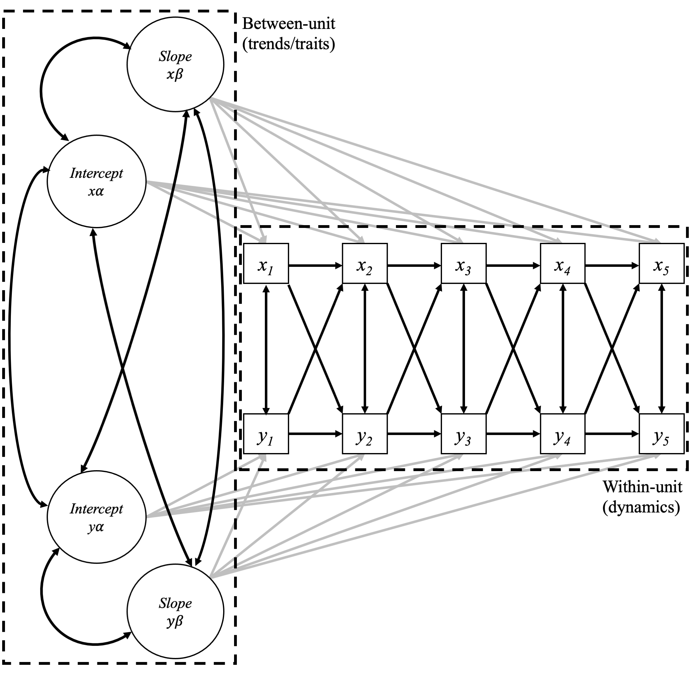
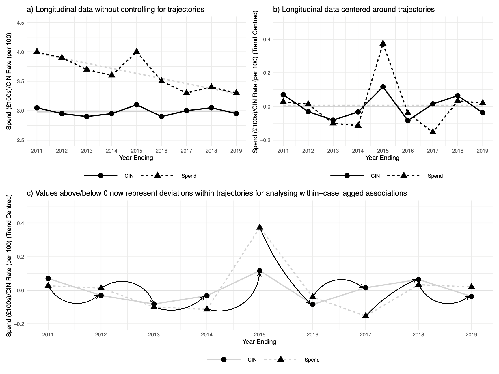
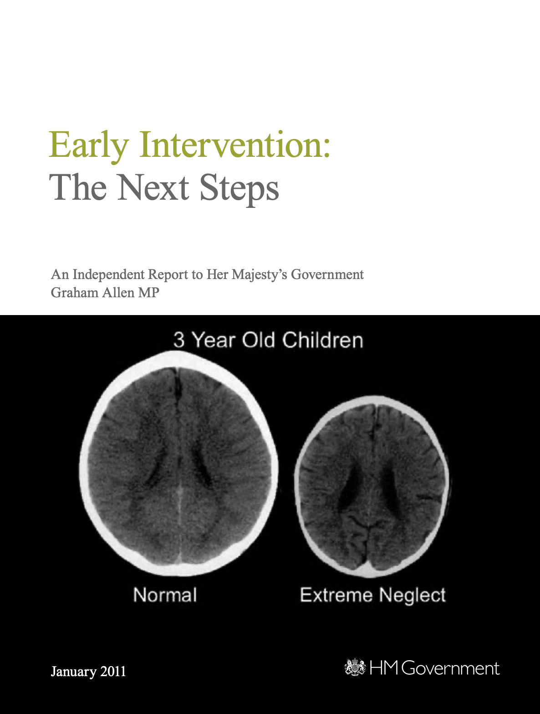

class: middle
background-size: contain

# .tuos_purple[In Defence of Ordinary Help: The declining effectiveness of preventative children's services in England.]

### Dr. Calum Webb, the University of Sheffield.
#### c.j.webb@sheffield.ac.uk

.small[Press P on your keyboard to view speaker's notes.]

```{r setup, include=FALSE}
options(htmltools.dir.version = FALSE)
library(icons)
library(tidyverse)
library(plotly)
library(xaringanExtra)
library(xaringanthemer)
knitr::opts_chunk$set(
  fig.width=9, fig.height=3.5, fig.retina=3,
  out.width = "100%",
  cache = FALSE,
  echo = TRUE,
  message = FALSE, 
  warning = FALSE,
  fig.show = TRUE,
  hiline = TRUE
)
```

```{r xaringan-tile-view, echo=FALSE}
xaringanExtra::use_tile_view()
```

```{r xaringan-logo, echo=FALSE}
xaringanExtra::use_logo(
  image_url = "images/uni-sheffield.png",
  exclude_class = c("inverse", "hide_logo")
)
```

```{r xaringan-themer, include=FALSE, warning=FALSE}
library(xaringanthemer)
style_duo_accent(
  primary_color = "#019EE3",
  secondary_color = "#FCF281",
  colors = c(tuos_purple = "#030043"),
  header_font_google = google_font("Playfair Display", "600", "600i"),
  text_font_google   = google_font("Work Sans", "300", "300i"),
  code_font_google   = google_font("Lucida Console"),
  header_h1_font_size = "2.25rem",
  header_h2_font_size = "1.75rem",
  header_h3_font_size = "1.5rem"
)
```

```{r xaringan-panelset, echo=FALSE}
xaringanExtra::use_panelset()
```

```{r xaringanExtra, echo = FALSE}
xaringanExtra::use_progress_bar(color = "#019EE3", location = "top")
```

```{r metathis, echo=FALSE}
# Add metadata
library(metathis)
meta() %>%
  meta_name("github-repo" = "cjrwebb/cjrwebb.github.io/tree/master/pres/smi") %>% 
  meta_social(
    title = "In Defence of Ordinary Help: The declining effectiveness of preventative children's services in England",
    description = paste(
      "On average, an additional £40 spent per child on preventative services in a given year was associated with decreases of nearly 5 children in need per 10,000, but this effectiveness has been declining over the decade."
    ),
    url = "https://cjrwebb.github.io/pres/smi/smi-research",
    image = "https://cjrwebb.github.io/pres/smi/idoh-card.png",
    image_alt = paste(
      "Title slide of In Defence of Ordinary Help"
    ),
    og_type = "website",
    og_author = "Calum Webb",
    twitter_card_type = "summary_large_image",
    twitter_creator = "@cjrwebb",
    twitter_site = "@cjrwebb"
  )
```


---

### Child welfare interventions have been increasing in England and in many other countries in the Global North.

```{r demand-plot, echo = FALSE, out.height=500, dpi=400, fig.height=5, fig.width=10, out.height=500, out.width = 1000}

clacpp_plot <- read_rds("csc_extract.rds") %>%
  filter(!description %in% c("Total Population Aged 0-17", "Total Expenditure per Child Aged 0-17 (£ per child in 2019 prices)", "Referral Rate per 10,000 Aged 0-17", "Children in Need rate per 10,000 Aged 0-17")) %>%
  group_by(year, description) %>% 
  summarise(value = median(value, na.rm = TRUE)) %>%
  mutate(description = factor(description)) %>%
  ggplot() +
  geom_line(aes(x = year, y = value, colour = description), size = 4, lineend = "round") +
  ggplot2::theme_minimal() +
  xlab("\nYear Ending") +
  ylab("LA Median Rate per 10,000\n") +
  scale_x_continuous(breaks = seq(2011, 2019, 1)) +
  theme_xaringan() +
  scale_color_discrete(type = c("#019EE3", "#030043")) +
  theme(legend.position = "bottom", legend.title = element_blank(), legend.box="vertical",
        text = element_text(size = 14), title = element_text(family = "Work Sans"), 
        axis.title = element_text(size = 14))

clacpp_plot

```

???

In the UK, there has been a quiet concern about rising numbers of children and families subject to child protection investigations and child removal into local authority care. This has been called the Care Crisis by some, and there is currently an Independent Review of the Children's Social Care system seeking to address these unsustainable rises in care and investigation. 

Globally, there have been parallels drawn between the criminal justice and policing system and the child protection system; with many starting to call for its abolishment due to its disproportionate surveillance and institutionalisation of marginalised families, and especially the institutionalisation of Black children from poor areas.


---

### At the same time, funding for early help, family support, and other preventative services has fallen under austerity.


```{r spending_plot, echo=FALSE, warnings=FALSE, out.width="100%", out.height="450", fig.cap=".right[Data from <a href=https://www.gov.uk/government/collections/section-251-materials>S251 Outturns, DfE 2011-2020</a>.]"}

spend_plot <- readr::read_rds("csc_data_spend_imd.rds") %>%
  pivot_wider(names_from = "description", values_from = "value") %>%
  janitor::clean_names() %>%
  dplyr::rename(exp_cla = 4, exp_sg = 5, exp_eh = 6, pop = 7, imd = 8) %>%
  mutate(exp_cla = (exp_cla*100000) / pop,
         imd_tertile = as.factor(dplyr::ntile(x = imd, n = 3))) %>% # 3 = most deprived
  group_by(imd_tertile, year) %>%
  summarise_at(vars(exp_cla:exp_eh), ~round(median(., na.rm = TRUE), 1)) %>%
  ungroup() %>%
  pivot_longer(cols = exp_cla:exp_eh, names_to = "spending", values_to = "value_per_child") %>%
  mutate(spending = case_when(spending == "exp_cla" ~ "Looked-after", 
                              spending == "exp_sg" ~ "Safeguarding",
                              spending == "exp_eh" ~ "Early Help etc.") %>% 
           fct_relevel(., c("Looked-after", "Early Help etc.", "Safeguarding")),
         imd_tertile = fct_recode(imd_tertile, "Least Deprived 50 LAs" = "1", "Average 50 LAs" = "2", "Most Deprived 50 LAs" = "3")) %>%
  ggplot() +
  geom_area(aes(x = year, y = value_per_child, fill = spending)) +
  geom_text(data = . %>% filter(year %in% c(2011, 2013, 2015, 2017, 2019)) %>% filter(spending %in% c("Early Help etc.", "Safeguarding")) %>% mutate(value_per_child_less_sg = ifelse(spending == "Safeguarding", 0, value_per_child)) %>% group_by(year, imd_tertile) %>% summarise(value_per_child = sum(value_per_child), value_per_child_less_sg = sum(value_per_child_less_sg)), 
            aes(x = year+0.1, y = value_per_child+20, label = round(value_per_child_less_sg,0)), size = 2.5) +
  geom_line(data = . %>% filter(spending %in% c("Early Help etc.", "Safeguarding")) %>% group_by(year, imd_tertile) %>% summarise(value_per_child = sum(value_per_child)), 
            aes(x = year, y = value_per_child), size = 0.2, alpha = 0.8) +
  facet_wrap(vars(imd_tertile)) +
  ggeasy::easy_add_legend_title("\n\nSpending\nCategory") +
  ggplot2::theme_minimal() +
  scale_xaringan_fill_discrete() +
  xlab("") +
  ylab("Median Spending per Child") +
  scale_x_continuous(breaks = seq(2011, 2019, 2)) +
  theme(axis.text.x = element_text(angle = 45))

spend_plot <- ggplotly(spend_plot, tooltip = "") %>% config(displayModeBar = F)

spend_plot

```

???

Local authorities, children's charities, and academics have repeatedly highlighted the retrenchment of preventative services and universal welfare as a driver of increasing rates of investigation and removal. 

On average, median spending per child on early help, family support, and other youth services on has fallen by more than 50 per cent over the decade, with the greatest decreases being in the most deprived local authorities. 


---

class: inverse, middle

> # "Our inspectors have seen this across the country and we now know that: Inadequacy is __not a function of size, deprivation or funding__, but of the quality of leadership and management."

<br>

> >  ### Sir Michael Wilshaw, Chief Inspector, Ofsted, 2016: 5


???


However, the Department for Education and the government have been unreceptive to this argument, with the Chief Inspector for Ofsted even going so far as to claim that the quality of children's services was not a function of size, deprivation, or funding in 2016.

This was based on findings from a National Audit Office study which found no association between spending and rates of intervention or Ofsted ratings.


---

### However, a key flaw in their analysis is that it relies on a child welfare intervention meaning the same thing in every local authority. This is unlikely to be the case...

.pull-left[

Local authorities interpret legislation for interventions, especially 'low-level' ones, differently. e.g.

Section 17 (10) of the Children Act 1989: __Definition of a 'Child in Need'__:

> (a) he is unlikely to achieve or maintain ... a reasonable standard of health or development without the provision for him of services by a local authority .. 

> (b) his health or development is likely to be significantly impaired, or further impaired, without the provision for him of such services... or;

> (c) he is disabled.


]

.pull-right[.center[

```{r, echo = FALSE, fig.width=5, fig.height=4, out.height=400, out.width=500, dpi=400}

csc_data <- read_rds("csc_extract.rds") %>%
  filter(description %in% c("Total Expenditure per Child Aged 0-17 (£ per child in 2019 prices)",
                            "Children in Need rate per 10,000 Aged 0-17")) %>%
  pivot_wider(names_from = description, values_from = value) %>%
  rename(exp = 4, cin = 5) %>%
  left_join(., read_rds("imd_year.rds"), by = c("la_name", "year")) %>%
  select(-new_la_code.x, -new_la_code.y)

mod1 <- lm(csc_data, formula = cin ~ imd) %>% broom::augment(newdata = csc_data) %>%
  select(la_name, year, exp, cin, imd, cin_resid = .resid)

csc_data2 <- lm(csc_data, formula = exp ~ imd) %>% broom::augment(newdata = csc_data) %>%
  select(la_name, year, exp_resid = .resid) %>%
  left_join(., mod1)


scatterplot_csc <- csc_data2 %>%
  ggplot() +
  geom_point(aes(x = exp_resid, y = cin_resid), size = 0.5) +
  scale_x_continuous(limits = c(-475, 750), n.breaks = 4) +
  scale_y_continuous(limits = c(min(csc_data2$cin), 300), n.breaks = 4) +
  ylab("\nChildren in Need Rate per 10,000\n(Adjusted for Deprivation)") +
  xlab("\nExpenditure per Child\n(Adjusted for Deprivation)") +
  facet_wrap(~year) +
  theme_minimal() +
  theme_xaringan() +
  theme(legend.position = "bottom", legend.title = element_blank(), legend.box="vertical",
      text = element_text(size = 10), title = element_text(family = "Work Sans"), 
      axis.title = element_text(size = 10))

scatterplot_csc


```

]
]

???

However, this analysis was flawed because of some fundamental misunderstandings of how children become designated as Children in Need, and how services decide when to intervene.

Firstly, there are definitional problems -- terms like Children in Need are subject to local authorities' interpretation of legislation and, in the specific case of Need, this interpretation can be quite broad.

---

### However, a key flaw in their analysis is that it relies on a child welfare intervention meaning the same thing in every local authority. This is unlikely to be the case...

.pull-left[

A significant factor in the numbers of interventions is the extent of __rationing of services__ within a local authority (Webb & Bywaters, 2018; Devaney, 2019; Hood, 2020).

* Local authorities with less funding (relative to need), or with decreasing funding, more strictly ration access to services (and therefore the numbers of children who can be 'in Need' at a given time).

]

.pull-right[.center[

```{r, echo = FALSE, fig.width=5, fig.height=4, out.height=400, out.width=500, dpi=400}

scatterplot_csc

```

]
]


???

In practice, then, local authorities often ration many of their services, especially preventative or early help services, depending on the total amount of funding they have available -- in other words, need rates might often go down or be stable not because need has gone down, but because they are no longer able to have such an inclusive definition of need.

---

### However, a key flaw in their analysis is that it relies on a child welfare intervention meaning the same thing in every local authority. This is unlikely to be the case...

.pull-left[

A significant factor in the numbers of interventions is the extent of __rationing of services__ within a local authority (Webb & Bywaters, 2018; Devaney, 2019; Hood, 2020).

* Local authorities with less funding (relative to need), or with decreasing funding, more strictly ration access to services (and therefore the numbers of children who can be 'in Need' at a given time).


#### What we really want to analyse is what happens **within** a local authority when their spending on preventative services increases or decreases __above or below their normal level and trajectory__.

]

.pull-right[.center[

```{r, echo = FALSE, fig.width=5, fig.height=4, out.height=400, out.width=500, dpi=400}

scatterplot_csc

```

]

]

???

This means that relying on the relationships between cases may be unreliable -- higher levels of spending often correspond with higher rates of children in need, but using standard statistical models like those used by the National Audit Office does not recognise that that local authority may have a more inclusive defition of CIN and be more able to provide services.

What we really want to know is what happens to CIN rates _within_ a local authority when their expenditure on these services fluctuates above or below their stable level and trajectory.


---

### The separation of between-'unit' and within-'unit' components of individual change over time using the ALT-SR model (Curran, et al. 2014)

.pull-left[
.middle[
```{r, echo = FALSE, out.width="90%"}



```
]
]

.pull-right[
.middle[

```{r, echo = FALSE, out.width="100%"}



```
]
]

<div style="text-align:right;">Figures from Webb, under review.</div>

???

Fortunately, other observational studies in other research fields have been faced with this exact problem:

* How do you measure the effect of dietary changes on children's development when they are developing at different rates due to a number of measurable and unmeasurable indivdiual-level characteristics, like genetics?

* How do you measure the effect of alcohol consumption on wellbeing for a cohort that is ageing from late adolescence to adulthood?

This is where Curran, et al. developed the ALT-SR model to separate between-unit and within-unit components of change over time, to better identify within-unit dynamics. 

This partitions between-unit effects to a latent growth part of a structural equation model, and within-unit effects to a cross-lagged part of the model.

To my knowledge, I am the first person to apply this to local public services and populations as opposed to individuals.


---

### Higher spending per child in a given year was associated with significant reductions of Children in Need *within* local authorities, but this effect has weakened over the decade.

.pull-left[

* After adjusting for stable traits and trends in CIN rates and preventative spending per child at the local authority level, __each increase of 1% in spending in a given year was associated with a 0.11% decrease in CIN rate the following year__.

* After estimating this effect independently for each pair of years, __the effectiveness of spending on preventative services for children and young people was found to have declined to a point of non-significance beyond around 2015__.

* Spending cuts since 2010/11 can account for __between 13,000 to 16,500 more children and young people each year between 2010 and 2015 kept at risk of developmental or health impairments nationally__.

]

.pull-right[


```{r, echo = FALSE, fig.width=5, fig.height=4, out.height=400, out.width=500, dpi=400}

idoh_results <- tibble(
  year = c("2011 \U2192 2012",
           "2012 \U2192 2013",
           "2013 \U2192 2014", 
           "2014 \U2192 2015", 
           "2015 \U2192 2016",
           "2016 \U2192 2017",
           "2017 \U2192 2018",
           "2018 \U2192 2019"),
  effect = c(-0.159,
             -0.131,
             -0.097,
             -0.07,
             -0.039,
             -0.011,
             0.026,
             0.056),
  lower = c(-0.248,
            -0.208,
            -0.165,
            -0.135,
            -0.106,
            -0.088,
            -0.067,
            -0.056),
  upper = c(-0.068,
            -0.05,
            -0.024,
            0.002,
            0.036,
            0.075,
            0.127,
            0.174)


)

idoh_results %>%
  mutate(year = factor(year)) %>%
  ggplot() +
  geom_vline(xintercept = 0, colour = "grey") +
  geom_segment(aes(x = lower, xend = upper, y = fct_rev(year), yend = fct_rev(year)), 
               col = "#019EE3", size = 2, lineend = "round") +
  geom_point(aes(x = effect, y = fct_rev(year)), size = 4) +
  geom_text(aes(x = effect, y = fct_rev(year), label = effect), nudge_y = 0.4, size = 3) +
  theme_minimal() +
  theme_xaringan() +
  ylab("") +
  xlab("\nPredicted effect of 1% increase in preventative services\nspending per child on following year's CIN rate (in %)\nwith 95% BCa Bootstrap Intervals") +
  theme(legend.position = "bottom", legend.title = element_blank(), legend.box="vertical",
      text = element_text(size = 10), title = element_text(family = "Work Sans"), 
      axis.title = element_text(size = 10), panel.grid = element_blank())


```


]


???

When we apply this model to rates of children in need and levels of spending on preventative services per child, we find a significant and contextually large effect that indicates higher spending per child within a local authority results in reductions in children in need the following year.

On average, an additional £40 spent per child on preventative services in a given year was associated with decreases of nearly 5 children in need per 10,000 (the average rate of children in need in a local authority is around 360 per 10,000, and the average expenditure per child over the decade was around £320).

However, we also find that this effect has been decreasing over the decade: this is despite a significant investment in two 'What Works' centres, with over £15million of government grants provided to the Early Intervention Foundation and over £30million in grants provided to the What Works Centre for Children's Social Care over the decade.


---

### Consequences for policy

.pull-left[

#### What has changed over the past ten years?

* A __reduction in total expenditure__ on services.

* A focus on __'What Works'__ and services that can be evaluated using Randomised Controlled Trials or Quasi-Experimental Designs.
  * This has crowded out universal services and those delivered in a community setting, which are harder or impossible to evaluate under RCTs/QEDs, especially when they are __community-led, designed, and delivered__.
  
* A __disproportionate focus on 'Early Intervention'__ - the first 1,000 days - at the expense of the needs of older children and teenagers.

* RCTs can help design better interventions - **but not better systems**.

]

.pull-right[

.center[

```{r, echo=FALSE, out.width="70%"}



```

]

]

???

Given this focus on "What Works" - why has the effectiveness of spending on services not improved over the decade?

One easy explanation is that preventative services can only work effectively if they are adequately funded in the first place; research by Rick Hood, Action for Children, and the YMCA has found that over the past ten years services have had to become more and more targeted and less universal to match restricted resources.

But also, the way that evidence has been used in policy has disproportionately focused on 'good evidence' being from a very limited number of methods, taking their queue from the Allen Reports of 2011.

These methods are inappropriate for evaluating many services that were common in 2010/11 - children's centres, youth centres - due to their universal accessibility and their place-based provision. As such, some services have been the least able to retain funding under the new 'evidence-informed' paradigm.

These include community-led and community-designed services, especially those provided universally or out of a physical location. Further, services for teenagers have been affected more than those of any other age group, no doubt due to the flexibility required in youth work and the inappropriateness of delivering highlight structured 'interventions'. The YMCA estimate a 71% cut to services for young people; coincidentally, the rates of 16 to 17 year olds entering care have doubled since 2012, whereas for under-4s they have stayed roughly the same.


---

### The role of 'soft causality' for improving services offered to children, young people, and their families: a future for the ALT-SR model in social policy?

```{r, echo=FALSE, out.width="100%", out.height = "400"}

DiagrammeR::grViz("digraph {
                  
                  graph[layout = dot, rankdir = LR]
                  
                  RCT[label='What is being\ndone? By who?\nFor who?\nHow does it\nfit together?\n(Case Studies)', height=2.5, width=2.5, style='filled', fillcolor='PowderBlue', color='White', fontname='Helvetica']
                  MTA[label='Can other places\nlearn from this?\n(Impact & Change)', height=2.5, width=2.5, style='filled', fillcolor='PowderBlue', color='White', fontname='Helvetica']
                  SYS[label='Where seems\nto have a\ngood system?\n(ALT-SR)', height=2.5, width=2.5, style='filled', fillcolor='PowderBlue', color='White', fontname='Helvetica']
                  OBS[label='For whom\nis it\nworking?\n(ML ALT-SR)', height=2.5, width=2.5, style='filled', fillcolor='PowderBlue', color='White', fontname='Helvetica']
                  
                  SYS -> OBS -> RCT -> MTA
                  
                  }")
```

???

What this has ultimately, and unintentionally done is damaged the system of support available for families - even if it has improved the efficacy individual-focused, manualised, interventions.

My proposal and research for the next three years proposes a radical but feasible alternative that instead focuses on identifying effective systems using 'soft' causal evidence like that attained from using the ALT-SR models.

Instead of trying to scale up RCT evidence from multiple different interventions into a coherent system, we should be trying to identify 'effective' systems; inequalities in them; and then trying to understand their components better in relation to each other.

Doing so may be able to reverse a vicious cycle of poor support at the early stage of problems arising leading to child protection concerns and the removal of children from their families of origin.


---

### References

Allen, G. (2011). _Early intervention: the next steps, an independent report to Her Majesty's government by Graham Allen MP_. The Stationery Office.

Curran, P. J., Howard, A. L., Bainter, S. A., Lane, S. T., & McGinley, J. S. (2014). The separation of between-person and within-person components of individual change over time: a latent curve model with structured residuals. _Journal of Consulting and Clinical Psychology_, 82(5), 879.

Devaney, J. (2019). The trouble with thresholds: Rationing as a rational choice in child and family social work. _Child & Family Social Work_, 24(4), 458-466.

Hood, R., Goldacre, A., Gorin, S., & Bywaters, P. (2020). Screen, ration and churn: Demand management and the crisis in children’s social care. _The British Journal of Social Work_, 50(3), 868-889.

Ofsted. (2016). _The report of Her Majesty’s Chief Inspector of Education, Children’s Services and Skills 2016_. Manchester: Ofsted. 

Webb, C. J., & Bywaters, P. (2018). Austerity, rationing and inequity: trends in children’s and young peoples’ services expenditure in England between 2010 and 2015. _Local Government Studies_, 44(3), 391-415.

Webb, C. J. (Under review). In Defence of Ordinary Help: Estimating the effect of Early Help/Family Support Spending on Children in Need Rates in England using ALT-SR. _Journal of Social Policy_.