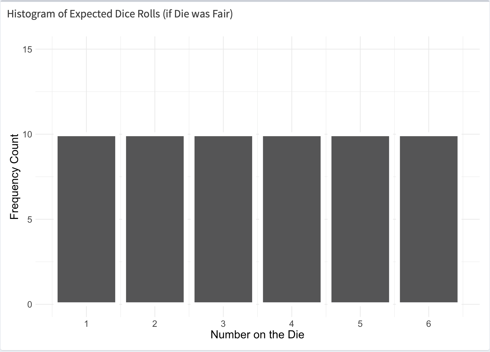

class: middle
background-size: contain

# .tuos_purple[Introducing hypothesis testing and statistical inference.]

### Dr. Calum Webb, the University of Sheffield.
#### c.j.webb@sheffield.ac.uk

```{r setup, include=FALSE}
options(htmltools.dir.version = FALSE)
library(icons)
knitr::opts_chunk$set(
  fig.width=9, fig.height=3.5, fig.retina=3,
  out.width = "100%",
  cache = FALSE,
  echo = TRUE,
  message = FALSE, 
  warning = FALSE,
  fig.show = TRUE,
  hiline = TRUE
)
```

```{r xaringan-tile-view, echo=FALSE}
xaringanExtra::use_tile_view()
```

```{r xaringan-logo, echo=FALSE}
xaringanExtra::use_logo(
  image_url = "images/uni-sheffield.png",
  exclude_class = c("inverse", "hide_logo")
)
```

```{r xaringan-themer, include=FALSE, warning=FALSE}
library(xaringanthemer)
style_duo_accent(
  primary_color = "#019EE3",
  secondary_color = "#FCF281",
  colors = c(tuos_purple = "#030043"),
  header_font_google = google_font("Playfair Display", "600", "600i"),
  text_font_google   = google_font("Work Sans", "300", "300i"),
  code_font_google   = google_font("Lucida Console"),
  header_h1_font_size = "2.25rem",
  header_h2_font_size = "1.75rem",
  header_h3_font_size = "1.5rem"
)
```

```{r xaringan-panelset, echo=FALSE}
xaringanExtra::use_panelset()
```

```{r xaringanExtra, echo = FALSE}
xaringanExtra::use_progress_bar(color = "#019EE3", location = "top")
```


---
class: middle

# Learning outcomes

.panelset[

.panel[.panel-name[What will I learn?]

By the end of this week you will:

* LO1: **Gain an intuitive understanding of and be able to explain the purpose of hypothesis tests and some of their shared statistical terms, crucially, p-values and statistical significance.** (Lecture)
* LO2: Be able to interpret the output from a simple inferential statistical test - the chi-squared goodness-of-fit test - and use this to decide whether to reject or fail to reject a null hypothesis. (Lecture tutorial)
* LO3: Be able to perform a chi-square goodness-of-fit test in `R`, using some of the skills you have developed in the previous weeks. (Workshop)
* LO4: Practice applying this method to an analysis of real-world data, using the findings to draw research conclusions. (Workshop)
* LO5: Reflect on how this method could be used in a real-world research project. (Workshop)

]

.panel[.panel-name[What existing skills will I be using?]

To achieve this week's learning outcomes, we will be using the following skills from previous weeks across the programme:

* __Descriptive statistics and data distributions (SMI106, Week N)__ - LO1, LO2
* __Samples and populations (SMI108, Week N)__ - LO1, LO2
* __Interpreting data visualisation - histograms (SMI105, Week N)__ - LO1, LO2
* Setting up an `R` project (SMI106, Week N) - LO3, LO4
* Reading data in `R` (SMI106, Week N) - LO3, LO4
* Creating summary statistics for categorical variables in `R` (SMI106, Week N) - LO3, LO4
* Research project design (SMI107, Week X) - LO4, LO5


]

.panel[.panel-name[How does this week fit into my course?]

> To develop undergraduate social science students’ skills in quantitative data analysis;

* Before this week, you developed skills to understand how to describe data, including its central tendency (means, medians, modes) and distribution (range, standard deviation), visually and numerically.
* This week will help you develop the foundational knowledge you need to understand *inferential statistics*, and the methods that quantitative social scientists rely on the create inferences about populations from representative samples. 
* In the following weeks, the content of this lesson will help you understand more complex tests for statistical inference that can be used for analysis in quantitative research projects.


> To give students strong practical experience in the use of quantitative analytical techniques to address substantive social science problems. 

* Before this week, you learned how to use `R` to read data, produce descriptive statistics and to visualise this data.
* This week, you will use the `R` skills you have developed to run and interpret a test of statistical significance, you will then apply this to real-world social science data.
* In the following weeks, you will use these skills to understand and interpret more complex inferential statistics, including bivariate tests of association.


]


]


???

At the start of every teaching session I try to do three things:

* Give students an overview of the learning outcomes for the week
* Outline how they will be using skills they've developed from previous weeks both in this module and across their core programme, to build their confidence and help with revision if they are struggling with the content.
* Outline how this week fits in with the programme level outcomes and how it will further their knowledge from past weeks and support their learning going forward.

For this demonstration I just want to focus on the first 30 minutes or so of a 2-hour teaching session that is split into a lecture/seminar style session and a practical lab-based session.

And the purpose of this session is to really give students an *intuitive* sense of what inferential statistics are used for, I want them to really develop a deep understanding of what, for example, a p-value *means* and the underlying statistical theory, before they build their more technical skillset.


---

class: inverse, middle

# Last week we learned how to describe the different types of variables in sample data.


???

For my imaginary cohort, in the last few weeks they will have covered descriptive statistics...


---

class: inverse, middle

# But how can we be confident that a relationship or pattern in our data applies to the entire population we are interested in, and isn't just an artefact of our specific sample?

???

But this week we are interested in how we can generalise the kinds of patterns, or tendencies, or relationships in our data to the population as a whole. 

How can we be confident that something we find in a random sample is generalisable knowledge? 

Statistical methods that help us do this are called Inferential Statistics.


---


# Getting a feel for inferential statistics

.pull-left[

* If you'd like to join in, please scan the QR code, type in the URL, or click the link in chat and open the `Shiny` App for the exercise. `r icons::fontawesome("camera")`

]

.pull-right[


]


???

Before we talk about how inferential statistics are used and expressed in practice, I'd like you to join in with a practical activity with me. 

If you can start by loading up the Shiny app either on your phone by scanning the QR code, or by clicking the link in the chat, and giving it a couple of minutes to load while I explain what we'll be doing.


---

# Getting a feel for inferential statistics

.pull-left[

* If you'd like to join in, please scan the QR code, type in the URL, or click the link in chat and open the `Shiny` App for the exercise. `r icons::fontawesome("camera")`

* We've been contracted by a Las Vegas casino who have discovered that half of their dice are loaded, and do not roll fairly. `r icons::fontawesome("user-secret")`

]

.pull-right[


]

???

So, imagine for a moment that we've been contracted by a Las Vegas casino who have discovered that half of their dice are loaded and do not roll numbers fairly. The problem is, they don't know which of their dice are loaded and which of them are fair.

---

# Getting a feel for inferential statistics

.pull-left[

* If you'd like to join in, please scan the QR code, type in the URL, or click the link in chat and open the `Shiny` App for the exercise. `r icons::fontawesome("camera")`

* We've been contracted by a Las Vegas casino who have discovered that half of their dice are loaded, and do not roll fairly. `r icons::fontawesome("user-secret")`

* Each of you have been given a (virtual) die that you can roll as many times as you like. You don't know whether you have a **fair** die, or a **loaded die**. A loaded die will roll some numbers more often than others. `r icons::fontawesome("dice")`

]

.pull-right[


]


???

As you load up the app, you will have been given either a fair or a loaded die that you can roll as many times as you like. 

---

# Getting a feel for inferential statistics

.pull-left[

* If you'd like to join in, please scan the QR code, type in the URL, or click the link in chat and open the `Shiny` App for the exercise. `r icons::fontawesome("camera")`

* We've been contracted by a Las Vegas casino who have discovered that half of their dice are loaded, and do not roll fairly. `r icons::fontawesome("user-secret")`

* Each of you have been given a (virtual) die that you can roll as many times as you like. You don't know whether you have a **fair** die, or a **loaded die**. A loaded die will roll some numbers more often than others. `r icons::fontawesome("dice")`

* Our task is to use our data analysis skills to determine whether we have a fair or loaded die. `r icons::fontawesome("search")`

]

.pull-right[


]


???

Our task is to roll the die and use our data analysis skills to determine whether the die each of us has been been allocated is fair or unfair. 

[Start practical activity: show 20 rolls as an example, inspect outcomes, ask participants to roll die twenty times and inspect their outcome, then do 'hands up' confidence check before repeating two more times. Remember to mention that at the end I would ask people to reflect on what happened to their confidence as they increased the size of their sample. ]

---

class: inverse, middle

# .tuos_purple[Inferential statistics help us quantify the confidence we have in a hypothesis based on how likely we would expect to see the results we got if it were accurate.] 

#### (e.g. that a die is fair, or that there is no relationship between two variables)


---

# Hypothesis testing

.pull-left[

**.tuos_purple[What are the chances we would see a sample of rolls like this...]**


<center>(Observed)</center>

]

.pull-right[]

???

What we are doing, in a very unconcious way in our heads with this task is looking at what we were rolling and comparing the chances that we would see something like this... 


---

# Hypothesis testing

.pull-left[

**.tuos_purple[What are the chances we would see a sample of rolls like this...]**


<center>(Observed)</center>

]

.pull-right[

**.tuos_purple[When we know if the die were fair we would expect to see something like this...? (Null hypothesis)]**



<center>(Expected)</center>


]

???

With what we would expect if the die were fair -- we know already what kind of distribution we would expect to see if a die were completely fair, we'd call this our null hypothesis, but we also know there is a lot of randomness in the world and that our dice rolls would very very rarely ever look exactly like this.

---

# Hypothesis testing


.pull-left[

We can express how unlikely we were to get results like this if the die was fair using a **p-value**.

There are many different kinds of inferential statistics and tests we can use for different hypotheses and kinds of relationships in data. The one we use here is called a __chi-squared goodness-of-fit test__ but don't worry about how it's calculated at this point!

]

.pull-right[


]


???

We can quantify how likely we are to see something like this using a *p-value*.

There are many different kinds of tests that produce p-values, and as we go forward into the next few weeks you will learn which ones should be used for what kinds of research questions and types of data. For the exercise we're doing here, we can use a very simple test called a chi-squared test -- don't worry about what that means or how it's calculated for now! Right now, we just want to focus on the p-value.


---


# Hypothesis testing


.pull-left[

We can express how unlikely we were to get results like this if the die was fair using a **p-value**.

There are many different kinds of inferential statistics and tests we can use for different hypotheses and kinds of relationships in data. The one we use here is called a __chi-squared goodness-of-fit test__ but don't worry about how it's calculated at this point!

* An inferential statistical gives us a __p-value__.


]

.pull-right[


]


???

So - an inferential statistic gives us something called a p-value.


---

# Hypothesis testing


.pull-left[

We can express how unlikely we were to get results like this if the die was fair using a **p-value**.

There are many different kinds of inferential statistics and tests we can use for different hypotheses and kinds of relationships in data. The one we use here is called a __chi-squared goodness-of-fit test__ but don't worry about how it's calculated at this point!

* An inferential statistical gives us a __p-value__.

* The p-value tells us the probability of seeing the kind of results we got __if the null hypothesis__ (that the die is fair) __were true__.


]

.pull-right[


]

???

The p-value tells us the probability of seeing the kind of results we got *if the null hypothesis that the die is fair were true*


---

# Hypothesis testing


.pull-left[

We can express how unlikely we were to get results like this if the die was fair using a **p-value**.

There are many different kinds of inferential statistics and tests we can use for different hypotheses and kinds of relationships in data. The one we use here is called a __chi-squared goodness-of-fit test__ but don't worry about how it's calculated at this point!

* An inferential statistical gives us a __p-value__.

* The p-value tells us the probability of seeing the kind of results we got __if the null hypothesis__ (that the die is fair) __were true__.

* For the above example, __our p-value was 0.1355__.

]

.pull-right[


]

???

For the above example of rolls, our p-value was 0.1355


---

# Hypothesis testing


.pull-left[

We can express how unlikely we were to get results like this if the die was fair using a **p-value**.

There are many different kinds of inferential statistics and tests we can use for different hypotheses and kinds of relationships in data. The one we use here is called a __chi-squared goodness-of-fit test__ but don't worry about how it's calculated at this point!

* An inferential statistical gives us a __p-value__.

* The p-value tells us the probability of seeing the kind of results we got __if the null hypothesis__ (that the die is fair) __were true__.

* For the above example, __our p-value was 0.1355__.

* This means we would see results at least this different to what we would expect around 13.55% of the time or less, when a die is fair.


]

.pull-right[


]

???

This means we would see results at least this different to what we would expect around 13.55% of the time or less, when a die is fair.


---

class: inverse, middle

# So, what do we think?

# 13.55% is quite a low probability of something happening. Should we report this die as unfair or not?

???

So how do we use that information.

13.55% is quite a low probability of something happening, but it's not completely unreasonable. Should we report this die as unfair or not? 


---


# Hypothesis testing


.pull-left[

In applied statistics, we compare our p-value with a pre-chosen 'critical value' (sometimes called *alpha*) below which we decide to reject the null hypothesis. 

* Conventionally, our critical value **below which we reject the null hypothesis** is __0.05__.

]

.pull-right[


]

???

In applied social statistics, we often pick a pre-defined critical value in conjunction with the p-value from our test to make that judgement call.

In social science, we usually say that if the p-value is less than 0.05 (or 5%), we reject the null hypothesis, because the results we got are sufficiently unlikely to have happened if it were true.


---

# Hypothesis testing


.pull-left[

In applied statistics, we compare our p-value with a pre-chosen 'critical value' (sometimes called *alpha*) below which we decide to reject the null hypothesis. 

* Conventionally, our critical value **below which we reject the null hypothesis** is __0.05__.

There is no strong reason why 5% is used in the social sciences, and sometimes 10%, 1% or 0.1% are used instead, but it can depend on the following:
  * What are the risks if we set our critical value too high and incorrectly reject the null hypothesis? __(Type I error; false positive)__
  * What are the risks if we set our critical value too low and incorrectly fail to reject the null hypothesis? __(Type II error; false negative)__
  
5%, or 0.05, is often seen as a good compromise between these two risks.

]

.pull-right[


]

???

Why do we pick 5%?

There is not really any strong reason, but it is conventionally considered to be a good balance between the risk of us wrongly rejecting the null hypothesis - wrongly reporting that the dice isn't fair when it is - which is called a type 1 error; and us wrongly failing to reject the null hypotheiss - wrongly claiming the dice is fair when it actually isn't.

It's common to see critical values of 10%, 5%, 1% or 0.1% chosen, and this should depend on the specific risk of making an error in a given research context. 

For example, in drug testing we might want to set a much lower critical value so we don't inadvertantly give people ineffective treatments, but we wouldn't want to make it so low that we end up rejecting potentially beneficial treatments.


---


# Hypothesis testing

.pull-left[

.middle[

* Our p-value is __0.1355__

* Our critical value is __0.05__

* __0.1355 is greater than 0.05__ (p > 0.05), and therefore we __should not reject our null hypothesis__ (that the die is fair) based on this evidence. 

* We conclude that __our data does not support the idea__ that the die is unfair.

<br>

*Don't worry if this is difficult to grasp immediately! No one is comfortable interpreting p-values the first time they come across them!*

*We will practice using them and interpreting them many many times over the next few weeks!*


]


]

.pull-right[


]


???

So, to recap, for this set of dice rolls our p-value was 0.1355.

Our critical value to reject the hypothesis that the die is fair is 0.05.

0.1355 is more than 0.05, and therefore, based on the criteria we set we should not reject our hypothesis that the die is fair. 

We use these tools to make our decision that our data does not support the idea that this particular die is unfair.

Don't worry if this this difficult to grasp right away! It is difficult stuff and no one is comfortable understanding or interpreting p-values correctly the first time they see them. The best way to learn is through practice and repetition. 

We will be doing this multiple times over this week and in the following weeks with different tests - the majority of them will use p-values so you will become very familiar with them!


---

class: inverse, middle


# Can you see how this statistic performs a similar function to our intuition when raising our hand when we feel confident that the die is or is not fair?


???

The main thing I want you to think about at the end of this session is this:

* Can you see how this statistic helps quantify the confidence we have in something based on what we observe in our data? Can you see how it gives us a tool to make those decisions about turning something we observe into a more general claim?


---

class: middle

# Break

.panelset[

.panel[.panel-name[So far...]

* Get a sense of the purpose of inferential statistics for quantifying uncertainty in order to make generalisations, and an intuition of how they work.

]

.panel[.panel-name[After the break...]

* Use the app in groups to run a chi-squared test on your dice rolls to get comfortable interpreting the results and the required code in `R`.
* Reflect as a group on what real-world research we could apply a chi-squared test to.

]

.panel[.panel-name[In our practical workshop later this week...]

* Learn how to prepare data for and run a chi-squared test in `R` using real-world data on gender segregation in the labour market (or B.Y.O.D.!)

]

]


???

So, at this point we would take a short break and recap our learning outcome and think of some 'sticking points' where students may be unclear.

For the remainder of the session, we would go through the built-in R workbook as groups that is part of the Shiny app. I would take this opportunity to sit with students and help them build that initial confidence and understanding. 

The workbook provides them with a basic understanding of the R code required to prepare data for a chi square test, in a foolproof environment that can be used anywhere with an internet connection.

In the second hour of content for that week, we would have a practical workshop where they would have to work on conducting a chi-squared test in a real world R-environment using real-world data on gender inequality in occupations from the Labour Market Survey, or they can Bring Their Own Data - this would build their very practical skills working in R - diagnosing errors, etc. and reinforcing their knowledge. 