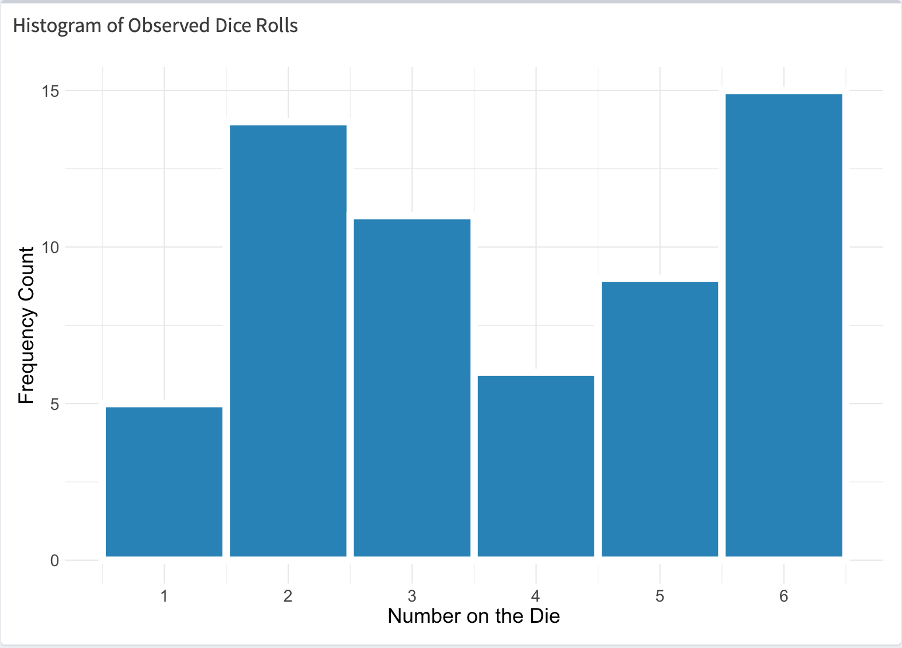
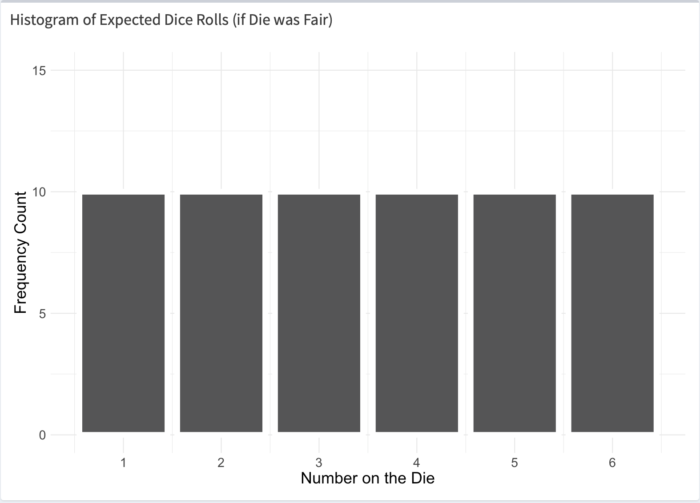
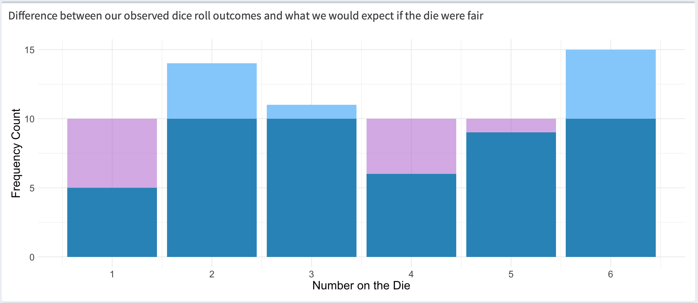
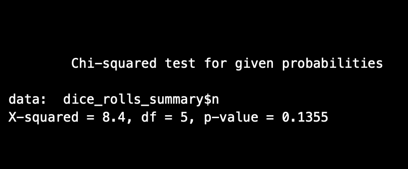
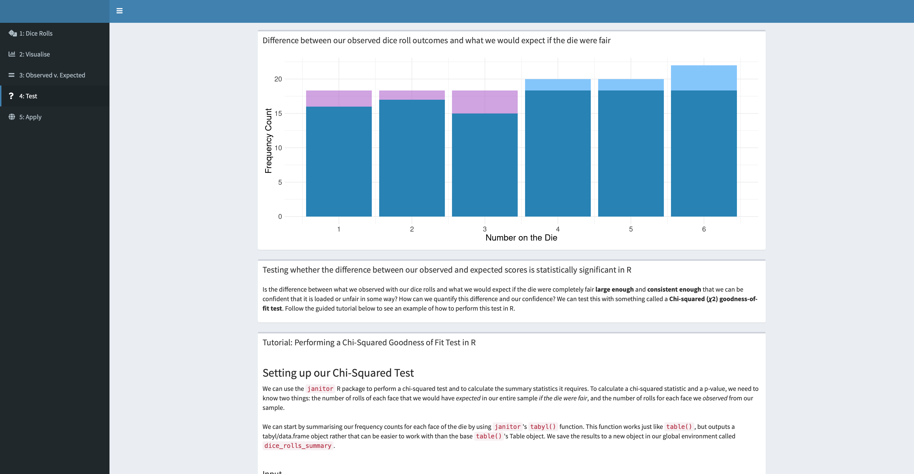

class: middle
background-size: contain

# .tuos_purple[Introducing hypothesis testing and statistical inference.]

### Dr. Calum Webb, the University of Sheffield.
#### c.j.webb@sheffield.ac.uk

```{r setup, include=FALSE}
options(htmltools.dir.version = FALSE)
library(icons)
knitr::opts_chunk$set(
  fig.width=9, fig.height=3.5, fig.retina=3,
  out.width = "100%",
  cache = FALSE,
  echo = TRUE,
  message = FALSE, 
  warning = FALSE,
  fig.show = TRUE,
  hiline = TRUE
)
```

```{r xaringan-tile-view, echo=FALSE}
xaringanExtra::use_tile_view()
```

```{r xaringan-logo, echo=FALSE}
xaringanExtra::use_logo(
  image_url = "images/uni-sheffield.png",
  exclude_class = c("inverse", "hide_logo")
)
```

```{r xaringan-themer, include=FALSE, warning=FALSE}
library(xaringanthemer)
style_duo_accent(
  primary_color = "#019EE3",
  secondary_color = "#FCF281",
  colors = c(tuos_purple = "#030043"),
  header_font_google = google_font("Playfair Display", "600", "600i"),
  text_font_google   = google_font("Work Sans", "300", "300i"),
  code_font_google   = google_font("Lucida Console"),
  header_h1_font_size = "2.25rem",
  header_h2_font_size = "1.75rem",
  header_h3_font_size = "1.5rem"
)
```

```{r xaringan-panelset, echo=FALSE}
xaringanExtra::use_panelset()
```

```{r xaringanExtra, echo = FALSE}
xaringanExtra::use_progress_bar(color = "#019EE3", location = "top")
```


---
class: middle

# Learning outcomes

.panelset[

.panel[.panel-name[What will I learn?]

By the end of this week you will:

* LO1: **Gain an intuitive understanding of and be able to explain the purpose of hypothesis tests and some of their shared statistical terms, crucially, p-values and statistical significance.** (Lecture)
* LO2: Be able to interpret the output from a simple inferential statistical test - the chi-squared goodness-of-fit test - and use this to decide whether to reject or fail to reject a null hypothesis. (Lecture tutorial)
* LO3: Be able to perform a chi-square goodness-of-fit test in `R`, using some of the skills you have developed in the previous weeks. (Workshop)
* LO4: Practice applying this method to an analysis of real-world data, using the findings to draw research conclusions. (Workshop)
* LO5: Reflect on how this method could be used in a real-world research project. (Workshop)

]

.panel[.panel-name[What existing skills will I be using?]

To achieve this week's learning outcomes, we will be using the following skills from previous weeks across the programme:

* __Descriptive statistics and data distributions (SMI106, Week N)__ - LO1, LO2
* __Samples and populations (SMI108, Week N)__ - LO1, LO2
* __Interpreting data visualisation - histograms (SMI105, Week N)__ - LO1, LO2
* Setting up an `R` project (SMI106, Week N) - LO3, LO4
* Reading data in `R` (SMI106, Week N) - LO3, LO4
* Creating summary statistics for categorical variables in `R` (SMI106, Week N) - LO3, LO4
* Research project design (SMI107, Week X) - LO4, LO5


]

.panel[.panel-name[How does this week fit into my course?]

> To develop undergraduate social science students’ skills in quantitative data analysis;

* Before this week, you developed skills to understand how to describe data, including its central tendency (means, medians, modes) and distribution (range, standard deviation), visually and numerically.
* This week will help you develop the foundational knowledge you need to understand *inferential statistics*, and the methods that quantitative social scientists rely on the create inferences about populations from representative samples. 
* In the following weeks, the content of this lesson will help you understand more complex tests for statistical inference that can be used for analysis in quantitative research projects.


> To give students strong practical experience in the use of quantitative analytical techniques to address substantive social science problems. 

* Before this week, you learned how to use `R` to read data, produce descriptive statistics and to visualise this data.
* This week, you will use the `R` skills you have developed to run and interpret a test of statistical significance, you will then apply this to real-world social science data.
* In the following weeks, you will use these skills to understand and interpret more complex inferential statistics, including bivariate tests of association.


]


]

---

class: inverse, middle

# Last week we learned how to describe the different types of variables in sample data.


---

class: inverse, middle

# But how can we be confident that a relationship or pattern in our data applies to the entire population we are interested in, and isn't just an artefact of our specific sample?

---

# Getting a feel for inferential statistics

.pull-left[

* If you'd like to join in, please scan the QR code, type in the URL, or click the link in chat and open the `Shiny` App for the exercise. `r icons::fontawesome("camera")`

* We've been contracted by a Las Vegas casino who have discovered that half of their dice are loaded, and do not roll fairly. `r icons::fontawesome("user-secret")`

]

.pull-right[


]

---

# Getting a feel for inferential statistics

.pull-left[

* If you'd like to join in, please scan the QR code, type in the URL, or click the link in chat and open the `Shiny` App for the exercise. `r icons::fontawesome("camera")`

* We've been contracted by a Las Vegas casino who have discovered that half of their dice are loaded, and do not roll fairly. `r icons::fontawesome("user-secret")`

* Each of you have been given a (virtual) die that you can roll as many times as you like. `r icons::fontawesome("dice")`

]

.pull-right[


]

---

# Getting a feel for inferential statistics

.pull-left[

* If you'd like to join in, please scan the QR code, type in the URL, or click the link in chat and open the `Shiny` App for the exercise. `r icons::fontawesome("camera")`

* We've been contracted by a Las Vegas casino who have discovered that half of their dice are loaded, and do not roll fairly. `r icons::fontawesome("user-secret")`

* Each of you have been given a (virtual) die that you can roll as many times as you like. `r icons::fontawesome("dice")`

* You don't know whether you have a **fair** die, or a **loaded die**. A loaded die will roll some numbers more often than others. `r icons::fontawesome("balance-scale-right")`

]

.pull-right[


]

---

# Getting a feel for inferential statistics

.pull-left[

* If you'd like to join in, please scan the QR code, type in the URL, or click the link in chat and open the `Shiny` App for the exercise. `r icons::fontawesome("camera")`

* We've been contracted by a Las Vegas casino who have discovered that half of their dice are loaded, and do not roll fairly. `r icons::fontawesome("user-secret")`

* Each of you have been given a (virtual) die that you can roll as many times as you like. `r icons::fontawesome("dice")`

* You don't know whether you have a **fair** die, or a **loaded die**. A loaded die will roll some numbers more often than others. `r icons::fontawesome("balance-scale-right")`

* Our task is to use our data analysis skills to discover whether we have a fair or loaded die. `r icons::fontawesome("search")`

]

.pull-right[


]


---

class: inverse, middle

# .tuos_purple[Inferential statistics a family of statistics that provide a way of quantifying the confidence we have in a hypothesis based on how likely we would expect to see the results we got if it were correct.] 

### (e.g. that a die is fair, or that there is no relationship between two variables)


---

# Hypothesis testing

.pull-left[

**.tuos_purple[What are the chances we would see a sample of rolls like this...]**



<center>(Observed)</center>

]

.pull-right[]

---

# Hypothesis testing

.pull-left[

**.tuos_purple[What are the chances we would see a sample of rolls like this...]**


<center>(Observed)</center>

]

.pull-right[

**.tuos_purple[When we know if the die were fair we would expect to see something like this...? (Null hypothesis)]**



<center>(Expected)</center>


]

---

# Hypothesis testing



???

We can use a simple inferential statistics test, the chi-square goodness of fit test, to test whether these differences are 'statistically significant' or not -- how probable it is that the hypothesis that the die is fair is very probable given our sample.

These results were from 60 rolls. Raise your hand if you would feel confident saying that the die is not fair? Is it a tricky one?

---

# Hypothesis testing


.pull-left[

A chi-squared statistic is calculated with the following formula:

$$ \chi^2 = \sum \frac{(O_i - E_i)^2}{E_i} $$
* Don't worry too much about the details! You won't have to calculate it by hand!


]

.pull-right[





]

---


# Hypothesis testing


.pull-left[

A chi-squared statistic is calculated with the following formula:

$$ \chi^2 = \sum \frac{(O_i - E_i)^2}{E_i} $$

* Don't worry too much about the details! You won't have to calculate it by hand!

* The key thing to note that is that the chi-squared statistic is determined by the **size of the difference between what we observed** ( $O_i$ ) **and what we would have expected** ( $E_i$ ) under the null hypothesis that the die is fair.


]

.pull-right[


]

---


# Hypothesis testing


.pull-left[

A chi-squared statistic is calculated with the following formula:

$$ \chi^2 = \sum \frac{(O_i - E_i)^2}{E_i} $$

* Don't worry too much about the details! You won't have to calculate it by hand!

* The key thing to note that is that the chi-squared statistic is determined by the **size of the difference between what we observed** ( $O_i$ ) **and what we would have expected** ( $E_i$ ) under the null hypothesis that the die is fair.

* We are not particularly interested in the chi-squared statistic itself, but we are interested in its associated **p-value**.


]

.pull-right[


]

---

# Hypothesis testing


.pull-left[

> A p-value gives the probability of observing a pattern or relationship in a sample of data at least as extreme as the one we observed, under the assumption that the null hypothesis is correct. 

> It is used in conjunction with a significance level (sometimes called 'alpha', typically 0.05) to determine whether our data suggests we should reject the null hypothesis.

<br>

Don't worry if that's tricky to grasp at first - you will become very familiar with p-values over the coming weeks!


]

.pull-right[


]

---

# Hypothesis testing


.pull-left[

In our sample of dice rolls shown here:

* Our p-value is __0.1355__.


]

.pull-right[


]

---

# Hypothesis testing


.pull-left[

In our sample of dice rolls shown here:

* Our p-value is __0.1355__.

* This means that for this number of rolls (60) of a die with equal chances of landing on any number (our null hypothesis), __we would expect to see deviations this extreme from our expected distribution less than 13.55% of the time__.


]

.pull-right[


]

---

# Hypothesis testing


.pull-left[

In our sample of dice rolls shown here:

* Our p-value is __0.1355__.

* This means that for this number of rolls (60) of a die with equal chances of landing on any number (our null hypothesis), __we would expect to see deviations this extreme from our expected distribution less than 13.55% of the time__.

* This is fairly improbable, but not so improbable that we could confidently say the die is not fair. In this case, __we do not reject the null hypothesis that the die is fair because 13.55% is higher than our threshold of 5%__.


]

.pull-right[


]

---

class: inverse, middle

# Can you see how this statistic performs a similar function to our intuition when raising our hand when we feel confident that the die is or is not fair?


---

# Guided tutorial


```{r, echo = FALSE}



```

???

At this point I would move students on to a guided, sandbox r tutorial that they can complete and explore independently on their phones or in a lab. I would provide 20 minutes for this and use it as an opportunity to allow them to ask questions.