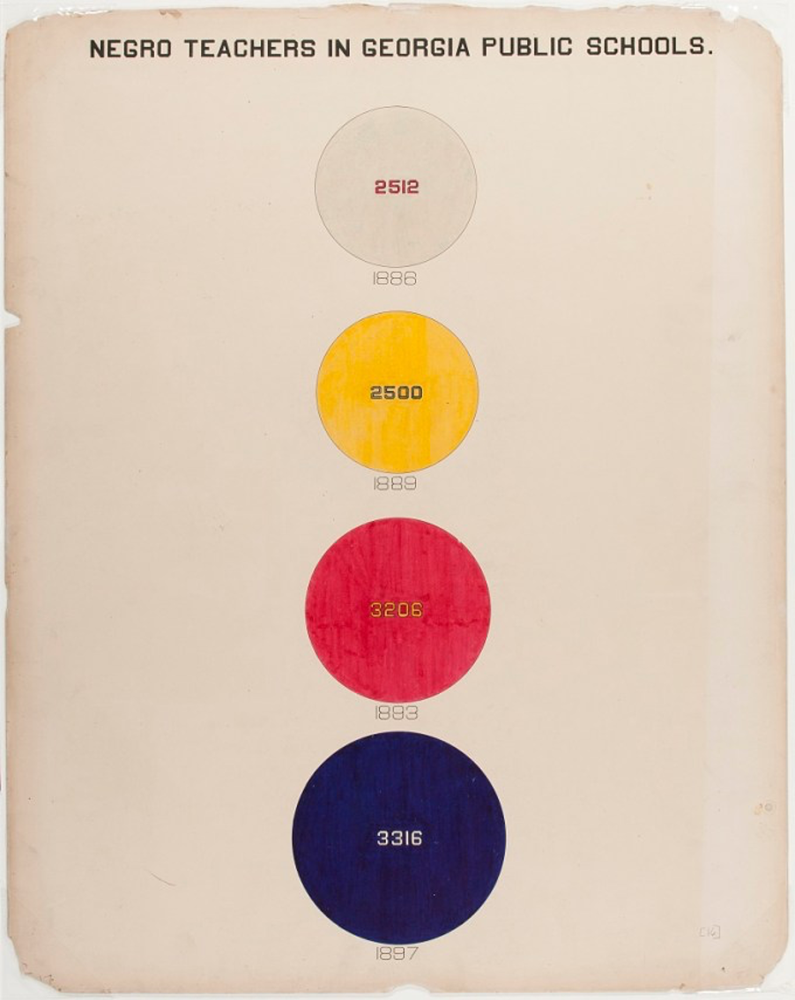

<!-- Set any additional styles here -->

<style>
div.act_box { background-color:rgba(75, 168, 244, 0.3); color:rgba(0, 0, 0, 0.8); border-radius: 5px; padding: 20px;}

</style>


```{r setup, include=FALSE}
library(fontawesome)
knitr::opts_chunk$set(echo = FALSE)
library(plotly)
library(tidyverse)
```

## Learning Objectives

By the end of this resource you will...

* Be able to articulate and reflect on the relationship between quantitative data, political rhetoric, social policy creation, and the inequalities in access to statistical representations of the social world.
* Have considered how quantitative data could be used to inform social work practice, from engaging with socioeconomic hardship that families face in direct work to strategic planning and social activism more broadly.
* Have practiced using two online resources for data visualisation to answer questions about trends and patterns in local areas and in children's services nationally, and thought critically about how this could be applied to policy and practice using a case study.

<hr>

## CPD Profile

<div class="act_box">

|SWE CPD Domain   |Description     |In this resource   |
|:----|:------------------|:------------------|
|4.4 |Demonstrate good subject knowledge on key aspects of social work practice and develop knowledge of current issues in society and social policies impacting on social work. |Learn about what local data is available related to society and social policy, and how and why this could be used in direct practice and advocacy. |
|4.5 |Contribute to an open and creative learning culture in the workplace to discuss, reflect on and share best practice. |Learn about open-source data exploration tools that can be used as a discussion tool in the workplace. |
|4.8 |Reflect on my own values and challenge the impact they have on my practice. |Critically engage with the way that data is used as a rhetorical device, and how you can challenge these narratives and create your own. |

</div>

<hr>


<br>

>“Meanwhile life was hard. The winter was as cold as the last one had been, and food was even shorter. … In any case [Squealer] had no difficulty in proving to the other animals that they were not in reality short of food, whatever the appearances might be. … Reading out the figures in a shrill rapid voice, he proved to them in detail that they had more oats, more hay, more turnips than they had in Jones’ day… The animals believed every word of it. … Sometimes the older ones among them racked their dim memories and tried to determine whether in the early days of the Rebellion, when Jones’ expulsion was still recent, things had been better or worse than now. They could not remember. There was nothing with which they could compare their present lives: they had nothing to go upon except Squealer’s list of figures, which invariably demonstrated that everything was getting better and better.”
>
>`r tufte::quote_footer('--- George Orwell, Animal Farm, 1945: 81-94[@orwell1945animal]')` 
>

<br>

## Introduction

This is an interactive resource created for Social Work students at the University of Sheffield about the use of quantitative data in social work practice. It is intended to be a living workbook/lesson that can be accessed by the wider community, with a padlet at the bottom where agreement, disagreement, thoughts and comments can be made. In it, I want us to think about the question of 'what role can data play in social work?', and in this case, I’ll be referring to data in its quantitative sense. This means numbers, figures, and statistics; data associated with counting and measuring, as opposed to qualitative data associated with text and language. The session is broken down into this reading, with some video examples and exercises at the end of each section. You can complete these exercises either independently or in groups, and may find it useful to compare how one another might use the data available. There will be a padlet board at the bottom to discuss your thoughts.

The first thing I want to do is provide an argument for effective and appropriate use of quantitative data and statistics in social work practice, particularly in relation to tackling socioeconomic inequalities in children and families social work. On the surface, these two things probably sound incompatible. But the following chapter explores whether something as impersonal as quantitative data can play a role in relationship-based practice, and help social workers promote social justice and tackle underlying inequalities in society in direct work, not just in activism. Quantitative data confers a distance from the personal stigma attached to poverty and personal oppression, while enabling us to acknowledge the impact these things may have on ourselves and our community.

Next, I want us to think about the context of data, and its relationship to power in society and our ability to ‘speak truth to power’ and pursue social justice pursuant to social work principles. Data and statistics are deeply political but are often presented as value neutral, and therefore carry with them a disproportionate legitimacy. In our current system of knowledge and evidence they are incredibly powerful, but there are large imbalances in access to and accessibility of quantitative data as well as unequal representation in the decision-making processes around what things are measured and reported. Being able to produce statistics that support or refute something often strengthens a rhetorical argument, and the ability to do so is highly segregated between those who have the access and training to engage with data (or people who can do this for them), and those who do not. Just like the case of Squealer and the animals of *Animal Farm*, the group with the numbers to back up their position tends to hold a lot of power over public thought. Further, those with the access to these numbers tend to be those already in positions of power. Therefore, if you want to advocate for the rights of marginalised and oppressed people, statistical literacy, accessibility, and representation are essential tools for doing so. 

By the end of this resource you will have heard arguments for the use of quantitative data in social work practice, and how these data can promote social justice. I will also have shown you two tools that are free to use and aim to improve the accessibility of, and access to, community and government data. 

## Data as a tool for working with stigma?
Recent research by myself and colleagues on the Child Welfare Inequalities Project found that children in the poorest ten per cent of neighbourhoods were around ten times more likely to be taken into care than children in the ten per cent least deprived neighbourhoods.[@bywaters2018inequalities;@webb2020untangling] There were also complex inequities between different ethnic groups[@bywaters2018paradoxical]. In all, there are clear structural and systematic differences in child welfare interventions that we cannot ignore. 

The great difficulty comes with figuring out how we translate these deep-rooted and complex structural problems to social work practice. There are, of course, very large changes we could propose to make to the child protection system, such as those that Brid Featherstone, Kate Morris, Sue White and Anna Gupta propose in their Social Model of Child Protection[@featherstone2018protecting]. But the reality we grappled with when we wrote the ‘Anti-poverty Practice Guide for Social Work’ with the British Association of Social Workers was this: how can we possibly tackle such enormous structural problems – social problems that require a complete overhaul of the welfare state and child protection system - at the level of practice, and if we can’t make large changes, can we do anything that makes a difference? 

At the micro level I’m going to focus on poverty. Families (usually) don’t want to talk about things like poverty and neither do social workers, especially when they feel like they can’t offer practical help to alleviate it[@morris2018social]. If no one wants to talk about it, how do we go about addressing it?  Further, because no one wants to talk about it, its impact is rarely systematically recorded, and because it’s rarely systematically recorded the experience itself falls further and further into the wallpaper of practice, hidden from view. The omission of socioeconomic inequalities produces a cycle wherein the individualisation of social problems like child abuse and neglect, or social care provision, become centralised in discourse. It’s useful to first assess why it’s so hard for us all to talk about poverty.

In Tracy Shildrick and Robert MacDonald’s article, ‘Poverty Talk: How people experiencing poverty deny their poverty and why they blame the poor’[@shildrick2013poverty], the authors explore the way that people living in conditions that, by consensus and many forms of measurement, would constitute poverty frequently distance themselves from the concept. This is achieved through a ‘distancing narrative’.  People that are objectively poor – unable or only intermittently able to meet their family’s needs for food, clothing, and housing – rather refer to themselves as in hardship, managing, or getting by. 

People labelled as living in poverty were conceptualised as people that were, in the eyes of the participants, ‘underserving’. People who were unable to manage because of some individual moral failing or downfall, rather than as a result of a structural failure of social and economic systems. Poverty was only considered to be a structural failing in distant locations, not at home, such as in representations of African countries in the media. This has long, if not always, been a part of our culture, where poverty reflects a ‘moral concept as much as it is a descriptive one’.[@spicker2007idea] To take another of Orwell’s works, ‘Down and Out in Paris and London’,[@orwell1933down] he recounts a conversation with another destitute man – Orwell himself was living as a 'vagrant' at the time – at a casual ward in Berkshire. In their exchange, the man admonishes Orwell for suggesting that the casual wards might provide the food usually wasted by the adjoining workhouse to the homeless men and women staying at the ward:

<br>
	
>“I produced arguments to prove him wrong, but he would not listen. He kept repeating: 
>  
>"You don’t want to have any pity on these here tramps – scum, they are. You don’t want to judge them by the same standards as men like you and me. They’re scum. Just scum."” 
>
>`r tufte::quote_footer('--- George Orwell, Down and Out in Paris and London, 1933: 213')` 

<br>

Despite living in the deepest conditions of poverty for six months at least, the man went to great lengths to disassociate himself from the idea of poverty, distancing it to an ‘other’ that he saw as 'scum'. 

One theory from Robert Walker[@walker2014shame] and colleagues posits that if there is an experience that constitutes a unifying theme of poverty across the world, it is shame. Poverty is deeply stigmatised as a moral failing in many cultures, but especially in cultures that place a high emphasis on a conflation of financial wealth with social or moral wealth. Being poor is cast as an individual failure, under the pretence that in a supposedly meritocratic society anyone who works hard can live a prosperous life, and that someone experiencing poverty must therefore not have worked sufficiently hard. We can see the effects of this in how inequality exacerbates social and health problems.[@marmot2020health;@pickett2015income;@wilkinson2010spirit] People in poverty are stigmatised as feckless, lazy, and idle, through media and policy narratives[@tyler2020stigma;@tyler2008chav] because this maintains the illusion that someone’s position in life is entirely dictated by their individual choices, and in itself maintains a strict social hierarchy. Very few people want to identify as, or want to feel like they are being identified as poor, because of the stigma it carries and the shame it provokes. Distancing narratives are therefore crucial tools that people use to protect themselves from the shame and stigma of poverty. 

But poverty has real effects on peoples’ lives and is not inevitable; it is a political decision to keep people in poverty. When face-to-face with someone living in poverty, your objective assessment that they are in poverty will usually mean very little. To declare someone as being in poverty is also to imply that they are guilty of the moral failures that our culture associates with it, which can create a significant barrier to forming relationships. How then does one engage with the socioeconomic disadvantage that is likely to be contributing to a person’s current hardships, which may include difficulties with parenting? And how do we enable services to act on poverty without further stigmatising people living in poverty?

This is where I believe we can leverage quantitative data and dissociation to positive ends. While many people may understandably seek to disassociate their personal lives from the stigmatising discourses of poverty and inequality, this is not necessarily the case for their wider neighbourhoods. Indeed, people are often able to sympathetically reflect on the challenges and inequalities that their community faces (for example, see: Castro & Lindbladh, 2004[@castro2004place] or Eby, et al. 2012[@eby2012perceptions]). The distance that aggregation from the individual to the geographical creates may be enough to cause someone to - if not accept - reflect on the pressures caused by poverty in their community and, by extension, the impact this may have on themselves. Exploring data visualised in an engaging way provides an opportunity to cast light on structural inequalities.

As explained above, a person is unlikely to tell you they are living in poverty if you ask - they are also unlikely to agree with your external assessment of their financial situation. Nonetheless, their reality may be that they face exceptional challenges associated with their material resources and there may be community support and services available to alleviate these. These might include, for example, benefits checks, clothing or food banks, or peer support and activism. In strategic roles, you may need to identify specific communities or geographies where these services are lacking. While these services are not a replacement for overhauling the existing punitive and unjust societal structure, they provide essential services where immediate help is needed. 

Identifying these support structures can reduce the impact of socioeconomic inequalities and improve lives. In adult social care, the consequences may be that they enable someone to live independently for longer[@ageUK2014improving]. In children’s social care, they may help parents manage the stress that occurs alongside financial hardship that can often lead to relationship conflict and poor parental mental wellbeing.[@cooper2013does] In mental health, they may provide resources and support that help the management of existing conditions.[@elliott2016poverty] Poverty and discrimination can often be thought of as the ‘cause of the causes’ of problems people may find themselves experiencing.

One way of making geographical data more accessible is to overlay colour coded shapes onto a map, enabling us to combine our tacit knowledge of place with the information contained in official statistics. This requires some technical knowledge, so to make the process easier, I created the Mapping Overlaps Gadget (https://webb.shinyapps.io/MOG_education/) which enabled the creation of these maps without any programming knowledge (other similar tools also exist). Each shape represents a geographical area with a population of around 1,500 for which statistics are routinely calculated. My hope for this is that it achieves a few things: firstly, that it can be useful for recognising hidden local inequalities and implementing preventative and early help and support, and secondly, that it allows us to democratise the visualisation and analysis of local data. Before we move on to the role of power, let me introduce you to the MOG app and show you how it can be used to visualise data in a way that may be helpful for delivering support.

### Video Example
<iframe width="840" height="470" src="https://www.youtube-nocookie.com/embed/KxoYW0jDaAk" frameborder="0" allow="accelerometer; autoplay; encrypted-media; gyroscope; picture-in-picture" allowfullscreen></iframe>

<aside>
<font size=2>
In this example, I’ll show you how we can use geographical data to identify whether there are high levels of income deprivation in a neighbourhood. I’ll also show how we can identify compound or intersectional inequalities, for example, areas where there is a high level of health deprivation and poor access to hospitals, where additional support may need to be put in place.
</font>
</aside>

<br>

```{r, layout="l-page-outset", fig.cap="A map of Sheffield in the MOG app showing neighbourhoods with high levels of Income Deprivation"}
knitr::include_graphics("Media/image1map.png")
```

<br>


```{r, layout="l-page-outset", fig.cap="A bivariate map of Sheffield showing areas with high levels of health deprivation and disability and low accessibility to hospitals (dark purple)"}

```

<br>
<div class="act_box">

<p style="text-align:right";>
`r fa("mouse-pointer", fill = "#00A0E9", height = "30px")`
</p>


#### Exercise

1)	Try using the MOG app (https://webb.shinyapps.io/MOG_education/) to explore a potential socioeconomic problem associated with child welfare interventions, mental or physical health problems, or wellness in older age, in an area you’re familiar with. For example, you might want to look at access to green or leisure spaces.
2)	Consider how you might overlay two pieces of quantitative data to explore multiple complex needs. For example, you could explore the relationship between health, deprivation and disability (HlthDprADS) deprivation score and income deprivation (IncomeScor) score. 

</div>
<br>

## Data, power, and data power
Having explored some of the ways local data can be used at the level of practice, I want to spend some time talking about the power that data holds, and why I think it’s important to shift this power in the direction of people with lived experience and their advocates to create granular structural changes. Further, I think this skill is essential in order for social workers to meet their ethical obligations to promote social justice.[@basw2014code] This argument is broken down into three parts, ending with an example and exercise. First, I want to present the important of data literacy in challenging misrepresentations of statistics.[@best2012damned] Second, I want to talk about the politics of data in social policy.[@muller2018tyranny] Thirdly, I want to talk about the colonial origins and class dynamics of quantitative methods, and the power and resistance involved.[@walter2013indigenous;@smith2012decolonizing] 

<br>

>“The great body of physical science, a great deal of the essential fact of financial science, and endless social and political problems are only accessible and only thinkable to those who have had a sound training in mathematical analysis, and the time may not be very remote when it will be understood that for complete initiation as an efficient citizen of one of the new great complex world-wide States that are now developing, it is as necessary to be able to compute, to think in averages and maxima and minima, as it is now to be able to read and write.”
>
> `r tufte::quote_footer('--- H. G. Wells, Mankind in the Making, 1903: 189-190[@wells1903mankind]')` 

<br>

This extract from H.G. Wells is more well known in its paraphrasing by statistician Samuel Wilks as “statistical thinking will one day be as necessary for efficient citizenship as the ability to read and write.” What Wells and Wilks mean by this is that an effective understanding of the language of data and statistics is needed to participate fully in conversations about the nature of the world, including the nature of social and political problems, because this is (or was) increasingly the way we were expressing our understanding of the world and social problems. Moreover, this ability is needed for people to recognise the difference between statistical fact and statistical fiction. 

The importance of statistical literacy is often illustrated by another famous saying popularised by Mark Twain, that there are three types of lie: “lies, damned lies, and statistics”. In Joel Best’s book of the same name,[@best2012damned] he articulates many examples of where poor data and statistical literacy has resulted in stories derived from data being deliberately or unknowingly misrepresented, misinterpreted, and misused. A widespread lack of statistical literacy creates opportunities for those in a position of power to create false or misleading narratives from data without being caught out. This is one of the roles that the pig Squealer in Orwell’s *Animal Farm* plays; bolstering the propaganda of “the Napoleon regime” through the use of his book of figures. This was, of course, a reference to a real use of official statistics by the Soviet Union, and not complete fiction. The reality that is presented by numbers becomes accepted by the animals, despite the fact that it directly contradicts their lived experience. 

This bring us to our second point: the tyranny of metrics.[@muller2018tyranny] While writing largely in reference to the use of metrics in organisations - Key Performance Indicators and other such devices that will inevitably be gamed - Jerry Muller[@muller2018tyranny] identifies the unique position that the quantification of things has in judgement and decision-making. Key to this is the position that statistics and quantitative data holds in our wider *episteme*.[@foucault1973order] Understanding what this means requires a brief review of the concept of *epistemology*. 

Epistemology is, roughly speaking, the study of how we know what we know.[@martin2014epistemology] We can often take for granted that the ways in which we come to know things, and can demonstrate them as being known, are fixed. Similarly, we often take for granted that forms of knowing something follow a linear process of improvement, but it is not necessarily as simple as that. We have, at different times in history, different ‘*fashions*’ of knowing; which Foucault refers to as different epistemes. If you were alive at the time of the ancient Greek philosophers and were being asked to demonstrate the existence of something, the dominant *episteme* may have dictated that you do so through rhetoric, and the construction of a watertight logical argument through some Socratic dialogue. If you were a contemporary of Thomas Acquinas in 13th century Europe, you might be required to demonstrate truth by theological means. Today, we have a strict hierarchy of ‘evidence’ and ways of knowing where the scientific method dominates, and is characterised by the quantification of things through measurement: the collection and presentation of ‘evidence’. 

Statistics is the *lingua franca* of “science and evidence”. Fortunately, other ‘languages’ are available and have grown in prominence, but the dominant position of quantitative evidence that was established in a largely positivist *episteme* lingers on. And within the quantitative study of the world there are clear methodological hegemonies, chiefly that of the medical model and its randomised controlled trial.[@wastell2017blinded] Of course, valid arguments can be made to justify this hierarchy of evidence. Quantitative research is supposedly more reproducible, or at least open to replication, and it is easier to demonstrate the procedures that led to the evidence so that they can be externally assessed. Of course, in practice this rarely happens and when it does the results rarely paint the strength of quantitative social science evidence in a positive light. But these traits create a visage of objectivity. That is, quantitative evidence positioned in contrast to qualitative evidence, which is framed as subjective. The findings emerging from quantitative data can then claim to be self-evident and free from human bias: the numbers speak for themselves.

Like *Animal Farm*, this is a fairy tale. Studies have demonstrated that the same data in the hands of different analysts produce wildly different results[@silberzahn2018many; @gelman2014statistical], and some statisticians go to great lengths to illustrate how human decisions have manipulated (knowingly or unknowingly) data and statistics to present a reality that doesn’t exist with great certainty (for example, see Andrew Gelman’s tireless work identifying these cases). The outlined strengths of quantitative research are frequently undermined by the nature of academic research, which is dismal at publishing ‘non-significant’ results, and therefore creates incentives for bad science. Unfortunately, the problem is only getting worse, especially outside of academia. This is the case with the rise of complex machine learning algorithms and big data; where the analysts trained in the use of which often do not understand and cannot articulate the underlying assumptions made in the algorithms or the ways in which the characteristics of big data might violate these.[@eubanks2018automating;@keddell2019algorithmic;@oneil2016weapons]

Despite these problems, quantitative evidence still retains the optics of legitimacy and objectivity, and usually outweighs other forms of evidence in political decision making. Take, for example, this quote from the Allen (2011) reports[@allen2011early] about the assessment of early intervention programmes:

<br>

>“What the Nottingham Life Skills programme currently lacks, in common with many other excellent UK-designed Early Intervention programmes, is an ‘effect size’, which the economists can plug into their models used in advising investors about where to get the best return of their scarce resources.”[@allen2011early]
>
>`r tufte::quote_footer('--- Graham Allen, Early Intervention: the Next Steps. 2011: 77')`

<br>

Multiple positive assessments of an intervention programme valued by participants are ridden roughshod over by the lack of evidence from a specific type of method popular in medical fields (a randomised controlled trial: for a good set of papers discussing the appropriateness of the RCT for social work interventions see Stewart-Brown, et al.[@stewart2011should;@stewart2012more]) Dave Wastell and Sue White[@wastell2017blinded] chart the impact that the dominance and acceptance of highly quantitative fields of research has had on social work practice. The combination of epistemological legitimacy enjoyed by quantitative data, the medical model, and the low levels of statistical literacy in society needed to scrutinise quantitative arguments, creates enormously powerful rhetorical potential.

Such a thing might not be a problem if this power were distributed fairly, if everyone has equal opportunities to produce quantitative evidence to support their position. However, the access to funding, data, and to the quantitative tools and education needed to use these, must be looked at critically. Maggie Walter and Chris Andersen[@walter2013indigenous] in particular, chart the colonial history of quantitative data and social statistics. In doing so, it’s possible to see the pernicious dimensions of official statistics, which often posit indigenous peoples as the ‘other’, and frame official data through a deficit-focused framework. Decisions on what to measure and how are usually made an exclusive membership of government officials and eminent scientists, who are overwhelmingly White, male, and middle class; this is the kiln in which most quantitative research is fired. 

We can observe the dark history of social statistics through a class lens. The need to maintain the health and reduce the mortality of workers in the context of early industrialisation, while likely having some philanthropic angle, was undoubtedly driven by the needs of capital for workers who lived longer and got sick less often.[@goldman1983origins] Early quantitative social science in Britain was driven by the mostly White intelligentsia, largely providing evidence and arguments for eugenics and casting the social problems of people living in poverty as biological defects.[@loucca2009emancipation] Indeed, H. G. Wells expressed favourable thoughts towards certain kinds of eugenics in the book from which the earlier quote was taken. The stations of people in poverty; the position of women in society; the criminalisation of non-White people; have all been, at one time or another, justified through apparently objective methods. 

While many sentiments may have changed, those at the forefront of modern data-related innovations like AI remain overwhelmingly White and Male.[@west2019discriminating] What makes us any more confident that claims based on statistical data now are any more accurate than they were then? Modern quantitative methods are certainly more opaque than quantitative methods have ever been, especially once we step into the world of deep learning and neural networks. When the numbers ‘speak for themselves’ it’s often easy to forget the positionality of the people creating and presenting them.

There were and are, of course, contrasts to this bleakness. The early work of W.E.B. Du Bois at the turn of the century[@battle2018web] showed how statistical research and data visualisation could be used to illustrate the growing prosperity of Black Americans, and was an early example of coproduction in quantitative research. Innovative even by today’s standards, Du Bois created statistics and visualisations *with* people from the African-American community, with the end product being a *strengths*-based, not deficit-based, exploration. Before this, Florence Nightingale famously illustrated the impact of sanitation on reducing death rates in field hospitals. Both came from backgrounds that were, and still are, heavily excluded from mainstream quantitative social science; the fact that this enabled them to contribute research that holds up today and changed the world - while we now know basically nothing of the many eugenicist social scientists - is probably not coincidental. 

This is not to say that the contributions of White middle- and upper-class men in quantitative social science were all eugenics and functionalism. Charles Booth and Seebohm Rowntree highlighted the great disparities between the rich and poor, and the need for social security that smoothed income over time to save men and women from poverty in old age. Later, Peter Townsend’s[@walker2010peter] work showed that poverty was not something that could be consigned to the annals of history and was a great injustice in contemporary British society that demanded attention. Today, organisations like the Joseph Rowntree Foundation define a Minimum Income Standard to continue the essence of this argument for those that would rather see the concept of poverty, not poverty itself, abolished. Quantitative social science has the power to do much good. How do we make sure that the modern history we are writing with social statistics contains more light than darkness?

<br> 


```{r, layout="l-page-outset", fig.cap="Florence Nightingale’s Famous Visualisation of the Causes of Mortality in the Army in the East"}
knitr::include_graphics("Media/image4fn.png")
```


```{r, layout="l-page-outset", fig.cap="One of W.E.B. Du Bois’ Data Portraits of Black America presented at the 1900 Paris Exposition"}

```

## Redistributing data power

Firstly, we need to promote statistical literacy. Given the influence statistics has on the daily lives of people, I would be tempted to go even further and argue that access to data and statistical education is a human right. As I see it, the major pitfall that assails people trying to do this is the expectation that every person must become a statistician. This is not true. 

At the heart of much statistical evidence is usually a very simple argument that can be expressed in a number of ways. “Our measure of this thing has been going down”. “This group of people scores higher on average than this group of people”. In many cases, there are ways to present these arguments that does not require a deep statistical knowledge or scary equations. Many have a corresponding visual depiction, a way of visualising data to describe the argument. Most people can interpret lighter and darker shades of colour on a map as better or worse outcomes, as we did above. Many people can interpret the consequences of a downward-or upward-sloping line. Achieving statistical literacy is a two-way process; not only do we have some responsibility to educate ourselves on social statistics, but people creating statistical evidence have a responsibility to present this evidence in an accessible way. 

Secondly, it must be possible to challenge the orthodoxy of numerical data’s strangehold at the top of our wider hierarchy of evidence used in decision-making. Admittedly, a degree of statistical literacy helps with this. The fact that the numbers contradict other forms of evidence does not mean the numbers are correct by virtue of being numbers. Indeed, arguments that are not about outcomes - such as those based on the moral imperative to do one thing over another - must have a place in our decision-making lest we become a dystopian utilitarian technocracy (if we’re not there already). It is essential to challenge the dualism of quantitative versus qualitative evidence and reach more holistic assessments.

Thirdly, we must recognise and rectify the exclusionary colonial, class, and gender inequalities and lenses underpinning quantitative research. There are fundamental problems with the processes by which things become designated as worth measuring, how they are framed and operationalised. Changing this requires strong and sustained deliberate action. One way in which we might start such a process is by enabling and empowering marginalised groups with little representation to contribute to the construction of their quantified selves and communities, to define what is important and measure it on their own terms. Democratising access to quantitative analysis and discourse may be as rich an opportunity for radical change as any other anti-oppressive action.

To serve as a concrete example, one way I have tried to do this is by enabling social workers to engage with ‘quantified debates’ in children’s services through the use of a web application that brings together and visualises much of the currently used public data on the child protection system. Social work practitioners themselves, and the families they work with, are frequently excluded from the quantitative debates held around the social care system. They are usually expected to be passive in such discussions, and many have no choice given the unwieldy nature of public data, despite the material consequences that decisions around - for example, finance - will have on their daily lives and profession. Those that do wish to engage may find their forms of evidence easily dismissed, or struggle to match the rhetoric of government officials that is supported by those ever-powerful numbers. 

This was the case with the funding of children’s services between 2010 and 2015. The lived experience of social workers told them that many services that formed part of, or supported, their practice had disappeared, and the reasons for this was that they had had their funding removed. Nevertheless, the Department for Education and the National Audit Office maintained that children’s services spending had been protected.[@webb2018austerity] 

When we showed that this was not the case we had some impact, but our impact was much stronger when we created a way for practitioners and families to engage with the quantitative data on expenditure cuts in an accessible way. It allowed social workers to construct their own quantitative narrative, and therefore countered the powerful statistically supported argument that those in power had with an argument backed with the same numerical power. Even if the power of statistics is unwarranted and illegitimate, its impact cannot be ignored. This is only a small example of the possibilities of shifting data power. We have a long way to go and social workers, proud of their heritage of promoters of social justice, might be at the forefront of doing so.

### Video Example 

<iframe width="840" height="470" src="https://www.youtube-nocookie.com/embed/6peO5QJ7bg0" frameborder="0" allow="accelerometer; autoplay; encrypted-media; gyroscope; picture-in-picture" allowfullscreen></iframe>

<aside>
<font size=2>
Using the Child Welfare Inequalities Project App ([www.cwip-app.co.uk](www.cwip-app.co.uk)) I will demonstrate how data can be easily accessed and visualised, and the role this might play in challenging who ‘holds the keys’ to data-related power.
</font>
</aside>

<br>
<br>

```{r, layout='l-page-outset', fig.cap="Line graphs showing how expenditure per child has fallen in Sheffield since 2010, and how the proportion of spending on early help and family support has reduced over time."}


```

<br>


<br>
<div class="act_box">

<p style="text-align:right";>
`r fa("chart-line", fill = "#00A0E9", height = "30px")`
</p>

#### Exercise

* Using the CWIP App (https://www.cwip-app.co.uk), look at how funding has changed in Children’s Services in the past decade and consider how this compares to changes in intervention rates in an area you’re familiar with. What kind of story does this data tell?

</div>
<hr>

# Review

* Data can be used in a practical sense in social work to recognise and address socioeconomic inequalities. 
*	Aggregate data can be used to disassociate people from stigmatising individualised narratives of poverty, by shifting the discourse to one that focuses on community and neighbourhood challenges.
*	Quantitative data contains a unique power in rhetoric and our construction of evidence, which can be easily abused (knowingly or unknowingly) and, in turn, marginalise other forms of expertise. 
*	Access to the means of constructing and understanding quantitative data are deeply unequal, and are rooted in colonial, classist, and sexist origins. From the overwhelmingly White, Male, and upper-class origins of social statistics of old world to the modern White, Male, middle-class machine learning of the now.
*	This can change, and exciting possibilities await if people with lived experience are empowered to create their own quantitative data and construct their own narratives using it.
* How could data and the data tools overviewed here be used in social work practice and to help us engage with research?


<br>

<div class="act_box">

<p style="text-align:right";>
`r fa("user-friends", fill = "#00A0E9", height = "30px")`
</p>

## Case study

Mandy is in her eighties and recently moved into supported accommodation closer to her two adult children after experiencing three minor falls while at home that resulted in trips to A&E. Her new residence is around twenty-minutes away from where she used to live and closer to the city centre and hospital. Since moving into this new accommodation there have been no further falling incidents, but her support worker has reported a steady decline in her mood, including a reduction in appetite, talkativeness, and lethargy. Her children note that this is particularly unusual given that she was previously very active in the community. Her GP is concerned about the speed at which her mood has changed and that it may decline further.

Mandy's previous address was in Meersbrook, Sheffield. Her new address in supported accommodation is in Nether Edge, Sheffield. 

<br>

#### Reflective questions
* Before getting more information, how could data on the area Mandy used to live and the area around her new accommodation be used to identify potential structural factors that may be contributing to her decline in mood? Can you find any examples using the MOG App? How could you use this data in discussions about what might be helpful?
* What changes have happened in social care resourcing in the recent past, and could Mandy's situation be reflective of a larger problem in the social care system and availability of services? What kind of data would you need to explore these questions, and how could you advocate for people in Mandy's position using it?
* How do socioeconomic inequalities shape peoples access to things that allow them to maintain their wellbeing and independence? Can you identify which factors in your neighbourhood or wider community support your wellbeing?
* How could this kind of data be used in practice and leadership to inform better preventative support and planning?

<br>

#### Example answers to reflective questions
<details>
<summary>Click to reveal. Reflect on the questions above before looking at these!</summary>

* One notable difference between Mandy's old address in Meersbrook and her new address in Nether Edge is that in Nether Edge there is less access to active green space. Mandy may have benefitted from the greater access to green space in Meersbrook. This is something that could be discussed with Mandy and it might be possible to identify some support to improve her access to parks and outdoor spaces in Nether Edge or travel to the open spaces in Meersbrook if she wants it.
* There may have been a similar reduction in spending on support-focused, universal services like community cafes or gardening clubs that are often run as small projects by charities, as there has been in children's services. Data may be available from the local authority spending returns about how adult social care budgets are being spent, and it may be effective to advocate that reversing cuts to these kinds of support can help prevent peoples' difficulties managing their mental health from escalating.
* People may not even realise what parts of their local environment might subtley shape their outcomes. Even simple things, like walking distance access to supermarkets or pharmacies could help people maintain their independence and dignity.
* It may be possible to audit the accessibility to green space in different supported living accommodations across the local authority, and to identify whether peoples' access is unfairly restricted based on whether they come from a poor or affluent community. This information could be used to set a target to ensure a minimum amount of access to active outdoor space for people moving into supported accommodation, in order to improve their independence and wellbeing.

</details>

</div>


<hr>


# Padlet Discussion

<div class="padlet-embed" style="border:1px solid rgba(0,0,0,0.1);border-radius:2px;box-sizing:border-box;overflow:hidden;position:relative;width:100%;background:#F4F4F4"><p style="padding:0;margin:0"><iframe src="https://padlet.com/embed/i39dbk7hpuverace" frameborder="0" allow="camera;microphone;geolocation" style="width:100%;height:800px;display:none;padding:0;margin:0"
onload="this.style.display='block';"></iframe></p><div style="padding:8px;text-align:right;margin:0;"><a href="https://padlet.com?ref=embed" style="padding:0;margin:0;border:none;display:block;line-height:1;height:16px" target="_blank"></a></div></div>

<aside>
<font size=2>
Is quantitative data useful for social work practice? Does it play a part in promoting social justice? Is access a barrier that can (or should) be overcome? What interesting things did you find exploring local data? Any bright ideas for its use in practice? If you have lived experience with social services, what kind of ways would you have liked social workers to use data?
</font>
</aside>

