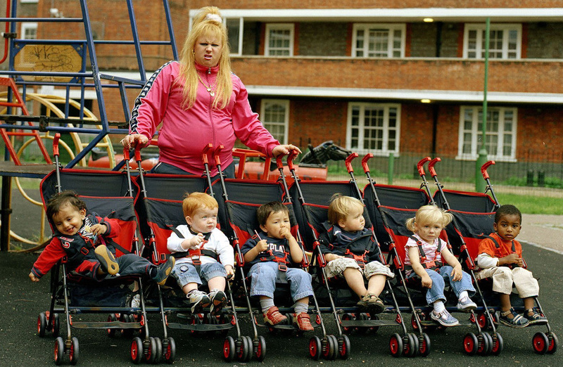
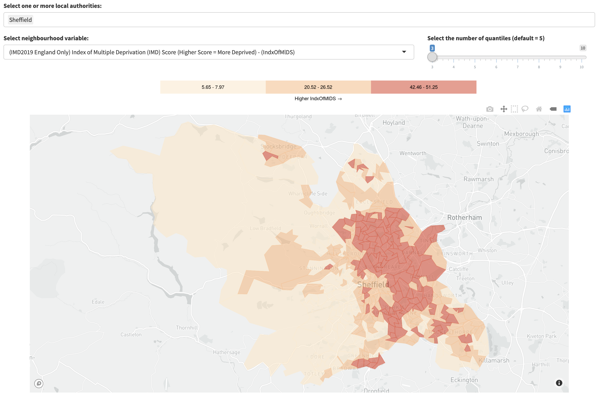

<!-- Set any additional styles here -->

<style>
div.act_box { background-color:rgba(75, 168, 244, 0.3); color:rgba(0, 0, 0, 0.8); border-radius: 5px; padding: 20px;}

div.revis_box { background-color:rgba(246, 214, 100, 0.3); color:rgba(0, 0, 0, 0.8); border-radius: 5px; padding: 20px;}

</style>


```{r setup, include=FALSE}
library(fontawesome)
knitr::opts_chunk$set(echo = FALSE)
library(plotly)
library(tidyverse)
```

## Learning Objectives

By the end of this resource you will...

* Have read an overview of recent research into small-area ethnic disproportionality in child welfare intervention rates, and how this differs from what we would expect in a non-intersectional analysis. 
* Have learned how to read different 'Incidence Rate Ratios', and apply these to a reflection on local levels of deprivation. 
* Have revised the theory of intersectionality, and also definitions of individual, institutional, and structural racism, critically applying these frameworks to your locality and to a case study reflection.


<hr>

## CPD Profile

<div class="act_box">

|SWE CPD Domain   |Description     |In this resource   |
|:----|:------------------|:------------------|
|4.4 |Demonstrate good subject knowledge on key aspects of social work practice and develop knowledge of current issues in society and social policies impacting on social work. |Learn about findings from contemporary research about disproportionality in child welfare intervention rates at the intersection of ethnicity and deprivation. |
|4.5 |Contribute to an open and creative learning culture in the workplace to discuss, reflect on and share best practice. |Learn how to interpret these findings and apply them to an reflection on neighbourhoods in your locality. |
|4.8 |Reflect on my own values and challenge the impact they have on my practice. |Think critically about how the intersection of ethnicity and deprivation might shape social work practice and systems, including the impact of individual, institutional, and structural racism and how racism can be filtered through the lens of poverty/class/deprivation. |

</div>

<hr>


```{r, layout="l-page-outset"}
knitr::include_graphics("Media/CLA_infographicv2.png")
```
[A colourblind friendly version of this graph is available by clicking here.](http://calumwebb.uk/img/CLA_infographicv2_colourblindfriendly.png)


## Evidence on Ethnic Disproportionality in Child Protection 

In a representative sample of English local authorities' administrative child protection data from 2015, we found rates of child who were 'Looked After' or on Child Protection Plans per 10,000 were 20% higher for Black children and 60% higher for Mixed/Multiple Ethnic Heritage children than they were for White children.[@bywaters2018paradoxical] We also found that rates for Asian children were only around 2/5<sup>ths</sup> that of the rate White children. 

There is no evidence that people with different ethnic heritage are this much more or less likely to experience child abuse even before controlling for other factors, with the possible exception of Asian respondents who have both lower rates of intervention and lower self-reported rates of experiencing abuse. An analysis of the [Crime Survey for England and Wales by the Office for National Statistics](https://www.ons.gov.uk/peoplepopulationandcommunity/crimeandjustice/articles/abuseduringchildhood/findingsfromtheyearendingmarch2016crimesurveyforenglandandwales#personal-and-household-characteristics-of-survivors-of-abuse-during-childhood) found that there were around 3 Black respondents reporting they had experienced childhood abuse for every 4 White respondents reporting abuse. There were around 6 Mixed Heritage respondents reporting abuse for every 5 White respondents reporting abuse, and around 1 Asian respondent for every 2 White respondents. These differences are much smaller than, or the inverse of, those found in the child protection system itself.

Other Child Welfare Inequalities Project research also found that rates of children taken into care, placed on child protection plans, or meeting the criteria for being 'in Need' were far higher in more deprived neighbourhoods [(Open Access Reports Link)](https://www.coventry.ac.uk/research/research-directories/current-projects/2014/child-welfare-inequality-uk/cwip-project-outputs/).[@bywaters2018inequalities; @webb2020untangling] Children living in the most deprived 10% of neighbourhoods were ten times more likely to be 'looked after' than children in the least deprived 10%. We also know that many ethnic groups are at far greater risk of poverty.[@platt2007poverty; @platt2019understanding] After housing costs in 2007, Mixed Heritage households^[Ethnicity of a household is determined by the 'Household Reference Person' in surveys] were 1.7 times more likely to be living in poverty; Pakistani and Bangladeshi households were 3.1 times more likely; and Black households were 2 times more likely.[@platt2007poverty]

One potential explanation for the overrepresentation of some ethnic groups in the child protection system might therefore be that ethnic disproportionality arises because of differential exposure to poverty.

When we investigated this, we found that this explanation was inadequate.[@webb2020cuts] In fact, neighbourhood poverty (from the neighbourhood a child lived in before entering care, in the case of children looked after), has a very different association with social work intervention rates depending on the ethnicity of the children involved. For example, in our recent article we estimate that the rates of Children Looked After in poor neighbourhoods^[Defined as +1 Standard Deviation Indices of Multiple Deprivation Score] are 15 times higher than they are in more well-off neighbourhoods^[Defined as -1 Standard Deviation Indices of Multiple Deprivation Score] for White British child populations, but for Black African child populations, the expected difference in the rates between poor neighbourhoods and well-off neighbourhood was only a 1.3 times increase.^[See video below for a more detailed overview of findings.]

We also found that there were very large differences *within* ethnic groups. For example, Black Caribbean child populations' rates of care were more strongly associated with deprivation than Black African child populations'. Black Caribbean child populations had around 3.5 times higher rates in poorer neighbourhoods than they did in well-off neighbourhoods. A much stronger socioeconomic gradient than there was for Black African populations, but one that was much lower than the White British gradient.

What this means is that, even though there are a disproportionate number of Black and Mixed Heritage children in the child protection system overall, ethnic disproportionality looks very different depending on the level of poverty in a neighbourhood, and vice versa - the 'social gradient'^[Socioeconomic inequalities in child welfare interventions] in child protection looks different depending on the ethnic demographics of the neighbourhoods. Child welfare intervention rate inequalities are intersectional. Different strategies for reducing ethnic and poverty disproportionality may be needed depending on the different contexts.

## What is intersectionality?

The term intersectionality was coined by Kimberlé Crenshaw in a 1989 essay, 'Demarginalizing the intersection of race and sex: A black feminist critique of antidiscrimination doctrine, feminist theory and antiracist politics'.[@crenshaw1989demarginalizing] Crenshaw highlighted, among other things, that multiple different institutions: race, sex, disability, age, class, and so on, create interlocking systems of discrimination and privilege, but that these were never simply an addition of any two in isolation.[@crenshaw2017intersectionality] Put simply with an example, the experience of being a Black woman can not be approximated by merging together what we know about the experiences of being a woman with what we know about the experiences of being Black. The intersectional experience is unique, not additive.

This might sound obvious, but in practice - especially scientific practice - we are usually stubbornly non-intersectional. This is especially the case when it comes to quantitative analyses. We tend to analyse differences between people and populations by seperating out parts of their identity and experiences and estimating some kind of effect averaged across all the other kinds of identities and experiences they may have. In many cases, the average can end up representing no-one or, very often, the average only ends up doing a better job representing the majority group across some other category: for example, in a predominantly White country the effect of deprivation isolated from ethnicity may more accurately reflect the effect for White people than it does for people from any other ethnic group.

We then tend to make the logical error of assuming we can simply 'add together' these average effects to get an accurate estimate of the combined effect. For example, we assume that if we add up the average experience of the Black population to the average experience of the 'Poor' population, we would get a good estimate of what it is like to be both Black and 'Poor'. Very often this is wrong. Sometimes it is very wrong, as we found with intervention rates! 

The importance of intersectionality can't be understated, and while it is still largely associated with the social sciences and critical social theory, the concept has been essential in improving clinical and epidemiological research.[@mullings2006intersectionality; @bauer2014incorporating; @holman2020mapping] As briefly discussed, and as this resource will go on to demonstrate below, it is essential for social workers to develop an intersectional understanding of (at least) the intersection of ethnicity and deprivation to understand child welfare inequalities.

<center>
<iframe width="560" height="385" src="https://www.youtube-nocookie.com/embed/rwqnC1fy_zc" frameborder="0" allow="accelerometer; autoplay; clipboard-write; encrypted-media; gyroscope; picture-in-picture" allowfullscreen></iframe>
</center>

<aside><font size = 2>Watch the following animated explanation of intersectionality from [Dan Holman](https://www.sheffield.ac.uk/socstudies/people/academic-staff/daniel-holman), [Sarah Salway](https://www.sheffield.ac.uk/socstudies/people/academic-staff/sarah-salway), and [Andrew Bell](https://www.sheffield.ac.uk/smi/people/academic/andrew-bell) at the University of Sheffield. You can find out more about their project 'Intersectional Health' [here](https://intersectionalhealth.org).</font></aside>


## Ethnicity, deprivation, motherhood, and childhood

There is not the space here to discuss in depth all of the possible combinations of experiences, cultural stereotypes, and institutionalised biases and prejudices that are relevant to child and family social work and which underpin child welfare inequalities. However, a few pieces of research and writing about some specific intersections of gender, ethnicity, and class, in relation to motherhood and childhood may be worth mentioning, as they can help us think critically about our the unequal intervention rates we see in social work. Perceptions of parents behaviour and children's behaviour are often filtered through the lens of 'race' and socioeconomic status.

Firstly, while focused on experiences in the US, Professor Dawn Marie Dow's book 'Mothering While Black: Boundaries and Burdens of Middle‐Class Parenthood' explores the intersection of motherhood, middle-class, and Black identity.[@dow2019mothering] In it, she discusses how access to greater socioeconomic capital (from being middle class), does not erase or alleviate the many discriminatory experiences associated with ethnicity, and many feel pressure to move to predominantly White, middle-class neighbourhoods where these experiences can become more acute. This is especially the case when it comes to the schooling of children, where many schools see education as a 'race-neutral' institution, resulting in a great deal of labour from mothers to educate schools on the effects of racism. Black children must simultaneously confront low expectations from teachers,[@rollock2014colour] racism from peers in predominant White schools,[@lander2015racism] and high expectations of parents. A middle-class identity does not erase the suspision Black children and parents face from many institutions, and in some cases this might even be exacerbated; removing the race-based structural inequalities related to the overrepresentation of Black families in poverty does not completely remove the effects of other forms of racism or effects of structural racism.

The experiences of White working-class mothers living in poverty are often ignored, oversimplified, or undertheorised and misrepresented, despite parodies being paraded in front of our faces very frequently. This is despite a wealth of sociological literature on the subject. Dr. Lisa McKenzie's book 'Getting By' explores the identities and experiences of White working class women living in the St. Anne's estate in Nottingham.[@mckenzie2015getting] In it, McKenzie describes the impact of the denigration of working class White women, especially those who live in diverse, multicultural areas, and how these narratives affect the people they stigmatise; particularly how stereotypes of laziness, irresponsibility, and promiscuity paint them as moral villains. Many of these stereotypes are also applied to, or originated in, racist language and narratives directed at Black women. In the US, Newitz & Wray (1996) highlight how the term 'white trash' performs a function to racialise 'low' socioeconomic status, explicitly positioning it in relation to ethnicity/race and simultaneously reinforcing the idea in a White supremacist society^[It is important here to state explicitly that a White supremacist society does not mean that Ku Klux Klan leaders and racists hold all the power in office, or that White people have all the power and privileges in law and so on, as many people mistakenly believe. A White supremacist society means a society with a history of culture, beliefs, norms, traditions, and laws that have been associated with the idea that White people are superior to people of other 'races', many of those beliefs, laws, and norms may no longer be expressed individually but their existence has far-reaching effects into the future. Countries that were built on slavery and then anti-miscegenation and segregation laws clearly had a historical view of Black and other groups of people as inferior to White people. Coloniser nations and colonial settler nations drew their legitimacy in taking land from indigenous populations from the idea that White Europeans were superior to the people who lived on the land and were bringing civility and order to those countries. These supremacist ideas were back by many institutions, including in education, where 'race science' taught that White people were biologically superior. These ideas still exist and resurface in various forms today. Read the work of Angela Saini (Superior: the return of race science) and Dorothy E Roberts (Killing the Black Body and Fatal Intervention) for an introduction.] that to be White and poor is atypically abhorrent, 'not quite White', but to be non-White and poor is normal.[@newitz1996white] Similarly, Professor Imogen Tyler examines the figure of the 'female chav', and the "vilification of young white working-class mothers ... that embodies historically familiar and contemporary anxieties about female sexuality, reproduction, fertility, and 'racial mixing.'"[@tyler2008chav] Often, the narratives of working-class women living in poverty are individualised, and ignore structural factors. 

Thirdly, and associated with the above example, White mothers of mixed heritage children - especially single White mothers - are especially vilified. Narratives of disgust about White working class women living in poverty with Mixed Heritage children are exchanged unchallenged most of the time, often in the form of jokes (see image below). These attitudes are reflective of the Fletcher report in 1930, that classified White women in relationships with Black men as 'mentally weak', 'young and reckless', 'prostitutes', or forced into marriage through pregnancy.[@fletcher1930report] In our culture they are often seen as permissable subjects of ridicule, and their children face the sharp end of both racism and class prejudice.

Again, these are only a few examples, but they show how thinking in an intersectional framework provides useful ways of reflecting on social work as an institution as well as on social work practice. Knowing that this is something that is useful can help us avoid falling into the trap of assuming that we can simply 'add up' abstracted experiences.

<br>

```{r, layout="l-page-outset", fig.cap="Vicky Pollard, a character in Matt Lucas and David Walliam's 'Little Britain'"}

```

<br>


<div class = "act_box">

<p style="text-align:right";>
`r fa("readme", fill = "#00A0E9", height = "30px")`
</p>

#### Key messages from research

* There are large inequalities between ethnic groups in social work interventions.
* These are not convincingly explained by different chances of experiencing abuse, as reported by adult respondents from different ethnic groups, meaning that understanding social work responses and policies is important.
* Very large inequalities between poor and well-off neighbourhoods, combined with the greater exposure to poverty that many ethnic minority groups face as a result of structural racism, also do not adequately explain the differences we see in intervention.
* An intersectional analysis shows that ethnic disproportionality looks different depending on the level of deprivation in the area, and strategies that do not consider both together may be unproductive. 
* Thinking about intersections of ethnicity and class can help us start to understand how some of these inequalities might emerge, and how effective anti-racist and poverty aware practice and polciies can be developed.

</div>


## Explaining Intersectional Ethnicity/Deprivation Patterns in Children Looked After Rates

<iframe width="840" height="470" src="https://www.youtube-nocookie.com/embed/WD3KhkASkFc" frameborder="0" allow="accelerometer; autoplay; encrypted-media; gyroscope; picture-in-picture" allowfullscreen></iframe>

<aside>
<font size=2>
This twenty-minute presentation shows how to interpret the graph at the start of the resource, and talks about some of the findings and their consequences for social work. 
</font>
</aside>


## Using Measures of Ethnic Disproportionality to Inform Practice

Using our research, it's possible to estimate how ethnic disproportionality is likely to look in neighbourhoods with different levels of deprivation. We can combine this information with maps of low, middling, and high deprivation neighbourhoods in a local authority to think more critically about ethnic disproportionality in the context of different parts of cities, towns, and counties. 

This section will show you how to interpret 'incidence rate ratios' for eleven ethnic groups in three tables - one for Children in Need rates, one for Child Protection Plan rates, and one for Children Looked After rates - and how to create a map of low, middling, and high deprivation in your area. These two pieces of information can be used to develop more complex insights and discussions about ethnic disproportionality.

Below are three tables that can be expanded and hidden. First, let's discuss the differences between the rates that are **in bold** typeface and the rates that aren't. If a rate ratio is in **bold** this means that the ratio is statistically significant at the 5% level. In other words, this means that if the rate is not in bold, we do not have strong evidence that the rate differs significantly from the White British rate.

The 'incidence rate ratio (IRR)' refers to the number of children per 10,000 in that ethnic group we would expect to experience an intervention for every one White British child experiencing that intervention per 10,000 White British children. In other words, an IRR *less than one* means that that ethnic group has lower rates than the White British rates in that context, and an IRR *greater than one* means that the ethnic group has higher rates than the White British rates in that context.

<div class = "act_box">
<p style="text-align:right";>
`r fa("star-half-alt", fill = "#00A0E9", height = "30px")`
</p>

#### Interpreting an IRR

In Table 2 (CPP rate ratios), the IRR value for Asian Bangladeshi children in High Deprivation Neighbourhoods is 0.06. This means that, in a high deprivation neighbourhood, we would expect to see only 0.06 per 10,000 Bangladeshi children on Child Protection Plans for every 1 White British child per 10,000 on a Child Protection Plan. In other words, that if we had a CPP rate of 100 per 10,000 for White British children, we would expect to see a CPP rate of only 6 per 10,000 for Bangladeshi children in the same type of neighbourhood. In this context, a high deprivation neighbourhood, we can see that White British children are far more likely to be placed on a protection plan than Bangladeshi children, relative to the size of their population.

But now take a look at the 'low deprivation' column on the right hand side. In a low deprivation neighbourhood, the ratio is 2.67 Bangladeshi children per 10,000 Bangladeshi children for every 1 White British child per 10,000 White British children.  In low deprivation neighbourhoods the difference between Asian Bangladeshi rates and White British rates is reversed. What consequences might this have for strategies to reduce disproportionality?

Try interpreting a few of these IRRs until you feel comfortable explaining what they mean to someone else. It may be useful to work in pairs.
</div>


#### Table 1. Intervention Rate Ratios for Children in Need per 10,000 (Bold = Significantly different to the White British population)

<details open>
  <summary>Click to show/hide table</summary>

| Ethnic Group | High Deprivation <br><br> IRR | Mid Deprivation <br><br> IRR | Low Deprivation <br><br> IRR |
|---  |--- |--- |--- |
| White British        | 1        | 1        | 1        | 
| Asian Bangladeshi    | **0.22** | **0.69** | **2.19** |
| Asian Indian         | **0.12** | **0.31** | **0.80** |
| Asian Pakistani      | **0.34** | **0.69** | **1.32** |
| Black African        | **0.54** | **1.19** | **2.65** |
| Black Caribbean      | **0.66** | **1.51** | **3.48** |
| Black Other          | **0.32** | 1.10     | **3.82** |
| M. Heritage Other    | 2.78     | **2.95** | 3.12     |
| White & Asian        | 0.90     | 0.97     | 1.05     |
| White & B. African   | **0.44** | 1.04     | **2.47** |
| White & B. Caribbean | **0.69** | **1.30** | **2.46** |

**Bold** rate ratios are statistically significant at at least the 5% level.

</details>

#### Table 2. Intervention Rate Ratios for Child Protection Plans per 10,000 (Bold = Significantly different to the White British population)

<details open>
  <summary>Click to show/hide table</summary>

| Ethnic Group | High Deprivation <br><br> IRR | Mid Deprivation <br><br> IRR | Low Deprivation <br><br> IRR |
|---  |--- |--- |--- |
| White British        | 1        | 1        | 1        | 
| Asian Bangladeshi    | **0.06** | 0.4      | **2.67** |
| Asian Indian         | **0.13** | **0.28** | **0.61** |
| Asian Pakistani      | 0.46     | **0.37** | 0.3      |
| Black African        | **0.22** | 0.59     | **1.56** |
| Black Caribbean      | 0.50     | 0.83     | 1.37     |
| Black Other          | **0.10** | 0.75     | **5.62** |
| M. Heritage Other    | **1.67** | **2.8**  | **4.71** |
| White & Asian        | 0.76     | 0.78     | 0.79     |
| White & B. African   | **0.43** | **1.6**  | **6.04** |
| White & B. Caribbean | **0.59** | **1.84** | **5.67** |

**Bold** rate ratios are statistically significant at at least the 5% level.

</details>


#### Table 3. Intervention Rate Ratios for Children Looked After per 10,000 (Bold = Significantly different to the White British population)

<details open>
  <summary>Click to show/hide table</summary>

| Ethnic Group | High Deprivation <br><br> IRR | Mid Deprivation <br><br> IRR | Low Deprivation <br><br> IRR |
|---  |--- |--- |--- |
| White British        | 1        | 1        | 1        | 
| Asian Bangladeshi    | **0.17** | 0.67     | **2.3**  |
| Asian Indian         | **0.04** | **0.13** | **0.44** |
| Asian Pakistani      | 0.18     | **0.33** | 0.54     |
| Black African        | **0.37** | 1.28     | **3.98** |
| Black Caribbean      | **0.84** | **1.91** | **3.35** |
| Black Other          | **0.27** | 1.13     | **3.81** |
| M. Heritage Other    | **1.74** | **2.62** | **3.41** |
| White & Asian        | 0.76     | 1.03     | 1.26     |
| White & B. African   | **0.4**  | 0.99     | **2.07** |
| White & B. Caribbean | **0.74** | **1.44** | **2.49** |

**Bold** rate ratios are statistically significant at at least the 5% level.

</details>


### Mapping Deprivation

We can use the Mapping Overlaps Gadget, a free tool, to create a map of low, middling, and high deprivation in a children's services local authority area. Start by going to [https://webb.shinyapps.io/MOG_education/](https://webb.shinyapps.io/MOG_education/) and waiting for the app to load.

1. On the left-hand menu, click the option 'Univariate Maps'
2. In the box 'Select one or more local authorities:', delete any current text and either scroll down or start typing the name of your local authority. Click, or press enter, when your local authority is selected to load it. 
3. In the box 'Select neighbourhood variable:', delete the current text and type "Index of Multiple Deprivation", then left-click the option for the English IMD score.
4. The map will now show neighbourhood deprivation split into 5 different groups, from low to high. The number of groups is controlled by the slider on the right hand side, under the text 'Select the number of quantiles (default = 5)'. We just want to focus on low, middling, and high deprivation to simplify things - so drag the slider down to 3.
5. You should now see a map of your local authority with neighbourhood areas coloured in by their level of deprivation. Dark orange/red represents high deprivation, orange represents middling deprivation, and light orange/yellow represents low deprivation. 

If you followed the steps above, you should have a map of your local authority that looks like the one below. You can hover over the map with your mouse to see the name of the area. 


```{r, layout="l-page-outset"}

```

<br>

<div class = "act_box">

<p style="text-align:right";>
`r fa("glasses", fill = "#00A0E9", height = "30px")`
</p>

#### Example: Combining the map and the ethnic disproportionality tables to better understand ethnic disproportionality.

*Brief: Sheffield Children's Services want evidence to inform a strategy to reduce disproportionate rates of Black African children that are 'in Need' in the city.*

Using Table 3, we can see that the IRR for Black African children in Need is 0.66 in High Deprivation areas, 1.19 in Middle Deprivation areas, and 2.65 in Low Deprivation Areas. All of the numbers are in bold, meaning the disproportionality between the White British children and the Black African children is statistically significant in all three types of area.

Using the map above, we can see that the red/dark orange areas are concentrated in East Sheffield. In those areas, rates of Children in Need among the Black African child population are lower than the rates among White British children, because the IRR is less than 1. This might indicate that there are opportunities to learn from these areas how Black African children are well-supported compared to other parts of the city. Additionally, we might learn whether the kind of support available could also be extended or adapted to include other ethnic groups with higher rates, or whether the delivery of services could be improved for Black African children elsewhere in the city through partnerships with other areas.

We can see that low deprivation areas are mostly in West Sheffield. Middle deprivation areas are dispersed and found in the city centre. These are the areas where Black African children have higher rates of 'in Need' status in their neighbourhoods compared to White British children in the same areas, because their IRR is greater than 1. Here, it might be interesting to explore what support may be missing, or what systemic factors may be in place that created greater risk of being in need for Black African children (for example, are there discriminatory housing practices?)

<p style="text-align:right";>
`r fa("mouse-pointer", fill = "#00A0E9", height = "30px")`
</p>

#### Exercise

* Using the MOG app, create a map of deprivation split into low, middle, and high, and explore estimates of small area ethnic disproportionality by cross-referencing the tables. Think critically about these areas in reference to practice and the availability of support (both formal and informal), as well as the ways in which systemic/structural, institutional, and individual racism (see box below) in and around the child protection system might help us understand possible mechanisms of ethnic inequality in intervention rates. It may be helpful to look at just a few ethnic groups to start with. Some possible starting points:

  * How might *structural racism* create disproportionate over-representation of Black children in care in low deprivation neighbourhoods?
  * How might *individual racism* change the interpretation of deprivation for families living in highly deprived neighbourhoods?
  * How might *institutional racism* affect how children of Black or Mixed heritage come to the attention of social workers in the first place?
  * How might *institutional, structural, and individual racism* in social work prevent effective action being taken to reduce ethnic disproportionality? (For example, think about the representation of minority ethnic groups in leadership and management positions)[@reid2020promote]

</div>

<br><br>

<div class = "revis_box">
<p style="text-align:right";>
`r fa("lightbulb", fill = "#C7BF78", height = "30px")`
</p>

#### Individual, institutional, and structural racism[@lawrence2004structural]

**Individual, or interpersonal racism,** refers to personally held racist beliefs and actions that can be internalised or externalised. People with individually racist beliefs or views may not even be consciously aware they hold them, especially if they have never interrogated the way that race and racism has shaped their own life and life chances in relation to others around them. Sometimes the result is explicit, for example, people making racist statements or decisions that affect others negatively, but individual racism may also result in unconscious beliefs and *implicit bias*. For example, a headteacher who consistently dismisses truancy and disruptive behaviour in White male schoolchildren as 'boys will be boys' but punishes and surveils the same behaviour in Black male schoolchildren (detentions, letters home, exclusions), is exhibiting individual, interpersonal racism (even if this is unconscious).

**Institutional racism** refers to racism that is expressed through the policies and behaviour of an institution as a whole, or across institutions. It may reinforce or reward individual racism, and perpetuates structural racism. It can emerge from a culture of unchallenged individual racism (e.g. in a workforce). For example, a law enforcement service with policies that result in them disproportionately policing neighbourhoods with high populations of ethnic minorities is an expression of institutional racism. Anti-racist institutional reforms can fail to be effective if institutional racism exists in adjacent institutions. For example, anti-racist social work reform may be restricted in effectiveness if other institutions that refer children and families to the child protection system, such as the police or schools, are institutionally racist and disproportionately profile children on the basis of their ethnicity.

**Structural racism** refers to the way that racism is embedded in society's history, culture, and collective institutions and policies. This includes, for example, histories where certain ethnic groups have been deprived of resources, opportunities, and liberty on the basis of their 'race', including slavery, colonialism, and segregation. These histories have lasting effects on peoples' opportunities today. For example, historical segregation laws (and/or dominant attitudes that reinforce segregation as a norm) meant that people with Black ethnic heritage were forced to live in poorer areas, which usually had worse schools - or they were forced to go to worse schools. This will have limited the opportunities that their children, grandchildren, and great grandchildren might have had if they had been White. As we saw, ethnic minorities still disproportionately live in the poorest neighbourhoods. Much of this is a legacy of how people were treated on the basis of their 'race' in the past, even though such discrimination is now illegal and unacceptable. Ignoring the impact of this history because discrimination is illegal now ignores the fact that historical racism created a structure that continues to affect peoples lives and life chances.

Structural racism in culture also includes representations of ethnic minorities (in the media and other institutions) that became, or become, commonly accepted; often leading to them being implicitly believed. For example, moral panics were created in the 1970s that portrayed a problem of 'black muggings';[@hall2013policing] similar race-adjacent narratives emerged in response to the 2011 riots in the UK[@murji2011riot] and are implied in responses and media representations of protests and riots associated with the Black Lives Matter movement at the time of writing. The Opportunity Agenda report in 2011[@agenda2011opportunity] found that representations of Black men in the media were commonly associated with criminality and physicality, and rarely with intellectual ability: Black men are portrayed as either athletes or outlaws. Cultural representations of 'race' can shape both institutional racism (e.g. policies developed on the basis of sentiments like 'social workers are too politically correct and need to be tougher on these communities'[@lavalette2013race]) and individual racism, including unconscious internalised racism (e.g. someone crossing the street at night to avoid a young Black man walking towards them because of cultural stereotypes related to criminality).


</div>


<hr>

## Review

* Ethnic disproportionality in child welfare intervention rates looks very different depending on the level of deprivation in a neighbourhood, the simple explanation that many minority ethnic groups are at a higher risk of poverty does not adequately explain the differences in child protection intervention rates. An intersectional analysis provides a more accurate picture.
* Intervention disproportionality at different levels of deprivation also looks very different depending on the ethnic group, even within broader 'categories'; for example, disproportionality looks very different for Black Caribbean ethnic heritage populations than it does for Black African ethnic heritage populations.
* Social gradients in intervention rates (greater poverty being associated with greater intervention), may reflect interpretations of poverty as neglect in some circumstances, especially for White and Mixed Heritage populations, but not in others. This might reflect racist cultural representations of poverty as the 'norm' for Black populations, and/or stigmatising cultural stereotypes about working class White mothers, especially those with Mixed Heritage children.
* Some Mixed Heritage ("Other") neighbourhood populations experience higher levels of intervention regardless of the level of deprivation in their neighbourhood, as well as strong social gradients, but their experiences are often ignored because of the poor recording and categorisation of ethnicity. They face a double-jeopardy of disadvantage. 
* There are no universal or simple ways to represent ethnic disproportionality in child welfare interventions: simplistic strategies are unlikely to work.
* Critical reflection on how deprivation and ethnicity together shape experiences and interactions with institutions like social work and its affiliated agencies are essential to create socially just policy and practice. Better understanding of ethnic and socioeconomic disproportionality, and how they relate to one another, is essential for developing effective anti-racist policies, practice, and activism. This includes shifting our gaze to ethnic disproportionality in 'affluent' areas.

<hr>

<div class = "act_box">

<p style="text-align:right";>
`r fa("user-friends", fill = "#00A0E9", height = "30px")`
</p>


## Case study

Michael is 14 years old and goes to King Edward's School, a comprehensive school in a predominantly White (95 per cent) part of Mosshire. His parents live about ten minutes walk from the school in a nice suburb of the rural county. His mother works as a nurse and his father works as a radiographer in the nearby Mosshire hospital. Michael's mother has Black Caribbean heritage and was taken into care when she was three-years old. She was adopted by a White couple in Mosshire when she was six. Michael's father has multiethnic heritage; his father was Indian and his mother White British. Michael's father moved to rural Mosshire with his mother as a teenager after his father passed away.

Under English census classifications Michael would be classed as being 'Mixed Heritage (Other)'. 

He was referred to children's services by the school. This referral escalated to an assessment on the basis of 'out of control' behaviour and suspected criminal exploitation. His headteacher, Mr. James, reports that Michael has multiple truancies on his attendence record; that he has been stopped and searched by local police, who found him to be in possession of alcohol that he was taking to a friend's house; and that he has been excluded on two occassions for starting fights with other boys. Mr. James also believes that Michael has begun to be ingratiated with a local gang after school. 

Mr. James states that Michael's parents have failed to turn up to parents evenings, and when they have responded to phone calls they have been 'aggressive and angry', and were 'defensive and dismissive' regarding the school's concerns. 

<!--- save for 'What is poverty and CWI resource
**Ryan**
Ryan is 12 years old and goes to St. John's, a grammar school in Greenwood. Ryan was accepted to the grammar school after completing his primary education in Flinthorpe, a historically deprived mining community. St. John's is around 45 minutes by bus from Flinthorpe. Both of Ryan's parents are White; he has green eyes and blonde hair. Ryan's father is unemployed and his mother works part-time in a local convenience store.

Ryan was referred to children's services after his teacher, Ms. Fromley-Brooks, noticed that he had frequently been staying around after school alone; sometimes he was still on the street near the school as late as 6pm when she left. Retrospectively, Ms. Fromley-Brooks reports that Ryan's hair often seems unwashed and his uniform can be 'smelly'. When the school phoned Ryan's parents to discuss this, they were told it was 'none of their business'. 

The referral was escalated to an assessment on the basis of suspected neglect.

--->

#### Reflective questions

* What are your initial reflections on this referral in relation to your own practice?
* How could thinking about individual, institutional, and structural racism help us critically reflect on how Michael's referral emerged and ended up escalating to an assessment (give examples)? 
* How does Michael's referral fit within the context of the intersectional patterns in intervention rates? (Use the incidence rate ratios above if you can.)
* How might the combination of socioeconomic factors (deprivation and affluence) and factors associated with 'race' and racism shape Michael's referral?
* How might Michael's experience and referral have been different if there was a challenge to anything noted that might constitute racism?
* How could social work departments *routinely identify and act on* these reflections to create change? 


#### Example answers and further prompts to reflective questions
<details>
<summary>Click to reveal. Reflect on the questions above before looking at these!</summary>

* There are several areas of concern where individual, institutional, and structural racism may have shaped Michael's referral and its narrative. For example, Mr. James' interpretation of Michael's after-school activities with 'gangs'; how do we know this is not based on the headteacher's prejudice interpretation, especially if Michael is friends with other teenagers with Black ethnic heritage? What about the interpretation that Michael was 'starting' the fights, or that his parents were 'angry and aggressive'? Institutionally, we might question how police stop-and-search policies might have disproportionately targeted Michael for criminalisation for something many teenagers his age do. Structurally, we might think critically about how Black women are often represented in culture as 'angry', and whether we can trust the headteacher's interpretation.[@ashley2014angry] Or, we might think about the cultural representations of young Black men as criminal. We might also consider whether structural racism and disadvantage played a part in Michael's mother's placement in care and whether her having been in care might have influenced the escalation of the referral.
* We can see using the incidence rate ratio table that rates of Mixed Heritage (Other) children on child protection plans in low deprivation areas are 4.7 higher than rates for White children in the same areas, but they are not significantly more likely to be 'in Need' (because this rate is not in bold).  
* We might want to critically question whether we think these concerns would have raised a referral to children's services and escalation to assessment if Michael lived in a more deprived area. For example, is it as likely that Michael would have been stopped by police if he lived in a more deprived area with a higher non-White population? Would behaviour that was 'concerning' raise this much suspicion if he lived in a deprived neighbourhood and went to a more deprived school, or would it have been seen as normal? Do White children engage in similar behaviours which get interpreted differently?
* If the police stop-and-search on Michael was challenged, would his behaviour have been more likely to be considered normal teenage behaviour rather than criminalised? Was any challenge made to whether the school's exclusion policies are more punitive for non-White students? Should Mr. James' interpretation of Michael's after-school associates as members of a 'gang' be challenged in case notes (or even excluded) until it can be confirmed that his perception was not based on racist stereotypes?
* Some suggestions might be: Greater education and more complex thinking about how institutions and individuals interpret things through the lens of 'race' and 'class'. More joined-up thinking about how institutionalised racism and class prejudice might spread from one institution (e.g. education) to another (e.g. social work), and how to identify and stop it by asking explicit questions about procedures, policies and referrals. Greater community engagement and reflection to understand how racism, class prejudice, and material resources shape routes into intervention in local areas. Strategies to promote diversity and lived experience at all levels of the social work workforce, especially where senior leadership is responsible for supervision. More awareness of how poverty might be inappropriately interpreted as neglect in some instances, but as a 'norm' in others (based on racist narratives that normalise poverty in Black and Mixed Heritage populations). Even if this referral is closed with no further action, should children's services have a responsibility to work with the school to implement anti-racist policies and anti-racist education (including for their educators?)

</details>

</div>

<hr>

# Padlet Discussion Board

<div class="padlet-embed" style="border:1px solid rgba(0,0,0,0.1);border-radius:2px;box-sizing:border-box;overflow:hidden;position:relative;width:100%;background:#F4F4F4"><p style="padding:0;margin:0"><iframe src="https://padlet.com/9e4keezwnh/ejeh98s5wek6dbno" frameborder="0" allow="camera;microphone;geolocation" style="width:100%;height:800px;display:none;padding:0;margin:0"
onload="this.style.display='block';"></iframe></p><div style="padding:8px;text-align:right;margin:0;"><a href="https://padlet.com?ref=embed" style="padding:0;margin:0;border:none;display:block;line-height:1;height:16px" target="_blank"></a></div></div>

<aside>
<font size=2>
Is it important to know about these intersectional inequalities, and why? How could you use this research to inform your own practice or to reflect on how children's services strategies could change? What other intersectional inequalities do you think there might be in child welfare, and how might they affect practice?
</font>
</aside>


