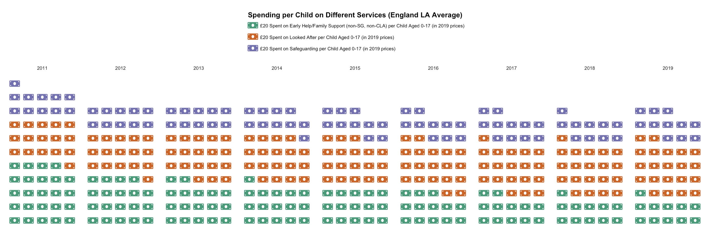
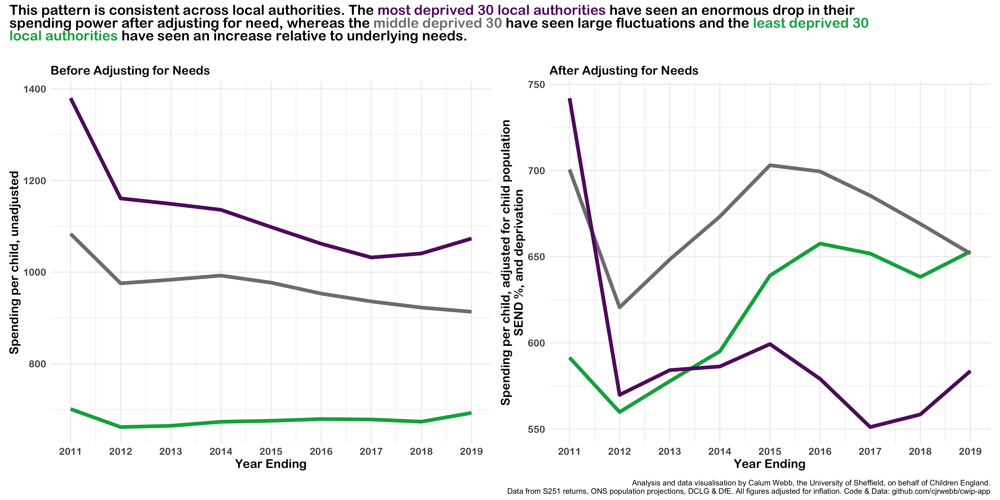

<!-- run rmarkdown::render_site(input = "cpd_website") to create site update after new content is finalised -->

<!-- csl: "../../../data_resources/the-open-university-numeric-superscript.csl" -->
<!-- bibliography: "../../../data_resources/biblio.bib" -->

<!-- Set any additional styles here -->

<style>
div.act_box { background-color:rgba(75, 168, 244, 0.3); color:rgba(0, 0, 0, 0.8); border-radius: 5px; padding: 20px;}

div.revis_box { background-color:rgba(246, 214, 100, 0.3); color:rgba(0, 0, 0, 0.8); border-radius: 5px; padding: 20px;}

</style>

```{r setup, include=FALSE}
library(fontawesome)
knitr::opts_chunk$set(echo = FALSE)
library(plotly)
library(tidyverse)
library(patchwork)
library(crosstalk)
library(DiagrammeR)
```

## Learning Objectives

By the end of this resource you will...

* Be able to reference legislation and codes of ethics in social work that are relevant to the need to understand and put in place practice and policy that addresses child welfare inequalities.
* Be able to describe the scale of child welfare inequalities in England and Wales, and the meaning of a socioeconomic 'social gradient' in intervention rates.
* Be able to explain the relationship between poverty and child welfare interventions, especially in consideration of how poverty *is* abusive to parents and children; how it acts as an external stressor for intermediatory mechanisms that can result in neglect or abuse; and how it creates over-surveillance of certain groups.
* Be able to explain how different local contexts change the strength of this social gradient in intervention rates, including how wider social conditions make poverty 'stand out'; how income inequality may affect relational practice; and how underfunding and austerity narratives may shape how people interpret the experiences of people living in poverty. 
* Be able to critically apply the theoretical mechanisms between poverty and child welfare interventions to better understand how these inequalities emerge and possible practice and systemic responses.
* Learn about practice and systems recommendations from the British Association of Social Workers' Anti-Poverty Practice Guide for Social Work, and critically evaluate their use in children's services.
* Evaluate a case study using an inequalities lens, and reflect on how poverty and child welfare inequalities shape social work practice.

<hr>

## CPD Profile

<div class="act_box">

|SWE CPD Domain   |Description     |In this resource   |
|:----|:------------------|:------------------|
|4.1 |Incorporate feedback from a range of sources, including from people with lived experience of my social work practice. | The content in this resource draws on material developed with and by people with lived experience, as well as more traditional academic resources. |
|4.4 |Demonstrate good subject knowledge on key aspects of social work practice and develop knowledge of current issues in society and social policies impacting on social work. | You will learn about cutting-edge research on child welfare inequalities from the Child Welfare Inequalities Project and review new guidance from BASW on anti-poverty practice. |
|4.5 |Contribute to an open and creative learning culture in the workplace to discuss, reflect on and share best practice. | You will reflect on new forms of practice, with the opportunity to reflect on a case study and discuss with others below. |
|4.6 |Reflect on my learning activities and evidence what impact continuing professional development has on the quality of my practice. | You will be able to use practice recommendations and theoretical models in this resource to reflect on your own practice, with a guided case study exercise to support this. |
|4.8 |Reflect on my own values and challenge the impact they have on my practice. | You will reflect on the ways that wider sociological factors may shape your own views that can impact on practice. |

</div>

<hr>

## What are child welfare inequalities and why are they important?

Child welfare inequalities refer to the observation that children have unequal chances of being involved with child protection and child welfare systems on the basis of their own or their family's identity, demographic characteristics, or socioeconomic status. Professor Paul Bywaters defined child welfare inequalities as:[@bywaters2015exploring]

> "when children and/or their parents face unequal chances, experiences or outcomes of involvement with child welfare services that are systematically associated with structural social dis/advantage and are unjust and avoidable"

The prevalence and trends in child welfare inequalities are important to social work as a profession that is committed to principles of social justice and anti-oppression, for example, as declared in the International Federation of Social Workers' Global Statement of Ethical Principles (§3.1):[@ifsw2018global]

> Social workers promote social justice in relation to society generally and to the people with whom they work.

> Social workers challenge discrimination, which includes but is not limited to age, capacity, civil status, class, culture, ethnicity, gender, gender identity, language, nationality (or lack thereof), opinions, other physical characteristics, physical or mental abilities, political beliefs, poverty, race, relationship status, religion, sex, sexual orientation, socioeconomic status, spiritual beliefs, or family structure.

Under Article 14 of the Human Rights Act 1998, Section 29 of the Equalities Act 2010, and article 2 of the Convention on the Rights of the Child, local authorities have a legal duty to ensure that services provided to children and families do not discriminate on the basis of age, disability, sex, gender reassignment, sexual orientation, marital status, race, religion or belief, political opinion, language, or national origin. 

You will notice, interestingly, there is no protection in law against discrimination on the basis of class and/or socioeconomic status; although this is reflected in IFSW's global principles and in the British Association of Social Workers' Code of Ethics, Section 2.2.[@basw2014code] The closest legal requirement to not discriminate on the basis of socioeconomic status is the 'socioeconomic duty', found in Section 1 of the Equality Act 2010:

> An authority to which this section applies must, when making decisions of a strategic nature about how to exercise its functions, have due regard to the desirability of exercising them in a way that is designed to reduce the inequalities of outcome which result from socio-economic disadvantage.

However, successive governments have refused to enact the socioeconomic duty as law, meaning families have no recourse to legal protection on the basis of socioeconomic or class-based discrimination.[@poverty2solutionsNDenact] This is important for understanding why social work awareness of socioeconomic inequalities are vital.

## Video and Podcast: 

The following video is from the earlier stages of the Child Welfare Inequalities Project that outlines why child welfare inequalities are important. It also explains the 'Inverse Intervention Law', which this resource will go on to talk about.  The figures in the video are slightly different to the final, representative estimates of child welfare inequalities in England.


<iframe width="840" height="470" src="https://www.youtube-nocookie.com/embed/j0IEYnrt0KY" frameborder="0" allow="accelerometer; autoplay; encrypted-media; gyroscope; picture-in-picture" allowfullscreen></iframe>

<aside>
<font size = 2>

The Child Welfare Inequalities Project was funded by the Nuffield Foundation, and identified socioeconomic and other inequalities in intervention rates across the four nations of the UK, using representative samples of local authorities.

</font>
</aside>

There has also been [a podcast](https://www.youtube.com/watch?v=7AE-BHvg4J8) from the British Association of Social Workers about Child Welfare Inequalities, with Professor Paul Bywaters, Professor Brid Featherstone, and Professor Kate Morris, the principal investigators of the Child Welfare Inequalities Project, which you may wish to listen to for a full overview of the project findings. 

<div class = "revis_box">
<p style="text-align:right";>
`r fa("lightbulb", fill = "#C7BF78", height = "30px")`
</p>

**Socioeconomic status** refers to a person's combined social and economic position and resources in society, usually measured by a combination of education, occupation, and income.[@baker2014socioeconomic] This is usually based on Bourdieusian  ideas of capital, which he divided into *economic*, *social*, *cultural* and *symbolic*.[@wacquant2006pierre] In practice, the first three are usually used in reference to socioeconomic status. As an oversimplified summary, *economic* capital refers to fairly self-explanatory income, wealth, and other material resources. *Social* capital refers to valuable connections with other people or institutions that can be used to a person's benefit, for example, if a parent knows a headteacher at a local grammar school and uses this connection to get information and resources to assist with their child's application, they are leveraging their social capital. *Cultural* capital refers to knowledge that is often passed on from parents or communities to children, in relation to how these different skills are valued; it is commonly seen in levels of education. For example, the family around a child may provide greater resources about literature by providing 'classical' books and encouraging reading, which a child would likely be able to use in their life to their own advantage (e.g. to create social capital). Importantly, cultural capital's worth depends on what the wider society sees as valuable - a similar family might encourage the same amount of reading but they may not have the pre-existing cultural capital to know what kinds of books are 'valuable' for their child to read. The Indices of Multiple Deprivation (IMD) is a geographic measure that captures deprivation, which we often use to approximate socioeconomic status.

</div>

<br>

## The scale of socioeconomic inequalities in child welfare

Children from the poorest ten per cent of neighbourhoods are over ten times as likely to be in foster or residential care than children from the least poor ten per cent of neighbourhoods.[@bywaters2020child] This is not just a sudden leap, but a steady climb, where increases in deprivation are associated with step-changes in intervention rates. We call this a social gradient. In later publications, we started ascribing a single number to describe the strength of a social gradient, representing the multiplicative change in intervention rates between low deprivation neighbourhoods and average deprivation neighbourhoods, and between average deprivation neighbourhoods and high deprivation neighbourhoods.[@webb2020untangling; @webb2020cuts] Low deprivation in this instance is roughly the average of all neighbourhoods in the least deprived 1/3rd of all neighbourhoods; high deprivation is roughly the the average of all neighbourhoods in the most deprived 1/3rd of all neighbourhoods (so not quite as extreme comparison points as bottom and top 10%). We found that the average social gradient was between 1.55 and 1.75, depending on the kind of intervention. This means that rates of intervention were 1.55 to 1.75 times higher in average deprivation neighbourhoods than they were in low deprivation neighbourhoods, and 1.55 to 1.75 times higher in high deprivation neighbourhoods than they were in average deprivation neighbourhoods. 

This is true even after controlling for ethnicity and ethnic density, spatial clustering, and infant mortality.[@webb2020untangling] The same or very similar patterns have also been found all over the world in Western/colonial settler nations, including in New Zealand,[@keddell2019child] the United States of America,[@lindsey1991factors; @maguire2017community; @putnam2013racial; @coulton2007neighborhoods] Australia,[@tilbury2015aboriginal] Israel[@sulimani2013child] and Canada.[@esposito2017out] In England and Wales, income deprivation is by far the strongest predictor of variation in local authority child protection plan/register and children looked-after rates.[@webb2020income] We estimated that as much as 75 per cent of the variation in children looked-after rates across England and Wales, and almost 50 per cent of variation in child protection plans/registrations, could be explained by the differences in income deprivation and income inequality across the country.

The following graphs show how the average child protection plan and children looked-after rates per 10,000 change in different deciles of neighbourhood deprivation in England, where 10 is the most deprived 10 per cent of neighbourhoods. As you can see, there is a very strong association between children looked after rates and child protection plan rates and levels of neighbourhood deprivation.

<br>

```{r, layout="l-page-outset"}

htmltools::HTML("<h3>Child Protection Plan Rate per 10,000 by neighbourhood deprivation decile (10 = most deprived).</h3>")

```

```{r, layout="l-page-outset"}

cwi_rates <- tibble(depr = c(1, 2, 3, 4, 5, 6, 7, 8, 9, 10, 1, 2, 3, 4, 5, 6, 7, 8, 9, 10),
                    cpp = c(9, 14, 21, 23, 32, 35, 47, 51, 71, 113, 1, 5, 8, 13, 17, 33, 39, 55, 74, 114), 
                    cla = c(12, 14, 23, 29, 29, 40, 55, 67, 88, 133, 7, 12, 16, 22, 31, 39, 54, 63, 108, 165),
                    country = c(rep("England", 10), rep("Wales", 10)))
        
cpp_plot <- cwi_rates %>%
  ggplot() +
  geom_bar(aes(x = as.factor(depr), y = cpp, group = country, fill = country, text = paste("CPP rate:", cpp, "per 10,000 -", country)), stat = "identity", position = "dodge") +
  ggtitle(str_wrap("", 80)) +
  scale_fill_manual(values = c("#00997B", "#F8C500")) +
  ylab("Child Protection Plans per 10,000 Children") +
  xlab("Deprivation Decile of Neighbourhoods (10 = Most Deprived)") +
  ggeasy::easy_add_legend_title("Country") +
  theme_minimal() +
  theme(plot.title = element_text(face = "bold")) &
  plot_annotation(caption = "Data from Bywaters, et al. 2020.")

ggplotly(cpp_plot, tooltip = "text") %>% config(displayModeBar = F)


```

<br>

```{r, layout="l-page-outset"}

htmltools::HTML("<h3>Children Looked-After Rate per 10,000 by neighbourhood deprivation decile (10 = most deprived).</h3>")

```

```{r, layout="l-page-outset", fig.cap="Data from Bywaters, et al. (2020)[@bywaters2020child]"}

cwi_rates <- tibble(depr = c(1, 2, 3, 4, 5, 6, 7, 8, 9, 10, 1, 2, 3, 4, 5, 6, 7, 8, 9, 10),
                    cpp = c(9, 14, 21, 23, 32, 35, 47, 51, 71, 113, 1, 5, 8, 13, 17, 33, 39, 55, 74, 114), 
                    cla = c(12, 14, 23, 29, 29, 40, 55, 67, 88, 133, 7, 12, 16, 22, 31, 39, 54, 63, 108, 165),
                    country = c(rep("England", 10), rep("Wales", 10)))
        
cla_plot <- cwi_rates %>%
  ggplot() +
  geom_bar(aes(x = as.factor(depr), group = country, fill = country, y = cla, text = paste("CLA rate:", cla, "per 10,000 -", country)), stat = "identity", position = "dodge") +
  ggtitle(str_wrap("", 80)) +
  ylab("Children Looked-After per 10,000 Children") +
  xlab("Deprivation Decile of Neighbourhoods (10 = Most Deprived)") +
  scale_fill_manual(values = c("#00997B", "#F8C500")) +
  labs(caption = "Data from Bywaters, et al. 2020.") +
  theme_minimal() +
  ggeasy::easy_add_legend_title("Country") +
  theme(plot.title = element_text(face = "bold")) &
  plot_annotation(caption = "Data from Bywaters, et al. 2020.")
        

ggplotly(cla_plot, tooltip = "text") %>% config(displayModeBar = F)

```

<br>

Further research by Rick Hood, et al. has shown that different levels of socioeconomic deprivation are associated with different types of cases and, most notably, that the most deprived third of local authorities are likely to have a proportion of neglect cases that is around 1.5 times higher than the proportion of neglect cases in low or middle-deprivation local authorities.[@hood2020identifying] This indicates that the poverty a family is experiencing is often interpreted as neglect by social workers. As Tammy Mayes, activist at ATD Fourth World frequently explains to social workers and policymakers: poverty is not neglect.[@atd2020donation] 


## Unpacking the relationship between poverty and child protection

<iframe width="840" height="470" src="https://www.youtube-nocookie.com/embed/Zf2x3zMfKWk?start=92;" frameborder="0" allow="accelerometer; autoplay; encrypted-media; gyroscope; picture-in-picture" allowfullscreen></iframe>

<aside>
<font size=2>
*Moraene Roberts, who was an activist with ATD Fourth World UK speaking at a discussion about family separation. Find out more about Moraene's life and legacy [here](https://atd-uk.org/2020/01/15/moraene-roberts-campaigning-with-a-banner-made-of-silk/).*
</font>
</aside>

In Dorothy Roberts' book, *Shattered Bonds*, first published in 2002, she argues that poverty becomes embedded in the child protection system in three ways.[@roberts2009shattered] Firstly, Roberts argues that poverty *is* abuse and neglect. It is reflective of a state and society that abuses both children and their parents directly by creating the conditions where the safety net is not adequate enough to support a basic quality of life. In this case, attenting parenting classes, budgeting classes, psychotherapy appointments, psychological assessments, will have little effect on the most important adversity the child and parents face; at best it will help them manage its impact. Practical support and dramatic policy change is needed.

Second, it is important to address the fact that in many cases of child maltreatment within poor families there *are* legitimate instances of physical, psychological, and emotional abuse. It is not in the best interests of families living in poverty for us to ignore this reality. Rather, we need to better understand how poverty can create incidences of domestic violence, physical abuse, or psychological abuse. 

Chronic low-income in childhood and adulthood has been shown to have cumulative effects on self-regulation and emotional-regulation, coping ability, and working memory.[@evans2013childhood; @evans2009adultworkingmemory; @kim2013effects; @daniel1983child] Living on a low-income also creates additional external stressors, such as poor-quality and overcrowded housing,[@stephens2017housing; @pevalin2008dynamics] fuel poverty,[@liddell2012measuring] and self-medication using drugs or alcohol,[@jones2016understanding] which can contribute towards mental and physical health problems, intentional or unintentional abusive or neglectful behaviour, and interpersonal conflicts that can result in domestic violence.[@sidebotham2002child] 

Social work interventions, including the use of child protection plans and direct work with families, tend to focus on the symptoms created at least in part by poverty, rather than the root cause of these symptoms. This is a shame because social workers often have a strong understanding of the effects of poverty and of theoretical models of change, but are often put into situations where poverty has to become the 'background' of practice rather than the focus.[@morris2018social] While there will always be those who require intensive therapeutic and clinical support that social workers frequently refer people to, there are also a significant number for whom alleviation of poverty would cause an enormous and sustainable reduction in risk factors. The end result would also probably be more economically efficient.[@webbforthcomingdefence]

Lastly, Roberts highlights the over-surveillance of families living in poverty and how this shapes their exposure to the child protection system. Roberts argues that there is a greater rate of discovery of child abuse and neglect in poor families than there is in more affluent families and, furthermore, that similar circumstances may be interpreted differently within a (White) middle-class setting.

This is most notable in contemporary social work practice in the use of predictive analytics and tools that purport to identify abuse or neglect.[@eubanks2018automating; @keddell2019algorithmic] These tools are usually built on public datasets that collect information about things like benefits and social housing uptake, missed council tax payments, hospital and GP appointments or admissions, or free school meal eligibility. More affluent families are able to avoid even being 'in' the system in any meaningful way, whereas poor families are 'logged into' it routinely, usually as a result of services and support they need because of poverty. They are entitled to these kinds of support and taking up such services demonstrates actions in the best interests of their children, but in reality accessing this support often ends up used as a conscious or unconscious mark against families.[@langstonforthcominggood; @eubanks2018automating]

The end result is a vicious cycle where reaching for support can be later used as a risk factor to justify child protection involvement. This doesn't just influence algorithms or predictive analytics, which pick up these patterns by design. Such records are commonly brought into reports as evidence of risk. If this has the desired effect of strengthening cases, the technique then become more likely to be used. In response, parents may be less likely to take up the benefits and support services they are entitled to, which might worsen the impact of poverty on their own and their children's lives. Although, paradoxically, doing so may shield them from the gaze of social services. 


## Socioeconomic contexts and rationing: inverse intervention, income inequality intervention, and rationing

Poverty and inequality don't just have an effect on practice and parenting. They also appear to shape the provision of services and the interpretation of needs and child protection outcomes at a far more macro level. Three factors have been identified as significantly changing rates of intervention and the relationship between poverty and child protection: the inverse intervention law, the income inequality intervention law, and inequitable rationing.[@bywaters2015exploring; @bywaters2018inequalities; @webb2020untangling; @webb2018austerity]

The inverse intervention law refers to the finding that local authorities with high levels of deprivation tended to have fewer inequalities between poor neighbourhood intervention rates and affluent neighbourhood intervention rates than local authorities with low levels of deprivation.[@bywaters2015exploring] For example, Webb et al. (2020) estimated that high deprivation local authorities had a Children Looked-After social gradient of around 1.5, meaning that there was about a 1.5 times increase in children looked-after rates when comparing high-deprivation neighbourhood rates to an average deprivation neighbourhood rates. By contrast, low deprivation local authorities had a social gradient of around 1.9, meaning that the average high deprivation neighbourhood rate is nearly twice the rate of the average deprivation neighbourhood rate. In other words, less deprived local authorities intervene with their poorest families far more disproportionately than more deprived local authorities.[@webb2020untangling] If poverty is experienced the same or a very similar way everywhere, surely this is a huge injustice?

<br>
<div class = "revis_box">
<p style="text-align:right";>
`r fa("lightbulb", fill = "#C7BF78", height = "30px")`
</p>

**Income inequality** refers to how fairly distributed all of the income earned in a place or setting (a nation, a local authority, an organisation, or the entire world) is across everyone who lives or works there. For example, if the total amount of income earned in a local authority with 10,000 people living in it was £300,000,000 (£300million), and every single person had an income of £30,000, we would call this a local authority with a perfectly equal income distribution. Instead, if only one of the 10,000 people earned all £300million of the income, and everyone else earned £0, this would be a perfectly unequal income distribution. A number called a Gini Coefficient is usually calculated to express how equal or unequal an income distribution is. It is a scale from 0 to 1, sometimes expressed as a percentage (0%-100%), where 0 means that every single person receives an identical share of income and 1 means that one person receives all of the income and everyone else receives nothing. The UK has a Gini coefficient of around 0.35, the USA has a Gini coefficient of around 0.434, Sweden has a Gini coefficient of around 0.28. The Gini coefficient of the entire world is estimated to be between 0.61 and 0.68.

</div>
<br>

The income inequality intervention law refers to a very similar phenomenon where local authorities with high income inequality have greater socioeconomic inequalities between poor and more affluent families in terms of child protection interventions. In this case, the social gradient for children looked-after rates in high income inequality local authorities was estimated to be 2.009, meaning that in a high income inequality local authority we'd expect children looked-after rates that were twice as high in high-deprivation neighbourhoods than they are in average-deprivation neighbourhoods. In low income inequality local authorities, the social gradient was 1.435 for children looked-after rates.[@webb2020untangling] 

<br>

```{r, layout="l-page-outset"}

htmltools::HTML("<h3>Children looked-after social gradient estimates for different combinations of income inequality and local authority deprivation.<sup>8</sup></h3>")

```

```{r, layout="l-page-outset", out.height=700, fig.cap="The graph above can be manipulated and hovered over to get different estimates of the social gradient in children looked-after rates for different levels of local authority (LA) deprivation (IMD) and income inequality (Gini). Income inequality (Gini) and LA deprivation (IMD) have been standardised, which means that scores of 0 equal average income inequality/deprivation, scores of 1 equal high income inequality/deprivation, scores of 2 equal very high income inequality/deprivation, scores of -1 mean low income inequality/deprivation, and scores of -2 mean very low income inequality/deprivation. Scores of 3 or -3 are roughly equal the most extreme possible high and low scores, respectively. <br><br> For example, local authorities with average (0) income inequality and deprivation had a social gradient of 1.67, which means that their highly deprived neighbourhoods have, on average, 1.67 times higher children looked-after rates than their middle-deprivation neighbourhoods. Local authorities with high income inequality (+1) and low deprivation (-1) had an average social gradient of 2.21, much larger socioeconomic inequalities."}


# Function for predicted value
matrix_3dplot_data <- function(intercept, LA_Dep_int_coef, Gini_int_coef) {
  x = seq(-3, 3, 0.1)
  z = seq(-3, 3, 0.1)
  combinations <- as_tibble(expand.grid(x, z))
  combinations <- combinations %>% rename(LA_dep = Var1, Gini = Var2)
  combinations <- combinations %>% mutate(
    LSOA_dep_coef = exp( intercept + (LA_dep * LA_Dep_int_coef) + (Gini * Gini_int_coef) )
  )
  
  return(combinations)
  
}


lac_iil_surface <- matrix_3dplot_data(0.509836, -0.120213, 0.162894)
lac_iil_surface2 <- as.data.frame(lac_iil_surface) %>% spread(LA_dep, LSOA_dep_coef)
rownames(lac_iil_surface2) <- lac_iil_surface2$Gini
lac_iil_surface2$Gini <- NULL
lac_iil_surface2 <- as.matrix(lac_iil_surface2)
rownames(lac_iil_surface2) <- seq(-3, 3, 0.1)
colnames(lac_iil_surface2) <- seq(-3, 3, 0.1)
cam.zoom = 2
ver.angle = 0


lac_surface <- plot_ly(z = lac_iil_surface2 ) %>% 
  add_surface(x = rownames(lac_iil_surface2), y = colnames(lac_iil_surface2), opacity = 0.9,
              cmax = 4, cmin = 0.5, 
              hovertemplate = paste("LA Deprivation zScore: %{x:.2f}", 
                                    "<br>Gini zScore: %{y:.2f}<br>",
                                    "Social Gradient: %{z:.2f}")
  ) %>% 
  layout(scene = list(zaxis = list(title = "Social Gradient", range = c(0, 4)),
                      yaxis = list(title = "Gini"),
                      xaxis = list(title = "LA IMD"),
                      aspectmode = "cube",
                      lighting = list(ambient = 0.7)
  ))

lac_surface %>% config(displayModeBar = F)

```

In addition to this, recent research found that higher income inequality was associated with higher rates of children look-after in England and Wales, not just higher inequalities in rates.[@webb2020income] Overall, the strength of the income inequality effect was around one-third the size of the deprivation effect, meaning it was quite substantial. However, this was only true for children looked-after rates, not for child protection plan/register rates. This implies that income inequality may create greater interventionary measures further 'downstream' the child protection system, for example, in the issuance of care orders. 

Lastly, local authorities with high deprivation have also seen a more significant reduction in their spending on children's services over the last ten years (2010-2019). This was particularly acute immediately following the election of the coalition government in 2010/11 until 2015, where the most deprived 50 local authorities saw year-on-year cuts to early help and family support spending that were 1.5 times greater than the year-on-year cuts in the 50 least deprived local authorities.[webb2018austerity]

Annette Hastings has described how this kind of reduction in funding often leads to rationing of the available resources, meaning that gatekeepers in charge of providing services at multiple levels often exercise greater discretion in distributing them.[@hastings2009poor] This discretion usually means that services tend to be protected, or improved, for more middle-class communities who have a greater amount of social capital to exploit. Workers also tend to engage in their own rationing practices, withholding what they know is limited support from people they deem to be 'undeserving'. This is particularly worrying when we consider the fact that there are strong negative narratives of people most in need of support, for example, single mothers living in poor areas, in popular media,[@tyler2008chav; @skeggs2004class] or people from marginalised groups who may be subject to implicit or explicit bias.

<br>

```{r, layout='l-page', fig.cap="The graph above shows how spending per child has decreased on average, and moreover, that the decrease in spending has been from a reduction in non-children looked after, non-safeguarding associated services (which includes family support and early help). Spending waffle plot created with the [CWIP App](www.cwip-app.co.uk)."}



```

<br>

## How do socioeconomic inequalities and contexts get 'into the system'?

There has been little empirical work completed on how these things - the inverse intervention law, the income inequality law and income inequality effect, and the rationing of resources - lead to child welfare inequalities in child protection systems and practice. However, we can apply Roberts' model of the ways that poverty results in greater child welfare interventions to create some ideas.

### Making sense of the inverse intervention law

The inverse intervention law may represent a kind of 'visibility hypothesis', where poor families 'stand out' more to services for intervention.[@garland1998minority] When there is widespread poverty and deprivation, it may be that poor families come under a lot less surveillance than when there is not widespread deprivation. This might be realised, for example, in schools. If it is normal for children to have unwashed hair or school uniforms, or to go without lunch, this might be less likely to lead to a referral than in a school where it is uncommon.

Another possible theory is the 'cupboard space' theory, which I attribute to Professor Kate Morris (although I don't believe it is written down anywhere, but may be in Protecting Children: A Social Model.)[@featherstone2018protecting] After controlling for underlying levels of deprivation and special education needs and disability, more deprived local authorities actually have far fewer resources to spend per child since 2014 than more affluent local authorities. This was reported by Children England in their submission to the comprehensive spending review, a graph from which is reproduced below.[@childrenengland2020comprehensive] Morris' thesis goes: 'social workers [and their resources] are like cupboard space, the more space you have the more you'll fill it up'. In other words, the more resources you have to invest in a risk-averse, protection-focused system, the more children you are likely to bring in, and the lower thresholds you are likely to have for intervention. 

<br>

```{r, layout="l-page-outset", fig.cap="The graphs above from Children England's submission to the Children's Services Comprehensive Spending Review show that after adjusting for spending associated with deprivation/poverty, special educational needs and disabilities, and child population size, the least deprived and middle deprived local authorities have had more resources in spending terms per child than the most deprived local authorities, at least since 2014."}

```

Hood, et al. found that children brought into the system in more affluent local authorities appear to be more likely to have their cases progressed through to more serious interventions. Children in more affluent local authorities were more likely to end up having child protection conferences, child protection plans, and care orders, than children in more deprived local authorities whose cases were more likely to be 'filtered out' to early help at or before the 'Child in Need' stage.[@hood2020identifying] 


### Making sense of the income inequality intervention law

There has been far less theorising of how the income inequality intervention law effect emerges. This is partly because of how difficult it is to understand what local income inequality really means, as we tend to think of inequality at much larger national or even global levels. When we talk about local inequality in England, we are usually talking about the scale of division between the very low-income population in the area and the 'professional' middle-income population. This is basically because millionaires and billionaires can only technically 'reside' in one place and there are so few of them. 

In other words, a local area (a city or county) with high *local* income inequality is likely to be a place where a large proportion of the population live on very low paid, insecure work, and/or welfare support, that *also* has a sizeable proportion of people with a 'comfortable' income, largely made up of those who work in essential professional roles including doctors, teachers, and social workers.[@webb2020socioeconomic] This actually tends to mean that more deprived places have higher *local* income inequality. As you may have noticed, this means that the inverse intervention law and the income inequality intervention law sit in opposition to, and in equilibrium, with each other.[@webb2020untangling]

High income inequality likely means these two populations have very different lived experiences, low inequality means they are likely to have more similar lived experiences. This is arguably because in low income inequality places, where there is a smaller gulf between the middle-income population and low-income population, there is less segregation between the two. To illustrate this, consider contrasting somewhere like Sunderland, one of the most deprived 20% of local authorities and one of the highest income-unequal local authorities, with Wokingham, one of the least deprived local authorities in the country with low levels of local income inequality.

In Sunderland, a middle-earning salary in a profession with fairly standardised national rates of pay is likely to buy you a nicer lifestyle than many people on a low income in the local authority would be able to afford. Probably, you could afford to rent or buy a house in Tunstall or off Pattinson Road, the least deprived parts of Sunderland, where the median house price in 2018 was between £200,000 and £250,000. By contrast, the median house prices in the *poorest* parts of Wokingham in 2018 were between £400,000 and £550,000; likely out of the reach of many middle-earning professionals. 

<br>

<iframe src="https://www.google.com/maps/embed?pb=!4v1602086717105!6m8!1m7!1sbdzowbDYET7YYo65CjZd7Q!2m2!1d54.89689879046756!2d-1.493145921426356!3f339.4669946534618!4f-7.778891356493901!5f0.7820865974627469" width="600" height="450" frameborder="0" style="border:0;" allowfullscreen="" aria-hidden="false" tabindex="0"></iframe>

<aside>
<font size=2>
One of Sunderland's least deprived Lower Super Output Areas, near Pattinson Road. Average house prices in 2018 between £200,000 and £250,000.
</font>
</aside>
<br>

<iframe src="https://www.google.com/maps/embed?pb=!4v1602087201203!6m8!1m7!1sZex0rmjnhimOlnIF2UV_cQ!2m2!1d51.4444184457374!2d-0.9029664642045893!3f244.69586296448418!4f-5.50061464711105!5f0.7820865974627469" width="600" height="450" frameborder="0" style="border:0;" allowfullscreen="" aria-hidden="false" tabindex="0"></iframe>

<aside>
<font size=2>
One of Wokingham's most deprived Lower Super Output Areas in Woodley. Average house prices in 2018 between £400,000 and £550,000.
</font>
</aside>
<br><br>


This means that, in Sunderland, middle- and higher-earning professionals - social workers, doctors, nurses, teachers, police officers, solicitors, and judges, all of whom play a part in children's services and have to have a presence all over the country - are far more likely to live away from the families living in poverty that they predominantly work with. They might even live 'out-of-authority'. 

By contrast, middle-earning professionals in Wokingham are far more likely to live side-by-side with the families they work with because their middle-income will purchase them a much more limited quality of life than it would in a place like Sunderland. They are more likely to be living in social or rented housing. They are also more likely to be on a low-income after housing costs and council tax due to differences in the cost of living. Their *gross* income is likely to be more similar to similarly sized families receiving housing benefits, as these benefits need to be much higher than elsewhere in the country to account for different housing markets. Lastly, the very poorest people that they are most different to the professional class will probably be priced out of Wokingham altogether, and under the jurisdiction of another local authority. 

This creates a situation where, maybe paradoxically in the context of the relationship between deprivation and local income inequality, the social workers and other children's services-adjacent professionals living in local authorities with low local income inequality have more similar lived experiences with families than the professionals living in high income inequality local authorities. In a speculative blog, I call this an 'organic empathy' effect.[@webb2020socioeconomic] In more income equal local authorities, social workers may be able to develop greater empathy for, and recognition of, the socioeconomic conditions that their families living in poverty face in the course of their own lives. In less income equal local authorities, there may be limited opportunities to develop this skill organically, which might feed into decision-making processes that lead to inequalities. 

Using Roberts' distinctions of how poverty-related interventions emerge, we might see how this lack of shared experiences might lead to a greater likelihood of poverty being interpreted as neglect and treated as a parental,<sup>NB</sup> rather than communal, failing. That is not to say that this is inevitable, if true. Empathy might still be developed 'inorganically' or 'synthetically' to reverse the income inequality intervention law through better, prolonged, and more meaningful engagement and participation with parents. For now, we don't have enough research on this unusual pattern in child welfare intervention to be sure about any theory; but it does bear thinking about.

<aside><font size = 2>as Hood, et al. found[@hood2020identifying]</font></aside>
 
 
### Making sense of rationing
  
Most social workers are probably keenly aware of the effect that austerity and rationing has had on their ability to provide services for families. Most notably, it was early help and family support services that saw the greatest cuts to their spending since 2010.[@webb2018austerity] Social workers may be aware of the effect this might have had on their practice, for example, in new management restrictions on discretionary payments under Section 17 of the Children Act. But rationing is not just boring accounting; it is an ideology that people will subscribe to to varying degrees.[@stanley2014we]

Reductions can quickly become rationalised in sentiments about some families not 'deserving' early help and family support services, for example, if social workers and other professionals take on the 'language of austerity' and begin to employ their own rationing measures.[@hastings2009poor; @stanley2014we; @devaney2019trouble] At the practice level, social workers may consciously or unconsciously deploy austerity and rationing narratives to justify withholding services from people they implicitly or explicitly believe, or have been told to believe, 'do not deserve' them. If we oversimplify this kind of action as something that only 'nasty' people would do, we miss opportunities to see it happening unconsciously. Needless to say, this kind of rationalisation is unjust, and is often something may not be routinely addressed in supervision.

Early help and family support services are often utilised to help families manage or remove stressors that can affect parenting or put children at risk. For example, these services might assist with drug addiction, mental wellbeing, postnatal support, or parenting education. However, often overlooked are services that might help with a large confluence of issues, or that offer more practical support and ordinary help, which might be financial but also could be related to providing childcare to help parents work or get respite. Needless to say, these latter services principally address the 'causes of the causes' highlighted by Roberts, poverty being one of them. These services have also been steadily eroded over the last three decades and replaced with the earlier mentioned 'symptom-specific', psychological, therapeutic or medical interventions.[@white2014re;  @wastell2017blinded; @hood2020identifying; @webbforthcomingdefence]

If Roberts is correct - which most existing research says she is[@cooper2013does; @cooper2017does] - that stress caused by exposure to poverty contributes significantly to events that lead to child protection and removal, it does not take much foresight to see how disastrous the direction we have taken because of austerity and rationing is. We are, as a society, dealing less and less frequently with the socioeconomic conditions underlying a vast proportion of social problems and more and more frequently reacting to the intermediary symptoms. This, clearly, does nothing to offset growing needs in communities. While the intermediary services may be effective and may help, they are hugely expensive and scale poorly. Meanwhile, the kinds of services sacrificed under austerity scale well and, although they may be less effective and more variable on an individual level, can create large and unpredictable positive benefits at a population level.[@stewart2011should; @webbforthcomingdefence]

<br>

```{r, layout='l-page-outset'}

htmltools::HTML("<h3>The family stress model of children's outcomes. Adapted from Cooper & Stewart, 2013.<sup>49</sup></h3>")

```

```{r, layout='l-page-outset', fig.cap="The Family Stress Model suggests that low-income and, by extension, poverty, is one of the key contributors to the creation of worse outcomes and risk through at least three mechanisms: parental depression, parental stress, and parental relationship conflict. These factors then effect parenting behaviours, which can result in worse outcomes for children, including outcomes associated with risk of abuse or neglect. This kind of mechanism is supported by the causal evidence that Cooper & Stewart have reviewed. Thinking about early help and family support services available in your local authority, which parts of the family stress model do they target the most and which do they target the least?"}

DiagrammeR::grViz("digraph {
                  
                  graph[layout = dot, rankdir = LR]
                  
                  iv1[label='Family\nIncome', height=1.5, width=1.5, style='filled', fillcolor='AliceBlue', color='White', fontname='Futura']
                  mv1[label='Parental\nStress', height=1.5, width=1.5, style='filled', fillcolor='AliceBlue', color='White', fontname='Futura']
                  mv2[label='Parental\nDepression', height=1.5, width=1.5, style='filled', fillcolor='AliceBlue', color='White', fontname='Futura']
                  mv3[label='Parental\nRelationship\nConflict', height=1.5, width=1.5, style='filled', fillcolor='AliceBlue', color='White', fontname='Futura']
                  mrv1[label='Parenting\nBehaviours', height=1.5, width=1.5, style='filled', fillcolor='AliceBlue', color='White', fontname='Futura']
                  rv1[label='Children&rsquo;s\nOutcomes', height=1.5, width=1.5, style='filled', fillcolor='AliceBlue', color='White', fontname='Futura']
                  
                  iv1 -> {mv1 mv2 mv3} -> mrv1 -> rv1
                  mv2 -> {rank=same; mv1 mv3} [dir=both]
                  mv1 -> mv3 [dir=both]
                  
                  }")


```


### Summary
This very brief sense-making section shows some possible routes by which complex structural factors may get 'into the system' in ways that are consistent with the ways we understand poverty to be related to child welfare interventions: either directly, as an abusive condition that can 'stand-out' more in some places than in others; intermediately, as a stressor that can lead to parental acts of abuse or neglect that services are increasingly failing to alleviate; and indirectly, as a mechanism to create surveillance in a highly risk-averse system. 


## Not the whole picture

Before concluding, it's important to state that poverty is neither an absolute explanation of all neglect and abuse,[@font2020s] nor is it the only structural inequality in the child protection system. Age, ethnicity, gender, disability, and national identity inequalities, to name just a few, are also significant and important to understand. Furthermore, our existing research has found that these inequalities are intersectional,[@webb2020cuts] and a specific resources has been created that focuses on the intersection between ethnic inequality and socioeconomic inequality [here](http://scslibrary.calumwebb.uk/posts/intersection-ethnicity-deprivation/). 

Socioeconomic inequalities, those related to poverty, are, however, the largest inequalities we are aware of in children's social services and therefore are crucial for social workers to grasp. As we saw in our brief review of equalities legislation at the start of this resource, this is especially important as there are no provisions in place for statutory protection of people from discrimination on the basis of their socioeconomic status. 


## Practice recommendations

The British Association of Social Workers and the Child Welfare Inequalities Project released the ['Anti-Poverty Practice Guide for Social Work'](https://www.basw.co.uk/what-we-do/policy-and-research/anti-poverty-practice-guide-social-work) in 2019, which included the following practice and policy messages:[@basw2019anti]


<div class = "act_box">
<p style="text-align:right";>
`r fa("book-reader", fill = "#00A0E9", height = "30px")`
</p>

### Policies and Systems Messages from the BASW Anti-Poverty Practice Guide for Social Work

<br>

<p style="text-align:right";>
`r fa("table", fill = "#00A0E9", height = "30px")`
</p>

#### 1. Using and understanding data

The use of data about poverty and indicators of deprivation has an uneven history in social work. In some areas, often those more connected to health and therefore the study of health inequalities, we have seen growing awareness of unequal outcomes driven by socio-economic circumstances. In other areas, such as safeguarding children and/or adults, there is no data collected on the socioeconomic circumstances of the families involved, making it difficult to examine the relationship between deprivation and need for statutory services within localities. The development of robust data about patterns and relationships between poverty and social work involvement will ensure that routine awareness of the links is developed and can support the development of policies and practices (nationally and locally). Building social workers’ confidence in interpreting and using data helps ensure that poverty is not overlooked in the provision of services and the development of practice. *(see the [Data(,) Power, and Social Work resource](http://scslibrary.calumwebb.uk/posts/data-power-social-work/))*

The demographic profile of an area can become taken-for-granted knowledge for social workers, based on everyday practice. But there is enormous value in ensuring this knowledge matches reality – not least in order to ensure services and skills are relevant. Supporting the development of a working knowledge of the areas served, including deprivation, ethnicity, population density is critical for all practitioners, rather than restricted to strategic or planning staff. Therefore social workers should be assisted to understand the levels of poverty in their locality and they should also ensure that they reflect on this and include this in their decision-making about the people they work with.

<br>

<p style="text-align:right";>
`r fa("users", fill = "#00A0E9", height = "30px")`
</p>

#### 2. Knowing local communities

The research by CWIP revealed that social workers and their managers struggled to access and use data and knowledge about their localities. This was partly caused by their location in remote parts of the communities – this meant that they had to drive rather than walk to home visits, missing the opportunities to interact and understand their areas.

Some social workers in the CWIP study had developed a stigmatising narrative about streets and places, at odds with social work core values. In their narratives, they did not show understanding of the strengths within their localities of work. However, organisations and teams that prize knowledge of local income maximisation services, anti-poverty  organisations, relief services and community informal support, increase their capacity to recognise and respond effectively to local needs. Therefore, social workers should understand the local and organisational contexts that they work in, the third sector providers, the religious organisations and others that people draw on for support. This knowledge is most valuable when it’s based on direct relationships with the people involved rather than knowledge of a list of resources.

<br>

<p style="text-align:right";>
`r fa("project-diagram", fill = "#00A0E9", height = "30px")`
</p>

#### 3. Building and maintaining interagency

The extent to which alliances have been formed with anti-poverty organisations varies considerably across teams and localities. There are examples of co-location of income maximisation staff in duty teams and social workers working closely with local food banks, but there is also evidence of lack of partnerships with housing, employment and poverty relief agencies. Attention is often given to partnerships with health, education and therapeutic services despite poverty often being the common experience of those needing services. Imaginative alliances connecting anti-poverty services with social work offer opportunities to ensure that the core priorities of people experiencing deprivation (for example, for food, warmth, housing and safety) remains the central objectives of social workers. Social workers should draw on their professional leadership skills and build alliances with individuals and organisations that can assist people experiencing poverty.

<br>

<p style="text-align:right";>
`r fa("people-carry", fill = "#00A0E9", height = "30px")`
</p>

#### 4. Involving communities and families

For social work to understand the impact of socioeconomic conditions on communities and families, and the extent to which social work services reinforce or help address these determinants, opportunities for meaningful conversations and feedback are essential. For many individuals and families the only means of providing feedback is largely negative and based on the complaints systems. Developing routine practices that enable feedback from families and communities about the role of social work services in addressing poverty, that are not based on individual complaints, opens up opportunities to create fresh approaches to community participation. These can include involvement in designing, commissioning, and evaluating services. Social workers should therefore seek formal or informal feedback from people they work with and their colleagues, and through critical reflection, explore how they can improve their work with people experiencing poverty.

### Practice models and skills

<br>

<p style="text-align:right";>
`r fa("city", fill = "#00A0E9", height = "30px")`
</p>

#### 1. Community social work practice

Social workers should recognise themselves as part of the communities in which they work because they share the space with people who use services. This ‘co location’ provides social workers with the opportunities to know the area and understand resources available. Community social work is a generic term for multiple approaches, reflecting the fact that communities may be based on locality, faith, ethnicity or identity. It is, however, evident that established individual casework models can only achieve specific impact when people’s needs are driven by wider systematic patterns of poverty and socioeconomic hardships. Thinking more broadly about the community or communities that surround the individual needing services allows social work to acknowledge social and economic determinants of needs and harms. Opportunities to develop skills in community social work that are valued and respected by employing agencies increases the possibilities for fresh approaches that address socioeconomic conditions to be  built and sustained. To be effective, social workers should assist people to (re)connect to family members and community groups  who can provide additional support to them.

<br>

<p style="text-align:right";>
`r fa("hand-holding-heart", fill = "#00A0E9", height = "30px")`
</p>

#### 2. Relationship-based approaches

Relationship-based social work seeks to understand and address the psychological and emotional impact of past traumatic events on people. Starting from the position that the relationship between the professional and service user can be a conduit for change, the model(s) emphasise empathy, respect of people’s dignity, allowing them to tell their stories, and recognising their inner strengths. Practicing within a relationship-based framework enables social workers to understand people’s life histories and to hear their lived experiences, bringing together the wider societal analysis of the determinants of harm with individual support plans.

<br>

<p style="text-align:right";>
`r fa("comment", fill = "#00A0E9", height = "30px")`
</p>

#### 3. Advocacy based practice

Social work interventions with people living in poverty should start from the position that they have socio-economic rights.

This implies focussing on:

* Empowering people to obtain their legally entitled benefits and support
* Assisting people to challenge any denials of their socio-economic, political, and human rights
* Evidencing how poverty is contributing to the violations of people’s human rights –for example, people being unable to access or sustain a healthcare plan because of lack of money; how poverty is compounding their physical or mental impairments

Income maximisation should be one of the core aims of the advocacy strand of anti-poverty approaches. This will involve social workers assisting families to access money and services that they are legally entitled to – for example welfare benefits, unpaid wages, and other payments in kind. Thus, one element is about increasing people’s income, but a second is ensuring that families do not wrongly pay for services that they are entitled to – for instance domiciliary care or family support services.

The implication of this discussion is that social workers should include conversations about income, money and poverty in their work with families, including assessments and care planning. However, the findings of the CWIP research indicate that social workers find it difficult to discuss poverty and finances, perceiving them as intrusive and potentially stigmatising. Yet, for individuals and families, not acknowledging their everyday reality is frustrating and can result in plans that are simply not feasible. Supporting social workers to become confident in talking about poverty, income and their consequences is a key organisational learning need. Social workers should develop their understanding of welfare benefits and the organisations that provide specialist support.

<br>

<p style="text-align:right";>
`r fa("users-cog", fill = "#00A0E9", height = "30px")`
</p>


#### 4. The role of supervision

Research has shown that the organisational and national policy context of social work can adversely impact on how social workers respond to people experiencing poverty. The social workers involved in the development of this Anti-poverty Practice Guide noted that high caseloads, tight timescales and lack of services affected their responses to people experiencing poverty. Given their narrow repertoires of choices, they prioritised safeguarding over provision of holistic support to families experiencing poverty. The CWIP study found that practitioners were experiencing a ‘moral muddle’; to identify poverty as a critical issue was felt to be stigmatising, yet to deny its impact was profoundly unhelpful to families.

Managing this complex ethical and emotional territory requires supervisors to be confident in: understanding the relationship between poverty and harm, the impact of poverty on everyday experiences, and the role of social workers in addressing the consequences of socioeconomic hardship.

Developing the knowledge and skills needed to support and supervise staff working with enduring socioeconomic hardship requires specific training, an understanding of the emotional and ethical demands and  clarity about the methods by which social work can avoid reinforcing the consequences of living in poverty.

</div>

<br>

More recently, there have been discussions around the commonalities between the Social Model of Child Protection[@featherstone2018protecting] and Contextual Safeguarding.[@firmin2020contextual; @firmin2017contextual] You can find out more about the two models and how they relate to one another in the context of practice by [reading this report](https://www.csnetwork.org.uk/assets/documents/CS-and-SM-Messages-for-practice-FINAL.pdf).[@featherstone2020social]


## Review

* Freedom from discrimination on the basis of class or socioeconomic status exists in social work's global principles and codes of ethics, but this kind of protection from discrimination is not currently enforceable in English law. Socioeconomic inequalities in interventions are therefore an important matter for social workers. 
* Socioeconomic inequalities in child welfare interventions are substantial, with income deprivation and income inequality explaining the majority of variation in children looked-after rates. Children in the most deprived 10% of neighbourhoods being 10 times more likely to be living in care. 
* It's possible that poverty can increase child welfare interventions in three ways: directly, as a form of societally/politically-inflicted abuse and neglect; externally, as a stressor that can lead to or exacerbate parental neglect or abuse through family stress; or indirectly, through its embeddedness in systems that over-surveil families living in poverty.
* Contextual factors are associated with large differences in socioeconomic inequalities in child welfare interventions: income inequality and overall low deprivation are associated with greater socioeconomic inequalities, and cuts to services have also been made more heavily in deprived areas. This means that changes in child welfare inequalities also depend on larger societal and national changes, and can't be solved simply by changing practice.
* How these contextual factors get 'into the system' is not well understood, but poor families may 'stand out' more in some contexts; income inequality may create empathy gaps between social workers and families that make relational and community-based practice difficult. Under austerity and insufficient service funding, workers may employ rationing narratives and service leaders may defund services related to the alleviation of socioeconomic effects, with the end result being an increase in the associated intermediate stressors between poverty and child abuse, such as like drug and alcohol abuse or domestic violence.  
* Making the child protection system work for families living in poverty requires a commitment to rethinking multiple structural, systemic, practice, and relational dimensions of social work, but there are steps that every individual social worker, team manager, and director of children's services can take. 

<hr>
<br>

<div class = "act_box">

<p style="text-align:right";>
`r fa("user-friends", fill = "#00A0E9", height = "30px")`
</p>

## Case study

Ciaran lives in Lawcourt, Annesbury, one of the most deprived wards in Monarshire, an otherwise affluent county. He is 11 years old and started seven months ago as a student at a community college in a more affluent part of Monarshire. He was previously a student much closer to home at a primary school in Lawcourt, and had never been referred to children's social services before. Due to Ciaran frequently attending school in visibly dirty uniform, with unbrushed hair that was rarely tended to and after the development of a persistent cough, a referral was made to children's services early help team. This referral was made with full consent from Ciaran's parents, due to them sharing the school's concerns regarding his persistent cough.

Whilst waiting for the referral to be actioned by the local authority, a Work Coach at a local Job Centre reported to children's services that he had observed bruising on Ciaran's arm. Ciaran had attended the job centre appointment with his stepfather, as there was no one else to care for him at that time. Following a safeguarding conversation with his manager, it was agreed that the Work Coach would share his observations with children's services. The referral made by the job centre was picked up by the Multi-Agency Safeguarding Hub, who recommended a child and family assessment should take place, under Section 17 of the Children Act 1989.  

In Ciaran's case files are reflections from the assessing social worker about his home conditions. The file notes that the home, a two bedroom apartment, was untidy and that Ciaran was sharing a bedroom with his two stepsisters, aged 4 and 7. His mother and stepfather slept in a second bedroom. His mother claimed to not see the dirty uniform and unbrushed/uncut hair as a problem, as she washed the uniform once a week and couldn't afford to run the washing machine every time it got dirty, and that neither of these things seemed to bother Ciaran anyway. The social worker also reported a lack of food in the fridge. 

Upon closer inspection, the social worker found the children's shared bedroom to have a growing infestation of black mould. On writing up the initial assessment, the social worker used the council's 'integrated insight system' to find that Ciaran's mother had previously been sectioned under the Mental Health Act and his stepfather had been arrested and sentenced in his early 20s for aggravated assault. These were noted as important risk factors.

At the child in need meeting, Ciaran's mother brought an advocate, a community support worker who had known both Ciaran's mother and his stepfather for more than 5 years. The advocate, Mrs. Masey, explained that Ciaran's mother had reported the mould to her private landlord when it started to develop six months ago, but no action had been taken by the landlord or the council. It turned out that the mould had been a previous problem but had been painted over after the last tenants left. She explained that the community charity she works for used to receive a grant from the council for small housing renovations, but that this had been stopped. The family was unable to move to a new property because of the cost involved. Ciaran's mother also explained that she was sectioned three years before Ciaran, her oldest child, was born, and that her husband, Ciaran's stepfather, was convicted before they became a couple. She was unable to explain the bruises on Ciaran's arm and said that they were 'probably from fighting with his sister'.  

A plan was created and taken to the council's resource panel for approval. At this panel, it was proposed that Mrs. Masey's organisation be granted some funds to deal with the immediate health problem that the mould represented. The resource panel refused this request, stating that the more important issue was the child's mother and stepfather's inaction addressing the mould, and that to provide a grant in this circumstance would make them liable for every housing renovation that was raised, which would raise large financial liabilities for the authority and should be the responsibility of the housing team. The team manager argued that the most important factor here was the child's unexplained bruises and the poor parenting that led to inaction on the room's mould, especially when the children's parents were from 'high-risk populations'. The plan was changed so that Ciaran's mother and stepfather would instead be expected to attend a series of parenting and budgeting workshops, and were referred to the Citizen's Advice Bureau for support related to the housing conditions.

#### Reflective questions

* Identify at least one instance where poverty could be considered to be 'abusing' the parents and child involved in the case study. What kind of support could prevent this?
* Identify at least one instance where poverty could be acting as a stressor on parenting capacity. What kind of support would prevent this?
* Identify at least one instance where poverty could be resulting in Ciaran's family coming under greater surveillance. What are the consequences of this surveillance?
* How might income inequality and/or the inverse intervention law affected this case? 
* How might rationing behaviours have affected this case?
* Identify one recommendation from the Anti-Poverty Practice Guide for Social Work and reflect on how you think it would change the current case (whether you think it would be effective or not).
* How could the local authority have provided better support for the social work team in dealing with this kind of case?
* How could central government have provided better support for the local authority in dealing with this kind of case?

#### Example answers to reflective questions

<details>
<summary>Click to reveal. Reflect on the questions above before looking at these!</summary>

* Poverty is impacting on the parents' ability to ensure that Ciaran has housing that does not damage his health. This might have been avoided if the council had more available social housing, or more powers to intervene safely with landlords who are failing to maintain their properties. 
* We do not know the source of Ciaran's bruises. It may be that the overcrowded housing associated with poverty is resulting in physical conflicts between him and his siblings, or worse, between him and his parents. Ciaran's parents might also have been able to get support from a legal professional more easily if they had a higher income, which might have helped them deal with the mould problem before it became harmful.
* Ciaran's bruises may not have been noticed or interpreted in the same way if his stepfather was not at a Job Centre. This is not necessarily a good or bad thing, but it could be unfair/unjust if very similar circumstances are not noticed because the families are not living in poverty. 
* Ciaran's clothes and hair might have 'stood out' more in the more affluent area that his college is in. However, his teachers may have been more used to this if they were living in similar places to where Ciaran's family live.  
* The pressure on the council to save money is clearly reflected in the conversations had by the resource panel. The social work team feels unable to act on housing because it would add to their spending, which would not be permissable to do. 
* If there was more community social work practice in place, there may have been more opportunities available to build coalitions in the community to address housing deprivation and provide early support. This might have removed one or two of the serious risk factors that could have been deciding factors in the case moving to a child protection conference. This could also have decreased council spending, if housing problems could be address proactively while they are still minor.
* The local authority could have created better 'joined-up' thinking in the provisions that families may need, to avoid the 'rationing competition' between departments. The housing and social work teams seem to be working against one another when they should be working together, and this seems to be because of the larger issue to do with council budgets and spending.
* Central government could put in place better legislation to support renters in solving problems with their accommodation; or could invest more in social housing development to ensure that there is adequately sized, affordable housing for families.

</details>

</div>

<hr>
<br>

# Padlet Discussion Board

<div class="padlet-embed" style="border:1px solid rgba(0,0,0,0.1);border-radius:2px;box-sizing:border-box;overflow:hidden;position:relative;width:100%;background:#F4F4F4"><p style="padding:0;margin:0">
<p style="padding:0;margin:0">
<iframe src="https://padlet.com/9e4keezwnh/c8j8kw2nbrcxndok" frameborder="0" allow="camera;microphone;geolocation" style="width:100%;height:800px;display:none;padding:0;margin:0"
onload="this.style.display='block';">
</iframe></p>
<div style="padding:8px;text-align:right;margin:0;">
<a href="https://padlet.com?ref=embed" style="padding:0;margin:0;border:none;display:block;line-height:1;height:16px" target="_blank">
</a>
</div></div>
<aside>
<font size = 2>
How might poverty have shaped your social work practice or children's services? What recommendations from BASW could be implemented and how?
</font>
</aside>

